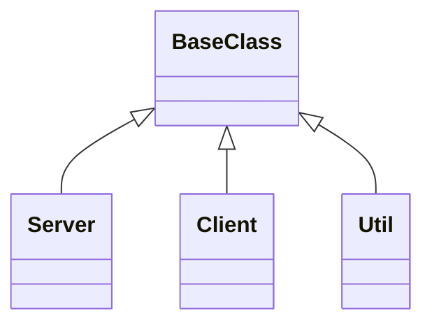

# Local-Vibecoding環境

## Git URL

https://github.com/BossApe/lo-vibe.git

git@github.com:BossApe/lo-vibe.git

## 進め方検討

1. AIに全て指示して実行する。AIは開発者として扱う
2. プロンプトログは Markdown にまとめる
3. 開発はスクラム / MVP (Minimum Viable Product) で実施する
4. 要求仕様箇条書き (人が行う)
5. タスク管理を GitHub Projects を使って行う。記載は API で実施
6. ソースバージョン管理は Jujutsu を使用する
7. 基本的にドキュメントは Markdown、図は Mermaid
   - https://ryuta46.com/112
8. プロジェクト計画書作成
9. 要件定義書作成
10. ドキュメントディレクトリ構成を検討
11. システム構成を検討、ドキュメント作成
12. イテレーションロードマップ作成
13. タスク分割
14. 機能一つづつ、設計、設計リファクタリング、コーディング、コードリファクタリング、単体テスト、単体テストリファクタリング、結合テスト、結合テストリファクタリング、リリース

## ローカルに Vivecoding 環境を構築

### ディレクトリ構成

- ドキュメント
  - 要求仕様フェーズ
  - 要件定義フェーズ
    - プロジェクト計画
      - プロジェクト管理方法: Scrum
      - タスク管理: GitHub Projects をカンバン形式で管理
      - ソースバージョン管理: JuJutsu
      - JuJutsu を使った GitFlow を考える
    - 要件定義書
  - 設計フェーズ
    - 規約
      - コーディング規約

## クラスダイアグラムのサンプル

