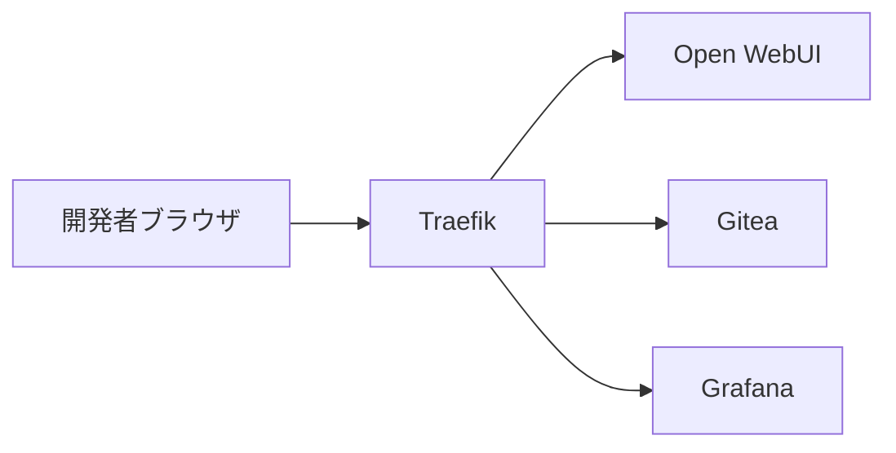

# 002-02. Traefik

[前: 002-01.VSCodium.md](002-01.VSCodium.md) | [一覧](../README.md) | [次: 002-03.Open-WebUI.md](002-03.Open-WebUI.md)

<details>
<summary>目次（クリックで展開）</summary>

- [1. 対応番号](#1-対応番号)
- [2. 主な機能](#2-主な機能)
- [3. 運用想定](#3-運用想定)
- [4. 動作イメージ](#4-動作イメージ)
- [5. 入出力フロー](#5-入出力フロー)
- [6. 運用ルール](#6-運用ルール)

</details>

## 1. 対応番号

- 3章/4章の対応番号: 2

## 2. 主な機能

- リバースプロキシ
- TLS 終端
- Docker ラベルベースのルーティング
- 認証ミドルウェア適用

## 3. 運用想定

- 実行場所: Linux サーバの edge ネットワーク
- 入力: 開発者ブラウザからの HTTPS
- 出力: Open WebUI、Gitea、Grafana など内部サービス
- 可用性: 単一ノード開始、必要時に冗長化

## 4. 動作イメージ



## 5. 入出力フロー

```mermaid
flowchart LR
    B[開発者ブラウザ] -->|インプット: HTTPSリクエスト| T[[2] Traefik]
    T -->|アウトプット: UIルーティング| W[Open WebUI]
    T -->|アウトプット: Git操作画面| G[Gitea]
    T -->|アウトプット: 監視画面| F[Grafana]
    W -->|インプット: レスポンス返却| T
    G -->|インプット: レスポンス返却| T
    F -->|インプット: レスポンス返却| T
```

## 6. 運用ルール

- 外部公開を前提にしない場合でも認証を有効化する
- 管理系 URL は IP 制限または VPN 配下に置く
- サービス追加時はラベル命名規約を統一する