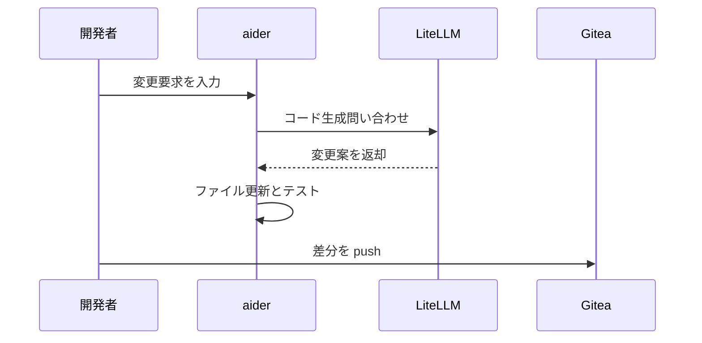

# 002-04. aider

[前: 002-03.Open-WebUI.md](002-03.Open-WebUI.md) | [一覧](../README.md) | [次: 002-05.LiteLLM.md](002-05.LiteLLM.md)

<details>
<summary>目次（クリックで展開）</summary>

- [1. 対応番号](#1-対応番号)
- [2. 主な機能](#2-主な機能)
- [3. 運用想定](#3-運用想定)
- [4. 動作イメージ](#4-動作イメージ)
- [5. 入出力フロー](#5-入出力フロー)
- [6. 運用ルール](#6-運用ルール)

</details>

## 1. 対応番号

- 3章/4章の対応番号: 4

## 2. 主な機能

- ターミナル操作中心の AI コーディング
- Git 差分を前提にした変更提案
- 複数ファイル更新の自動化
- テスト実行と改善ループの短縮

## 3. 運用想定

- 実行場所: Linux サーバ上の開発コンテナ
- 接続先: LiteLLM、Gitea
- 実行者: 開発者が対話で指示
- 出力: ローカルブランチの差分、コミット候補

## 4. 動作イメージ



## 5. 入出力フロー

```mermaid
flowchart LR
    V[VSCodium] -->|インプット: 実装タスク/編集対象| A[[4] aider]
    G[Gitea] -->|インプット: リポジトリ状態| A
    A -->|アウトプット: 推論リクエスト| L[LiteLLM]
    L -->|インプット: 変更案/補完| A
    A -->|アウトプット: ローカル差分/コミット候補| V
    A -->|アウトプット: push/PR更新| G
```

## 6. 運用ルール

- main/master 直 push は禁止し、PR 経由で統合する
- 大規模変更はタスク分割して段階適用する
- 生成差分は必ず人がレビューする