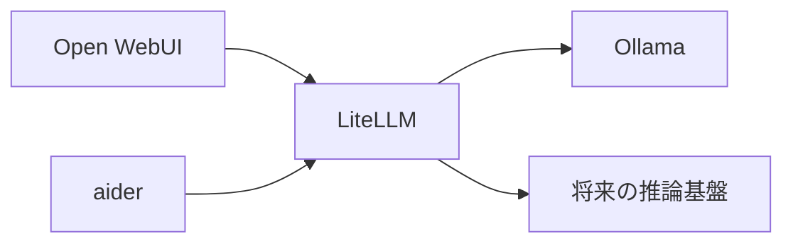

# 002-05. LiteLLM

[前: 002-04.aider.md](002-04.aider.md) | [一覧](../README.md) | [次: 002-06.Ollama.md](002-06.Ollama.md)

<details>
<summary>目次（クリックで展開）</summary>

- [1. 対応番号](#1-対応番号)
- [2. 主な機能](#2-主な機能)
- [3. 運用想定](#3-運用想定)
- [4. 動作イメージ](#4-動作イメージ)
- [5. 入出力フロー](#5-入出力フロー)
- [6. 運用ルール](#6-運用ルール)

</details>

## 1. 対応番号

- 3章/4章の対応番号: 5

## 2. 主な機能

- OpenAI 互換 API の統一エンドポイント提供
- 複数モデルバックエンドの抽象化
- モデル別ルーティングとフェイルオーバー
- 利用ログ収集とレート制御

## 3. 運用想定

- 実行場所: Linux サーバの ai ネットワーク
- 接続元: Open WebUI、aider
- 接続先: Ollama、将来追加の推論基盤
- 可用性: 初期は単一構成、負荷増で水平分割

## 4. 動作イメージ



## 5. 入出力フロー

```mermaid
flowchart LR
    W[Open WebUI] -->|インプット: チャット推論要求| L[[5] LiteLLM]
    A[aider] -->|インプット: コード生成要求| L
    L -->|アウトプット: 推論実行要求| O[Ollama]
    O -->|インプット: 生成結果| L
    L -->|アウトプット: 推論応答| W
    L -->|アウトプット: 推論応答| A
```

## 6. 運用ルール

- API キーは secret で注入する
- モデル名エイリアスを固定してクライアント側変更を減らす
- 応答遅延とエラー率を監視する