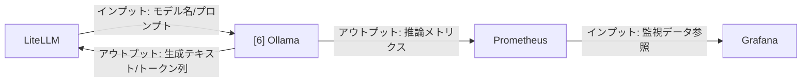

# 002-06. Ollama

[前: 002-05.LiteLLM.md](002-05.LiteLLM.md) | [一覧](../README.md) | [次: 002-07.Qdrant.md](002-07.Qdrant.md)

目次（クリックで展開）

- [1. 対応番号](#1-対応番号)
- [2. 主な機能](#2-主な機能)
- [3. 運用想定](#3-運用想定)
- [4. 入出力フロー](#4-入出力フロー)
- [5. 運用ルール](#5-運用ルール)

## 1. 対応番号

- 3章/4章の対応番号: 6

## 2. 主な機能

- ローカル LLM 推論サーバ
- モデル取得、配置、実行
- OpenAI 互換 API との連携
- GPU を使った低遅延推論

## 3. 運用想定

- 実行場所: Linux サーバの ai ネットワーク
- 接続元: LiteLLM
- リソース: GPU 優先、メモリとディスク容量を十分確保
- 保守: モデル更新時に精度・速度の回帰確認

## 4. 入出力フロー

## 5. 運用ルール

- 直接外部公開しない
- 用途別に利用モデルを固定し、評価結果を記録する
- モデルイメージと重みの保存容量を定期監視する