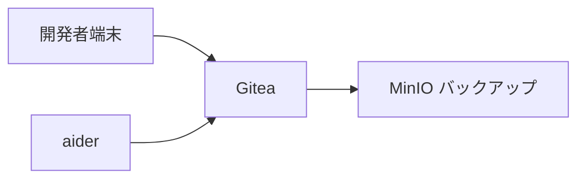
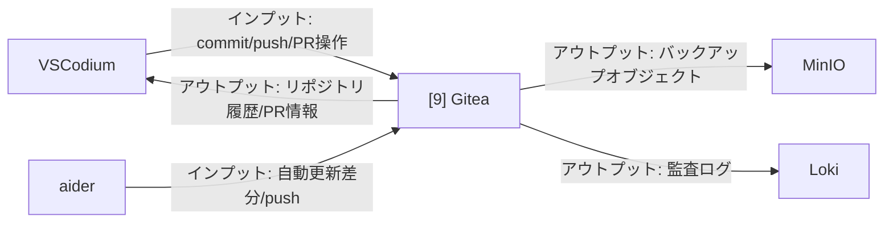

# 002-09. Gitea

[前: 002-08.SearXNG.md](002-08.SearXNG.md) | [一覧](../README.md) | [次: 002-10.MinIO.md](002-10.MinIO.md)

目次（クリックで展開）

- [1. 対応番号](#1-対応番号)
- [2. 主な機能](#2-主な機能)
- [3. 運用想定](#3-運用想定)
- [4. 動作イメージ](#4-動作イメージ)
- [5. 入出力フロー](#5-入出力フロー)
- [6. 運用ルール](#6-運用ルール)

## 1. 対応番号

- 3章/4章の対応番号: 9

## 2. 主な機能

- Git リポジトリ管理
- Issue と PR 管理
- チーム権限管理
- Webhook による自動連携

## 3. 運用想定

- 実行場所: Linux サーバの app ネットワーク
- 接続元: 開発者端末、aider
- 接続先: MinIO、将来 CI サービス
- 保全: 定期バックアップとリストア手順整備

## 4. 動作イメージ

## 5. 入出力フロー

## 6. 運用ルール

- リポジトリ保護ルールを有効化する
- 署名付きコミットを推奨し監査性を高める
- バックアップの復元訓練を定期的に行う