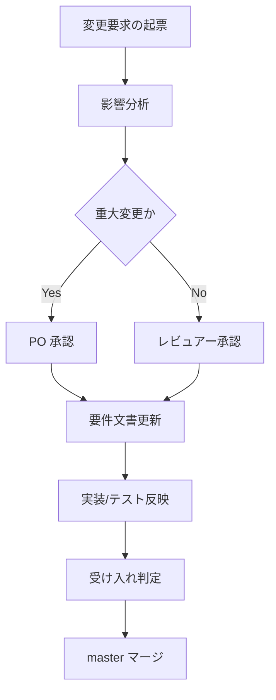

# 変更管理ルール

[前: 003-09.要件トレーサビリティ.md](003-09.要件トレーサビリティ.md) | [一覧](../README.md) | 次: なし

目次（クリックで展開）

- [1. 目的](#1-目的)
- [2. 対象](#2-対象)
- [3. 基本原則](#3-基本原則)
- [4. 変更フロー](#4-変更フロー)
- [5. 変更要求テンプレート](#5-変更要求テンプレート)
- [6. 影響分析観点](#6-影響分析観点)
- [7. 承認ルール](#7-承認ルール)
- [8. 反映ルール](#8-反映ルール)
- [9. 更新履歴](#9-更新履歴)

## 1. 目的

本ドキュメントは、仕様変更時の手順を定義し、開発混乱と品質低下を防止する。

## 2. 対象

- スコープ変更
- 機能要件変更 (FR)
- 受け入れ基準変更 (AC)
- 非機能要件変更 (NFR)

## 3. 基本原則

- 変更は必ず記録し、承認後に反映する
- 影響分析なしに実装へ着手しない
- 変更はイテレーション単位で計画へ取り込む

## 4. 変更フロー

## 5. 変更要求テンプレート

- 変更ID:
- 変更種別: Scope / FR / AC / NFR / Other
- 背景:
- 変更内容:
- 影響範囲: ドキュメント / 実装 / テスト / スケジュール
- 優先度: High / Medium / Low
- 希望反映イテレーション:
- 承認者:

## 6. 影響分析観点

| 観点 | チェック内容 |
| --- | --- |
| スコープ | In/Out Scope の変更有無 |
| 要件 | FR/AC/NFR の追加・変更・削除 |
| 設計 | 既存設計の再設計必要性 |
| 実装 | 修正対象モジュールと工数 |
| テスト | テストケース追加・修正要否 |
| リリース | master マージ判定への影響 |

## 7. 承認ルール

| 変更レベル | 判定基準 | 承認者 |
| --- | --- | --- |
| 軽微 | 文言修正のみ、挙動変更なし | レビュアー |
| 中規模 | FR/AC 変更あり、影響限定 | PO + レビュアー |
| 重大 | Scope 変更、複数機能へ波及 | PO |

## 8. 反映ルール

- 変更承認後、関連ドキュメントを同時更新する
- 受け入れ基準変更時はトレーサビリティ表も更新する
- 判定エビデンスを記録してから master マージする

## 9. 更新履歴

| 日付 | 版 | 変更内容 | 作成者 |
| --- | --- | --- | --- |
| 2026-04-29 | 0.1 | 初版作成 | Copilot |
