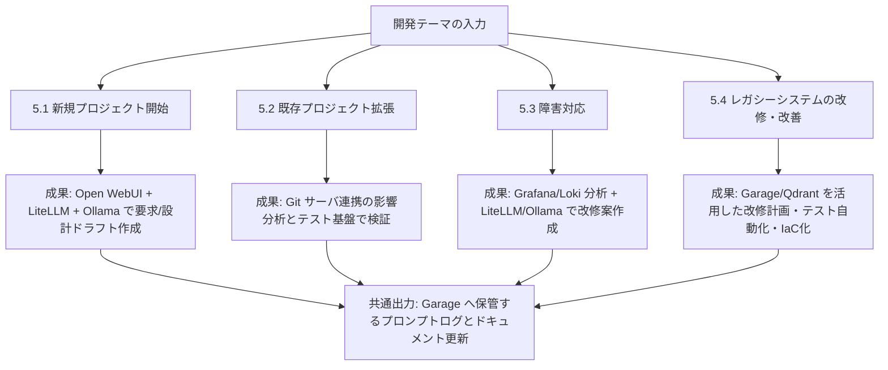
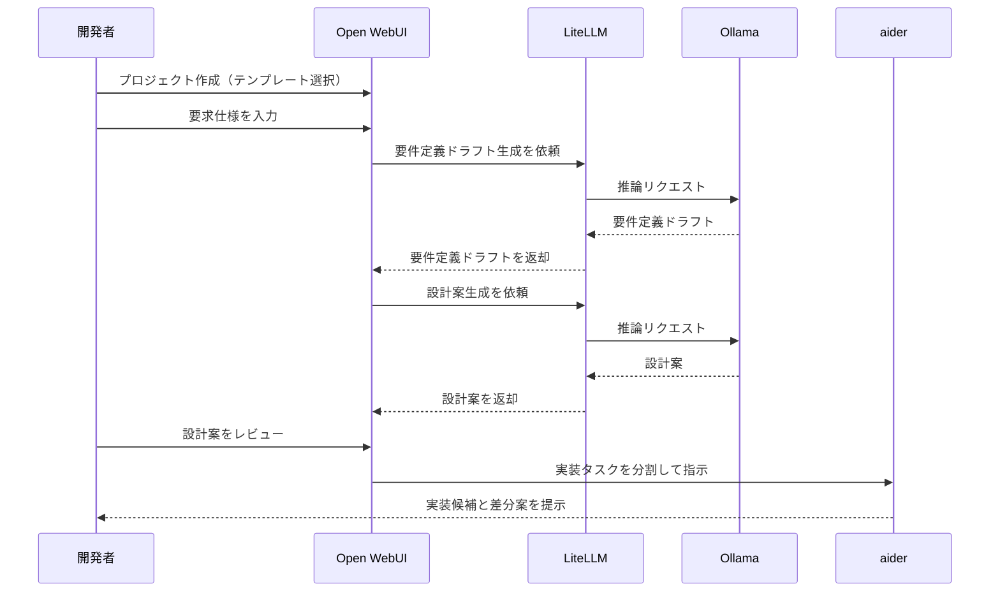
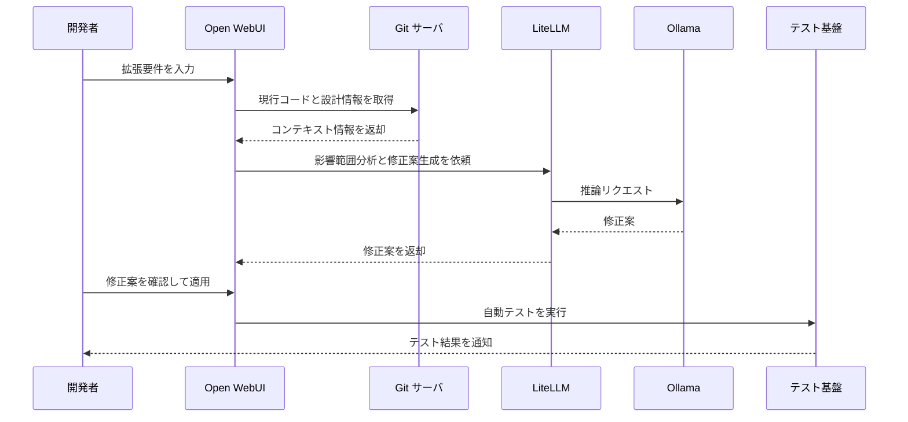
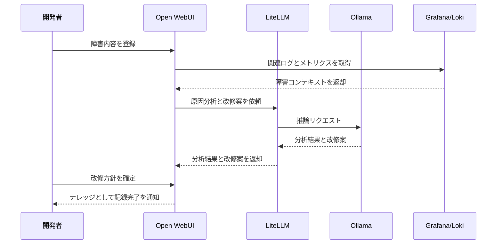
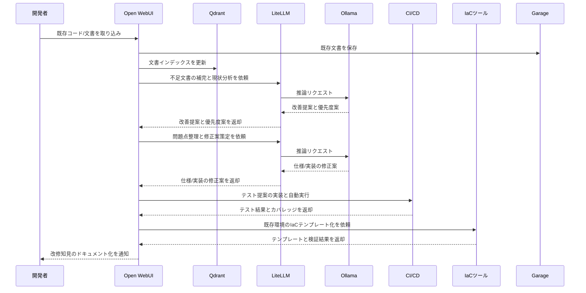

# ローカルバイブコーディング環境アプリケーション提案

前: なし | [一覧](../README.md) | 次: なし

目次（クリックで展開）

- [1. 目的](#1-目的)
- [2. 提案背景](#2-提案背景)
- [3. Musuhi アプリケーションの位置付け](#3-musuhi-アプリケーションの位置付け)
  - [3.1 インフラ層](#31-インフラ層)
  - [3.2 アプリケーション層（本提案）](#32-アプリケーション層本提案)
  - [3.3 統合層](#33-統合層)
- [4. Musuhi の主要機能](#4-musuhi-の主要機能)
  - [4.1 プロジェクト管理ダッシュボード](#41-プロジェクト管理ダッシュボード)
  - [4.2 ドキュメント管理](#42-ドキュメント管理)
  - [4.3 プロンプトログシステム](#43-プロンプトログシステム)
  - [4.4 ワークフロー エンジン](#44-ワークフロー-エンジン)
  - [4.5 規約・テンプレート管理](#45-規約テンプレート管理)
- [5. ユースケース](#5-ユースケース)
  - [5.1 新規プロジェクト開始](#51-新規プロジェクト開始)
  - [5.2 既存プロジェクト拡張](#52-既存プロジェクト拡張)
  - [5.3 障害対応](#53-障害対応)
  - [5.4 レガシーシステムの改修・改善](#54-レガシーシステムの改修改善)
- [6. 非機能要件](#6-非機能要件)
  - [6.1 パフォーマンス](#61-パフォーマンス)
  - [6.2 信頼性](#62-信頼性)
  - [6.3 拡張性](#63-拡張性)
  - [6.4 セキュリティ](#64-セキュリティ)
- [7. 推奨技術スタック](#7-推奨技術スタック)
- [8. 初期開発の段階モデル](#8-初期開発の段階モデル)
  - [8.1 Phase 0: MVP（最小機能品）](#81-phase-0-mvp最小機能品)
  - [8.2 Phase 1: コア機能拡張](#82-phase-1-コア機能拡張)
  - [8.3 Phase 2: 統合・最適化](#83-phase-2-統合最適化)
- [9. 開発方針](#9-開発方針)
  - [9.1 AI 主体の開発](#91-ai-主体の開発)
  - [9.2 Musuhi 自体がユースケース](#92-musuhi-自体がユースケース)
  - [9.3 段階的フィードバック](#93-段階的フィードバック)
  - [9.4 Scrum フレームワークの活用](#94-scrum-フレームワークの活用)
  - [9.5 MVP ファーストによる価値検証](#95-mvp-ファーストによる価値検証)
- [10. 成功基準](#10-成功基準)
  - [10.1 機能的な成功](#101-機能的な成功)
  - [10.2 運用的な成功](#102-運用的な成功)
  - [10.3 技術的な成功](#103-技術的な成功)
- [11. リスクと対策](#11-リスクと対策)
  - [11.1 AI 生成品質への依存](#111-ai-生成品質への依存)
  - [11.2 スコープ拡大](#112-スコープ拡大)
  - [11.3 外部ツール依存](#113-外部ツール依存)
- [12. マイルストーン](#12-マイルストーン)
- [13. 次のステップ](#13-次のステップ)
- [14. 結論](#14-結論)

## 1. 目的

本ドキュメントは、Musuhi として実装するローカルバイブコーディング環境アプリケーションの提案を記載する。

バイブコーディングプロセスをサポートするアプリケーションとして、以下を実現することを目指す。

- AI を活用したプロジェクト管理と開発タスク自動化
- 要件定義から設計、コーディング、テストまでの一連のフェーズを統合
- 開発ドキュメントの自動生成と保全
- プロンプトログの記録と可視化

## 2. 提案背景

従来のソフトウェア開発では、各フェーズの成果物がばらばらに管理され、AI 活用も散発的である。Musuhi は、これを統一されたプラットフォームとして提供し、AI との対話全体を一貫性のあるプロセスへ変える。

## 3. Musuhi アプリケーションの位置付け

Musuhi は、以下の層で構成される統合開発環境である。

### 3.1 インフラ層
- Linux サーバ上の Docker Compose 運用（`002.インフラ構成案` で詳細化）
- Hugging Face でモデルを一元管理し、Ollama によるローカル推論を実施
- Traefik によるエンドポイント統一

### 3.2 アプリケーション層（本提案）
- プロジェクト管理フロント
- ドキュメント自動生成エンジン
- プロンプトログ記録・検索機能
- テンプレートと規約の管理

### 3.3 統合層
- aider との連携
- 外部ツール（IDE、Git）との統合
- モデル別のワークフロー制御

## 4. Musuhi の主要機能

### 4.1 プロジェクト管理ダッシュボード
- プロジェクト情報の一元管理
- タスク・マイルストーン管理
- 進捗可視化とレポート生成
- Git サーバ（Forgejo / Gitea / GitHub）連携による Issue / PR 状態の集約表示

### 4.2 ドキュメント管理
- 要求仕様、要件定義、設計書の一元管理
- Markdown・Mermaid ベースのテンプレート
- バージョン管理と変更履歴
- Garage への成果物保管と Qdrant 連携による検索性向上

### 4.3 プロンプトログシステム
- AI 対話全体の記録
- セッション単位の管理
- 知見の抽出と再利用
- Open WebUI / LiteLLM / Ollama の実行コンテキストをログに紐付け

### 4.4 ワークフロー エンジン
- フェーズ別の推奨ワークフロー定義
- AI への指示内容のテンプレート化
- 成果物品質チェック
- aider 実行フローと CI テスト基盤を統合した実装サイクル制御

### 4.5 規約・テンプレート管理
- コーディング規約
- ドキュメント規約
- テストケース テンプレート
- Infra 構成（Open WebUI / LiteLLM / Ollama / Qdrant / Garage）に対応した標準テンプレート管理

## 5. ユースケース

### 5.1 新規プロジェクト開始

1. プロジェクト作成（テンプレート選択）
2. 要求仕様をドキュメント化
3. AI に要件定義ドラフト生成を依頼
4. 設計案の自動生成と人間によるレビュー
5. 実装タスク分割と aider への指示

### 5.2 既存プロジェクト拡張

1. 現在の設計・コード からコンテキスト自動抽出
2. 拡張要件を入力
3. 影響範囲分析と修正案生成
4. コード修正と自動テスト実行

### 5.3 障害対応

1. 障害内容と関連ドキュメント参照
2. AI に原因分析と改修案提示を依頼
3. 改修内容の記録と知見の蓄積

### 5.4 レガシーシステムの改修・改善

1. 対象システムのコード・既存ドキュメントを収集し、AI のコンテキストへ追加
2. 不足ドキュメントを特定し、AI で補完・整備
3. 現状分析をもとに改善提案を生成し、優先度付きの対応候補リストを作成
4. 仕様上の問題点（要件の曖昧さ・矛盾・抜け漏れ）を洗い出し、修正案を策定
5. プログラム上の問題点（バグ・技術的負債・セキュリティ懸念）を洗い出し、修正対応
6. 各種テストの提案と実施
   - 既存テストを分析し、テストコードとして整備・追加
   - CI パイプラインへ組み込み、テストの自動実施化
   - テスト観点（正常系・異常系・境界値・セキュリティ等）を明示したテスト仕様書を生成
   - テスト実施結果レポートおよびカバレッジ（Coverage）レポートを出力し品質可視化
7. インフラのコード化（IaC 化）
   - 既存環境を分析し、構成を Docker Compose / Terraform / Bicep 等の IaC テンプレートとして生成
   - IaC テンプレートをレビューし、環境再現性・冪等性を確認
   - IaC を CI/CD パイプラインへ組み込み、構成変更の自動適用・検証を実現
8. 変更内容と改修知見をプロンプトログ・ドキュメントに記録し再利用可能な状態で蓄積

## 6. 非機能要件

### 6.1 パフォーマンス
- ドキュメント検索: 1 秒以内
- プロンプト生成: 3 秒以内
- ワークフロー遷移: リアルタイム

### 6.2 信頼性
- プロンプトログの永続保存
- ドキュメント自動バックアップ
- 操作の監査ログ

### 6.3 拡張性
- プラグイン型のワークフロー拡張
- カスタムテンプレート追加
- 外部ツール連携インターフェース

### 6.4 セキュリティ
- ロールベースアクセス制御（RBAC）
- 秘密情報のマスキング
- 監査ログの暗号化

## 7. 推奨技術スタック

| 用途 | 推奨技術 | 理由 |
| --- | --- | --- |
| バックエンド | Python / Go | AI 統合しやすく、スケーラビリティに優れている |
| フロントエンド | Vue.js / React | Markdown リアルタイム プレビューに適している |
| DB | PostgreSQL | トランザクション要件が高く、JSON サポート |
| キャッシュ | Redis | セッション管理とプロンプト履歴の高速化 |
| 検索 | Elasticsearch | 大量のドキュメント・ログ検索を効率化 |
| メッセージキュー | RabbitMQ / Redis | 非同期タスク処理（テンプレート展開、レポート生成） |

## 8. 初期開発の段階モデル

本提案では、開発・テストを Copilot 主体で進める前提として、スケジュールは月単位ではなくイテレーション単位で管理する。
1 イテレーションは、計画 -> 実装 -> テスト -> レビュー -> ドキュメント反映 -> リリース (master マージ) の 1 サイクルを指す。

### 8.1 Phase 0: MVP（最小機能品）
- プロジェクト作成・管理
- Markdown ドキュメント管理
- プロンプトログの記録と表示
- aider との基本連携

目安: 2～3 イテレーション

### 8.2 Phase 1: コア機能拡張
- ワークフロー エンジン
- テンプレート管理
- 自動レポート生成
- プロンプト最適化提案

目安: 3～4 イテレーション

### 8.3 Phase 2: 統合・最適化
- 外部ツール連携（GitHub、Slack など）
- パフォーマンス最適化
- UI/UX 改善
- セキュリティ強化

目安: 2～3 イテレーション

## 9. 開発方針

### 9.1 AI 主体の開発
- AI（Copilot）が主たる実装者
- 人間はアーキテクチャ設計と品質管理を担当
- プロンプトログを通じた意思決定の可視化

### 9.2 Musuhi 自体がユースケース
- Musuhi の開発プロセス自体がバイブコーディング実例
- プロンプト、設計、コード、テストを全て記録
- 開発者に実践的な学習の場を提供

### 9.3 段階的フィードバック
- 各 Phase 完了ごとに振り返り
- ユーザーフィードバックの取り入れ
- 技術選定やアーキテクチャの見直し

### 9.4 Scrum フレームワークの活用
- イテレーションを Scrum Sprint として運営し、計画 → 実装 → レビュー → 振り返りのサイクルを回す
- Sprint 計画でプロダクトバックログから Sprint 目標を設定し、着手タスクを確定する
- Sprint レビューでステークホルダーへ動作するプロダクトをデモし、フィードバックを次 Sprint のバックログへ反映する
- Sprint レトロスペクティブで改善点を特定し、開発プロセスを継続的に最適化する
- プロダクトバックログの優先順位は PO が管理し、各 Sprint 開始時に更新する

### 9.5 MVP ファーストによる価値検証
- Phase 0 では必要最小限の機能（MVP）に絞り、早期に動くプロダクトとして価値を検証する
- MVP の検証結果をバックログへフィードバックし、次フェーズの優先度判断に活用する
- 機能追加は検証済みニーズを優先し、スコープ拡大リスク（[11.2](#112-スコープ拡大) 参照）を抑制する
- 各 Phase 完了時の MVP レビューを通じて投資対効果を継続的に評価する

## 10. 成功基準

### 10.1 機能的な成功
- 要求仕様から設計、コード生成までの自動化率 80% 以上
- ドキュメント自動生成の精度 90% 以上
- 開発サイクル短縮: 従来比 40% 削減

### 10.2 運用的な成功
- ユーザー（開発者）数: Phase 0 終了時 3～5 名
- 実運用プロジェクト: Phase 1 終了時 2 件以上
- プロンプトログの有効性評価: 70% の対話が参考になる

### 10.3 技術的な成功
- システム稼働率 99% 以上
- 機能テストカバレッジ 80% 以上
- ドキュメント完成度 90% 以上

## 11. リスクと対策

### 11.1 AI 生成品質への依存
- **リスク**: AI 生成の設計・コードが要件と乖離
- **対策**: 人間によるレビュー段階を必須化、品質チェックルール定義

### 11.2 スコープ拡大
- **リスク**: 機能要件が増加し、開発期間延長
- **対策**: MVP に絞り、Phase ごとに機能確定

### 11.3 外部ツール依存
- **リスク**: aider、Ollama の仕様変更
- **対策**: インターフェース層の抽象化、複数実装の検討

## 12. マイルストーン

| マイルストーン | 目標イテレーション | 主成果物 |
| --- | --- | --- |
| MVP 完成 | Iteration 3 | 最小限のプロジェクト管理・ドキュメント機能 |
| Phase 1 完成 | Iteration 6 | ワークフロー・テンプレート・レポート機能 |
| 初期実運用 | Iteration 6 | 実プロジェクト 2 件での検証 |
| Phase 2 完成 | Iteration 9 | 統合・最適化・UI 改善完了 |
| 本番運用開始 | Iteration 12 | 複数プロジェクトでの本格運用 |

## 13. 次のステップ

1. 本提案に対する評価・フィードバック
2. アーキテクチャ設計書の作成（3. 要件定義フェーズへ移行）
3. 開発環境構築（2. インフラ構成案を実装）
4. MVP 開発開始

## 14. 結論

Musuhi は、バイブコーディングプロセスを実装・統合するプラットフォームとして、以下のメリットを実現する。

- **効率性**: AI 活用による開発工数削減
- **透明性**: プロンプトログによる意思決定の可視化
- **学習効果**: 実践的なバイブコーディング体験
- **拡張性**: プロジェクトや組織に応じたカスタマイズ

段階的アプローチにより、リスクを抑えつつ機能を着実に拡張し、最終的には業界標準的なバイブコーディング基盤の確立を目指す。
