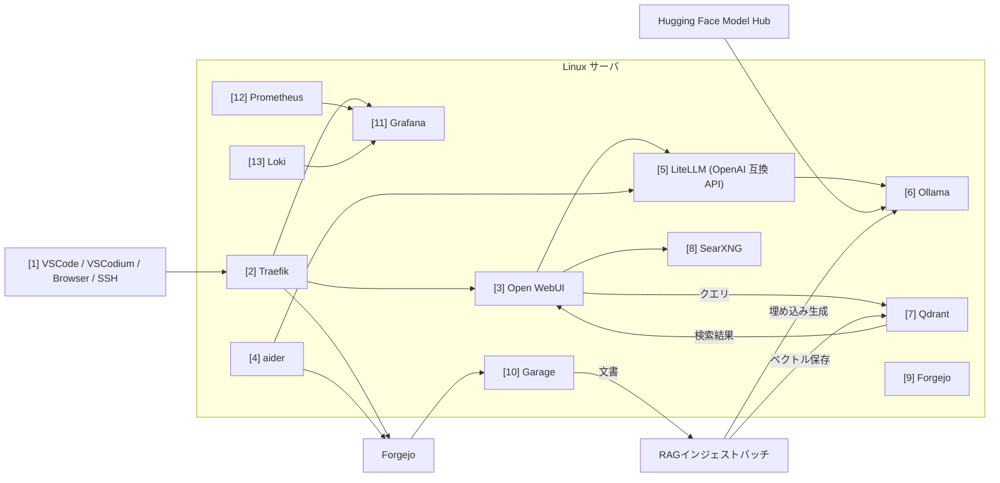
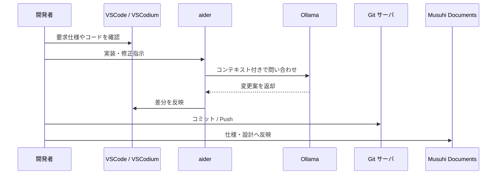
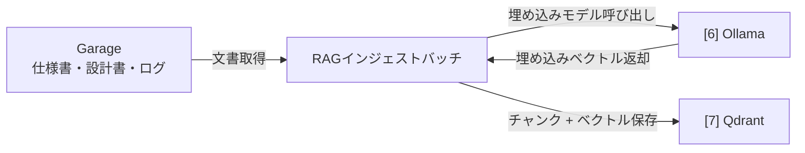
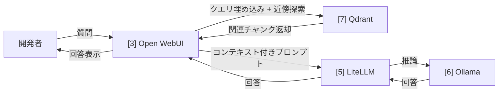

# ローカルバイブコーディング環境インフラ案

前: なし | [一覧](../README.md) | [次: 002-01.IDE.md](002-01.IDE.md)

<details>
<summary>目次（クリックで展開）</summary>

- [1. 目的](#1-目的)
- [2. 提案方針](#2-提案方針)
- [3. 推奨アーキテクチャ](#3-推奨アーキテクチャ)
- [4. 構成要素](#4-構成要素)
- [5. 最小構成と拡張構成](#5-最小構成と拡張構成)
  - [5.1 最小構成](#51-最小構成)
  - [5.2 拡張構成](#52-拡張構成)
- [6. 利用イメージ](#6-利用イメージ)
  - [6.1 RAGパイプライン](#61-ragパイプライン)
- [7. ネットワークと責務分離](#7-ネットワークと責務分離)
- [8. 推奨ディレクトリ案](#8-推奨ディレクトリ案)
- [9. モデル選定方針](#9-モデル選定方針)
- [10. セキュリティと運用上の注意](#10-セキュリティと運用上の注意)
- [11. この提案の評価](#11-この提案の評価)
  - [11.1 利点](#111-利点)
  - [11.2 留意点](#112-留意点)
- [12. 推奨する導入順](#12-推奨する導入順)
- [13. 結論](#13-結論)

</details>

## 1. 目的

Musuhi の開発で使うローカルバイブコーディング環境として、以下を満たす構成を提案する。

- 主要な構成要素は可能な限りオープンソースで揃える
- AI 実行基盤は Linux サーバ上で Docker オーケストレーションする
- 開発者の手元からは IDE とブラウザを中心に扱える
- 将来的に Musuhi 自体の機能へ段階的に取り込みやすい

## 2. 提案方針

提案方針は次の 4 点とする。

1. AI 実行面は Linux サーバに集約し、GPU や大きなメモリを有効活用する
2. 開発者端末は薄く保ち、IDE・ブラウザ・SSH クライアントに集中させる
3. 依存サービスは Docker Compose で束ね、将来 Kubernetes へ移行しやすい境界を切る
4. まずは最小構成で始め、RAG・監視・CI は段階導入する
5. モデルは Hugging Face でバージョン固定し、推論は Ollama でローカル実行する

## 3. 推奨アーキテクチャ



この構成では、モデル管理を Hugging Face で一元化しつつ、AI モデル実行と補助サービスを Linux サーバへ集約する。端末側は VSCode または VSCodium とブラウザから利用する。

## 4. 構成要素

| 推奨 OSS | 区分 | 役割 | 採用理由 |
| --- | --- | --- | --- |
| [1. VSCode / VSCodium](002-01.IDE.md) | IDE | 開発者の主作業環境 | Forgejo Copilot 利用時は VSCode、OSS 固定時は VSCodiumを選択 |
| [2. Traefik](002-02.Traefik.md) | リバースプロキシ | TLS 終端、ルーティング | Docker ラベル連携で運用が簡単 |
| [3. Open WebUI](002-03.Open-WebUI.md) | チャット UI | 会話、プロンプト検証、簡易ワークフロー | Ollama 連携が容易で Web から使いやすい |
| [4. aider](002-04.aider.md) | コーディングエージェント | ターミナル駆動の AI コーディング | Git との相性が良く、差分中心で安全に扱いやすい |
| [5. LiteLLM](002-05.LiteLLM.md) | OpenAI 互換 API | OpenAI 互換の統一エンドポイント | OpenAI 互換 API を前段に揃えやすく、将来のモデル切替にも向く |
| [6. Ollama](002-06.Ollama.md) | モデル実行 | ローカル LLM 配信 | Hugging Face 管理モデルをローカル推論に載せやすい |
| [7. Qdrant](002-07.Qdrant.md) | 埋め込み・RAG | ベクトル検索 | Docker 運用しやすく、RAG の拡張先として素直 |
| [8. SearXNG](002-08.SearXNG.md) | Web 検索補助 | OSS 検索メタエンジン | 外部依存を抑えつつ調査補助に使える |
| [9. Forgejo](002-09.Gitサーバ.md) | Git 管理 | ソース管理、Issue、軽量な運用基盤 | OSS で自己完結（Forgejo）または GitHub との組み合わせで選択 |
| [10. オブジェクトストレージ (Garage)](002-10.オブジェクトストレージ.md) | オブジェクト保管 | 成果物、ログ、添付保管 | MinIO 後継として、S3 互換 OSS で継続運用しやすい |
| [11. Grafana](002-11.Grafana.md) | 監視 | ダッシュボードと可視化 | メトリクスとログの参照先を一元化しやすい |
| [12. Prometheus](002-12.Prometheus.md) | 監視 | メトリクス収集 | ローカルでも標準的で、可観測性の基盤にしやすい |
| [13. Loki](002-13.Loki.md) | 監視 | ログ集約 | Grafana との連携が良く、軽量にログを扱える |

各 OSS の機能と運用想定は、上記リンク先の個別ドキュメントを参照する。

## 5. 最小構成と拡張構成

### 5.1 最小構成

まずは以下だけで開始する。

- Traefik
- Ollama
- Open WebUI
- aider 実行コンテナ
- Forgejo

最小構成の狙いは、Musuhi の要求整理と試作を短期間で回すことにある。RAG や監視を後回しにすることで、GPU・ストレージ・運用工数を抑えられる。

### 5.2 拡張構成

利用が安定したら次を追加する。

- Qdrant: 仕様書、設計書、ログの検索性向上
- SearXNG: 調査タスクの補助
- Garage: 成果物やプロンプトログの保管
- Prometheus / Grafana / Loki: ボトルネックと失敗原因の可視化

## 6. 利用イメージ



### 6.1 RAGパイプライン

RAG（Retrieval-Augmented Generation）は、文書検索で得たコンテキストを LLM への入力に付与することで、回答品質を高める仕組みである。本構成では以下の 2 フローで実現する。

**インジェストフロー（文書 → Qdrant）**



**検索・推論フロー（クエリ → 回答）**



**運用上のポイント**

| 項目 | 内容 |
| --- | --- |
| 埋め込みモデル | BGE 系など OSS モデルを Ollama で実行。LLM とは別のモデルエイリアスを LiteLLM に登録する |
| チャンク戦略 | 文書種別（仕様書・設計書・ログ）ごとにチャンクサイズを調整する |
| 再インデックス | 文書更新時にバッチを手動または CI トリガーで実行する |
| コレクション管理 | Qdrant のコレクション名は文書種別で分離し、検索精度を保つ |
| 導入タイミング | 最小構成が安定した後、仕様書・設計書検索の需要が出た段階で追加する |

## 7. ネットワークと責務分離

Docker Compose では少なくとも次のネットワークに分ける。

- edge: Traefik が公開する入口
- app: Open WebUI、aider、Forgejoなどの業務系サービス
- ai: Ollama や将来の推論系コンテナ
- obs: Prometheus、Grafana、Loki など監視系

責務分離の意図は、将来 Kubernetes へ移行する際に Service 境界を保ちやすくすることにある。

## 8. 推奨ディレクトリ案

Musuhi 配下では以下のような配置を推奨する。

```text
musuhi/
├── _compose/
│   ├── docker-compose.yml
│   └── .env
├── services/
│   ├── traefik/
│   ├── ollama/
│   ├── open-webui/
│   ├── aider/
│   ├── forgejo/
│   ├── qdrant/
│   └── observability/
├── _document/
│   ├── 001.提案・要求仕様フェーズ/
│   │   ├── 001.サービス・アプリケーション案/
│   │   ├── 002.インフラ構成案/
│   │   └── 003.要求仕様共通/
└── tools/
```

`tools/` は、プロジェクト推進時に必要となる各種バッチや補助スクリプトの保管場所として扱う。
環境構築、データ投入、検証、運用補助などで必要になったタイミングで追加し、使い捨てで終わらせず再利用できる状態を維持する。

**`tools/` 配下の運用ルール**

- 追加単位は機能ごとのサブディレクトリまたはバッチ単体とする
- 追加時は同じディレクトリに `README.md` を必ず作成する
- `README.md` には最低限、`概要` `目的` `利用方法` `運用手順` を記載する
- 利用方法には実行コマンド、前提条件、必要な環境変数、入出力ファイルを明記する
- 運用手順には実行タイミング、実行者、失敗時の復旧手順を明記する
- 破壊的操作（削除・上書き）を含む場合は注意事項とロールバック方法を明記する

## 9. モデル選定方針

モデル自体はアプリではないが、構成に与える影響が大きいため方針を定める。

- モデル管理: Hugging Face のリポジトリとリビジョン（commit SHA）で一元管理する
- 推論実行: Ollama でローカル実行し、外部 API 依存を最小化する
- コード生成の主力: Qwen 系や DeepSeek 系のオープンウェイトモデル
- ドキュメント整理: 軽量モデルを別に持ち、応答速度を優先
- 埋め込み: BGE 系などの OSS 埋め込みモデル
- 互換性管理: Ollama で利用可能な形式・量子化方式を事前検証する
- 変更管理: latest 運用を避け、承認済みモデルリストで更新を統制する

重要なのは単一モデルに寄せすぎないことだ。コーディング、要約、検索補助で求める特性が異なるため、用途ごとにモデルを切り替えられる構成にしておく。

## 10. セキュリティと運用上の注意

- 外部公開しない前提でも Traefik で認証入口を設ける
- Forgejoと Open WebUI の認証情報は .env ではなく secret ファイルで注入する
- Ollama には直接外部公開させず、内部ネットワークからのみ到達可能にする
- Hugging Face から取得するモデルはライセンスと利用条件を事前確認する
- 取得モデルのハッシュとリビジョンを記録し、供給網リスクを低減する
- プロンプトログ、会話ログ、成果物の保存先を分ける
- GPU 利用率、メモリ、ディスク使用量は早い段階で可視化する

## 11. この提案の評価

### 11.1 利点

- OSS 中心で構成でき、学習コストと調達リスクを抑えやすい
- Linux サーバ集中型のため、高性能モデルや GPU を共有しやすい
- Musuhi の今後の要求仕様、要件定義、設計へ自然に接続できる

### 11.2 留意点

- Ollama 単体では大規模同時利用に弱いため、利用者増加時は推論基盤の見直しが必要
- ローカル LLM は品質がモデル選定とハードウェアに強く依存する
- Hugging Face 依存のため、ネットワーク制約時はミラーやキャッシュ戦略が必要
- Open WebUI と aider を併用するとログ管理方針を最初に決めないと散らばりやすい

## 12. 推奨する導入順

1. Linux サーバ上に Traefik、Ollama、Open WebUI、Forgejoを Compose（または外部サービス）で構築する
2. Hugging Face の承認済みモデルリストを定義し、Ollama への取り込み手順を標準化する
3. 開発者端末は VSCode または VSCodium と SSH 接続、Git 操作に絞って薄く保つ
4. aider 実行コンテナを追加し、差分ベースの実装サイクルを固める
5. 仕様書検索が必要になった段階で Qdrant を追加する
6. 監視やログ分析が必要になった段階で Grafana、Prometheus、Loki を追加する

## 13. 結論

Musuhi のローカルバイブコーディング環境は、モデル管理を Hugging Face で一元化しつつ、Linux サーバ上に Docker Compose で OSS 群を集約し、開発者端末は VSCode または VSCodium とブラウザで扱う構成が最も現実的である。

初期段階では Traefik、Ollama、Open WebUI、aider、Forgejoの最小構成で十分であり、その後に Qdrant と監視基盤を追加する段階導入が、コストと運用負荷の両面で妥当である。
