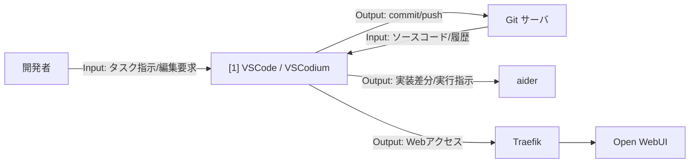

# 002-01. IDE (VSCode / VSCodium)

[前: 002-00.ローカルバイブコーディング環境インフラ案.md](002-00.ローカルバイブコーディング環境インフラ案.md) | [一覧](../README.md) | [次: 002-02.Traefik.md](002-02.Traefik.md)

目次（クリックで展開）

- [1. 対応番号](#1-対応番号)
- [2. IDE 選択方針](#2-ide-選択方針)
- [3. 主な機能](#3-主な機能)
- [4. 運用想定](#4-運用想定)
- [5. 入出力フロー](#5-入出力フロー)
- [6. 運用ルール](#6-運用ルール)

## 1. 対応番号

- 3章/4章の対応番号: 1

## 2. IDE 選択方針

本構成では開発者の利用スタイルに応じて **VSCode** または **VSCodium** を選択する。

| 項目 | VSCode | VSCodium |
| --- | --- | --- |
| ライセンス | Microsoft 独自ライセンス含む | MIT（完全 OSS） |
| テレメトリ | あり（無効化可能） | なし |
| 拡張マーケット | Microsoft Marketplace | Open VSX Registry（既定） |
| GitHub Copilot | **利用可能** | **利用不可** |
| Continue 拡張 | 利用可能 | 利用可能 |

**利用シナリオ別推奨**

- GitHub Copilot を利用する場合: **VSCode** を選択する
- OSS のみで固めたい場合: **VSCodium** + Continue 拡張を選択する

## 3. 主な機能

- AI コーディング系拡張を統合した開発体験（Copilot / Continue）
- Git 操作、差分確認、レビュー作業
- Remote SSH による Linux サーバ上ワークスペースの編集
- タスク実行、デバッグ、テスト実行の統合

**利用観点**

- 主要ユースケース: 新規実装、既存改修、障害対応時の調査・修正
- 呼び出し目的: 開発者が 1 つの画面で編集・実行・レビューを完結させるため
- Output活用目的: 生成差分や実行結果を Git サーバへ反映し、後続の CI とレビュー品質を高めるため

## 4. 運用想定

- 実行場所: 開発者端末
- 接続先: Linux サーバ上の開発コンテナ、または Git リポジトリ
- データ保持: ローカル設定、拡張設定、SSH 鍵
- 可用性: 端末障害時は設定を dotfiles で復元

## 5. 入出力フロー

## 6. 運用ルール

- 端末に秘密情報を長期保存しない
- Linux サーバ側でビルドと検証を実行する
- 主要拡張はバージョンを固定して再現性を確保する
- GitHub Copilot を使用する場合は VSCode を選択する