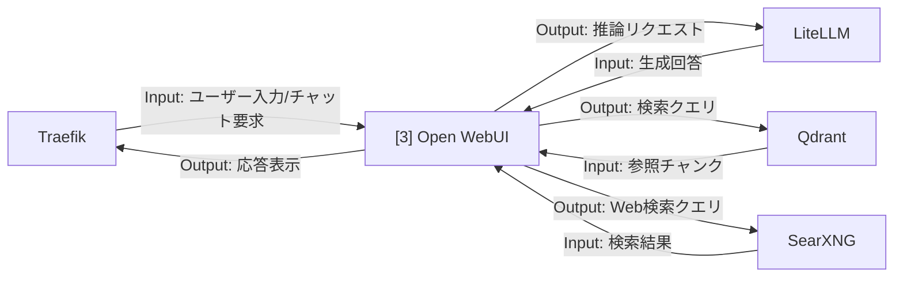

# 002-03. Open WebUI

[前: 002-02.Traefik.md](002-02.Traefik.md) | [一覧](../README.md) | [次: 002-04.aider.md](002-04.aider.md)

目次（クリックで展開）

- [1. 対応番号](#1-対応番号)
- [2. 主な機能](#2-主な機能)
- [3. 運用想定](#3-運用想定)
- [4. 入出力フロー](#4-入出力フロー)
- [5. 運用ルール](#5-運用ルール)

## 1. 対応番号

- 3章/4章の対応番号: 3

## 2. 主な機能

- LLM チャット UI
- モデル切替と会話履歴管理
- RAG 連携のフロント機能
- チーム内プロンプト試行の共有

**利用観点**

- 主要ユースケース: 要求整理、仕様確認、障害調査、設計レビュー時の対話利用
- 呼び出し目的: LiteLLM / Qdrant / SearXNG を横断して、開発者が対話起点で情報取得と推論を行うため
- Output活用目的: 生成回答や参照チャンクをドキュメント更新・実装判断・次のプロンプト改善に活用するため

## 3. 運用想定

- 実行場所: Linux サーバの app ネットワーク
- 接続先: LiteLLM、Qdrant、SearXNG
- 利用者: 開発者、設計担当
- ログ: 会話ログを保存し、必要に応じてエクスポート

## 4. 入出力フロー

## 5. 運用ルール

- 個人情報や機密情報の入力ガイドラインを明示する
- 重要なやり取りはドキュメントへ転記して一次情報化する
- セッション保持期間を決めて不要ログを削除する