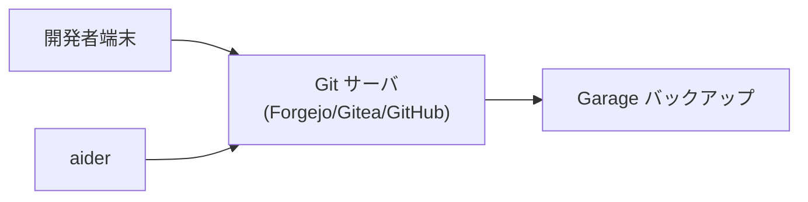
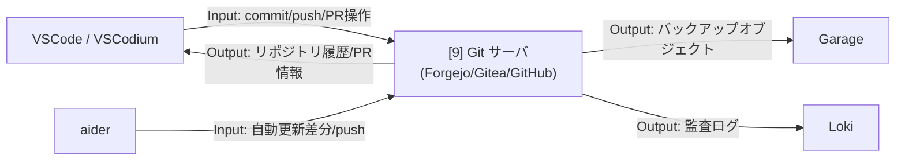

# 002-09. Git サーバ (Forgejo / Gitea / GitHub)

[前: 002-08.SearXNG.md](002-08.SearXNG.md) | [一覧](../README.md) | [次: 002-10.オブジェクトストレージ.md](002-10.オブジェクトストレージ.md)

目次（クリックで展開）

- [1. 対応番号](#1-対応番号)
- [2. 選択肢の比較](#2-選択肢の比較)
- [3. 主な機能](#3-主な機能)
- [4. 運用想定](#4-運用想定)
- [5. 動作イメージ](#5-動作イメージ)
- [6. 入出力フロー](#6-入出力フロー)
- [7. 運用ルール](#7-運用ルール)

## 1. 対応番号

- 3章/4章の対応番号: 9

## 2. 選択肢の比較

Git サーバとして以下の 3 択を想定する。初期は自己ホスト型の OSS を推奨するが、チームの方針や既存インフラに応じて選択する。

| 項目 | Forgejo | Gitea | GitHub |
| --- | --- | --- | --- |
| ライセンス | MIT (コミュニティ主導 fork) | MIT | 商用（Free/Pro/Enterprise） |
| 自己ホスト | ✅ | ✅ | ❌ (GitHub Actions はクラウド) |
| OSS 完全自己完結 | ✅ | △ (一部商業寄り) | ❌ |
| Webhook / CI 連携 | ✅ | ✅ | ✅ |
| Issue / PR / Wiki | ✅ | ✅ | ✅ |
| プロジェクト管理ボード | △ (カンバン相当。Gitea fork のため基本機能のみ) | △ (カンバン相当。基本機能のみ) | ✅ (GitHub Projects: カンバン・ロードマップ・カスタムフィールド対応) |
| GitHub Copilot 連携 | ❌ | ❌ | ✅ |
| 運用コスト | 低（自己管理） | 低（自己管理） | 低（SaaS） |
| 推奨シナリオ | OSS 固執・完全自己ホスト | 実績重視の自己ホスト | Copilot 利用 / 既存 GitHub 資産活用 |

**本提案の推奨:** Forgejo（完全 OSS かつコミュニティ主導）または Gitea（実績が豊富）を優先する。GitHub Copilot を利用する場合は GitHub との組み合わせも現実的な選択肢である。

## 3. 主な機能

- Git リポジトリ管理
- Issue と PR 管理
- チーム権限管理
- Webhook による自動連携

**利用観点**

- 主要ユースケース: チーム開発での変更管理、レビュー、リリース準備
- 呼び出し目的: ソース変更と議論履歴を一元管理し、開発フローを標準化するため
- Output活用目的: コミット履歴・PR 状態・監査ログを品質保証と運用監査に活用するため

## 4. 運用想定

- 実行場所: Linux サーバの app ネットワーク（Forgejo / Gitea の場合）、クラウド（GitHub の場合）
- 接続元: 開発者端末、aider
- 接続先: Garage（バックアップ）、将来 CI サービス
- 保全: 定期バックアップとリストア手順整備（自己ホスト時）

## 5. 動作イメージ

## 6. 入出力フロー

## 7. 運用ルール

- リポジトリ保護ルールを有効化する
- 署名付きコミットを推奨し監査性を高める
- バックアップの復元訓練を定期的に行う（自己ホスト時）
- GitHub を選択する場合はリポジトリの公開範囲（public / private）を明確にする