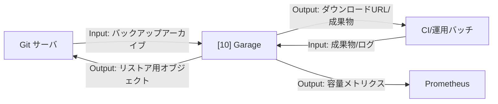

# 002-10. オブジェクトストレージ

[前: 002-09.Gitサーバ.md](002-09.Gitサーバ.md) | [一覧](../README.md) | [次: 002-11.Grafana.md](002-11.Grafana.md)

目次（クリックで展開）

- [1. 対応番号](#1-対応番号)
- [2. 主な機能](#2-主な機能)
- [3. 運用想定](#3-運用想定)
- [4. 入出力フロー](#4-入出力フロー)
- [5. 運用ルール](#5-運用ルール)

## 1. 対応番号

- 3章/4章の対応番号: 10

## 2. 主な機能

- S3 互換オブジェクトストレージ
- バージョニングとライフサイクル管理
- バックアップ保管先の提供
- ログと成果物の一元保管
- MinIO 公式保守終了を踏まえた Garage 採用

**利用観点**

- 主要ユースケース: Git サーバのバックアップ、成果物保存、プロンプトログ保管
- 呼び出し目的: 開発成果物の保全先を統一し、リストアと再利用を容易にするため
- Output活用目的: 保存オブジェクトを復旧対応・監査証跡・RAG インジェスト元データとして活用するため

## 3. 運用想定

- 実行場所: Linux サーバの app ネットワーク
- 採用候補: Garage（S3 互換 OSS）
- 接続元: Git サーバ、運用バッチ、将来 CI
- 保管対象: リポジトリバックアップ、成果物、ログ
- 可用性: 初期は単一、重要度増加時は分散構成

## 4. 入出力フロー

## 5. 運用ルール

- バケット用途を分離する
- 保存期間と削除ポリシーを明文化する
- 暗号化とアクセスキー管理を徹底する
- S3 互換 API の利用範囲を固定し、将来の実装差し替えを容易にする