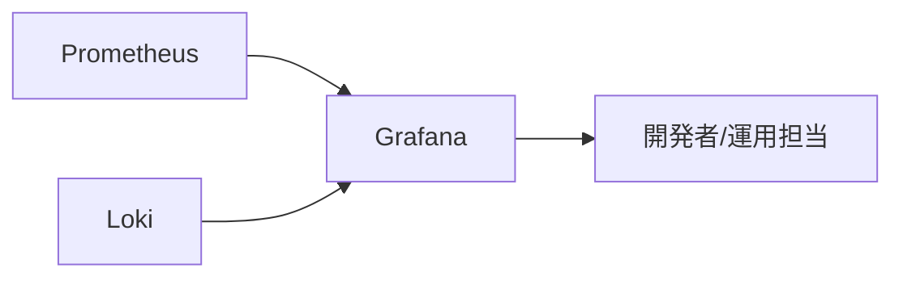
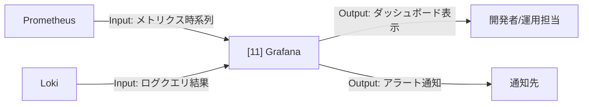

# 002-11. Grafana

[前: 002-10.オブジェクトストレージ.md](002-10.オブジェクトストレージ.md) | [一覧](../README.md) | [次: 002-12.Prometheus.md](002-12.Prometheus.md)

目次（クリックで展開）

- [1. 対応番号](#1-対応番号)
- [2. 主な機能](#2-主な機能)
- [3. 運用想定](#3-運用想定)
- [4. 動作イメージ](#4-動作イメージ)
- [5. 入出力フロー](#5-入出力フロー)
- [6. 運用ルール](#6-運用ルール)

## 1. 対応番号

- 3章/4章の対応番号: 11

## 2. 主な機能

- ダッシュボード可視化
- アラート通知
- Prometheus/Loki データソース統合
- 運用指標の時系列分析

**利用観点**

- 主要ユースケース: 推論遅延、エラー増加、リソース逼迫の早期検知
- 呼び出し目的: メトリクスとログを同一画面で相関確認し、障害原因特定を高速化するため
- Output活用目的: ダッシュボードと通知結果を運用改善・閾値調整・容量計画に活用するため

## 3. 運用想定

- 実行場所: Linux サーバの obs ネットワーク
- 接続先: Prometheus、Loki
- 利用者: 開発者、運用担当
- 監視対象: 推論遅延、エラー率、リソース使用量

## 4. 動作イメージ

## 5. 入出力フロー

## 6. 運用ルール

- ダッシュボードは目的別に分割する
- アラートは初期に過剰通知を避ける閾値で開始する
- 変更時は監視定義を Pull Request で管理する