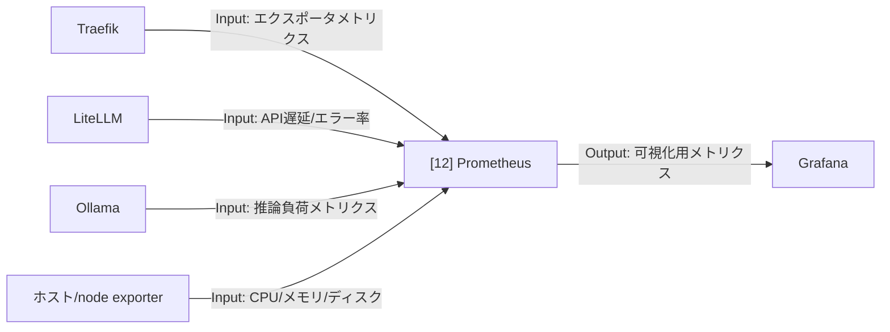

# 002-12. Prometheus

[前: 002-11.Grafana.md](002-11.Grafana.md) | [一覧](../README.md) | [次: 002-13.Loki.md](002-13.Loki.md)

目次（クリックで展開）

- [1. 対応番号](#1-対応番号)
- [2. 主な機能](#2-主な機能)
- [3. 運用想定](#3-運用想定)
- [4. 入出力フロー](#4-入出力フロー)
- [5. 運用ルール](#5-運用ルール)

## 1. 対応番号

- 3章/4章の対応番号: 12

## 2. 主な機能

- メトリクス収集
- ルール評価とアラート連携
- サービス健全性の定量化
- 長期分析用の基礎データ提供

**利用観点**

- 主要ユースケース: Traefik / LiteLLM / Ollama / ホストの稼働監視
- 呼び出し目的: 障害兆候を数値で継続観測し、早期にアラートを発報するため
- Output活用目的: 時系列メトリクスを Grafana 可視化と運用レポート作成に活用するため

## 3. 運用想定

- 実行場所: Linux サーバの obs ネットワーク
- 収集先: Traefik、LiteLLM、Ollama、ホストメトリクス
- 出力先: Grafana
- 保持期間: 初期は短期、必要に応じて延長

## 4. 入出力フロー

## 5. 運用ルール

- 収集対象を段階的に増やし、過剰収集を避ける
- 命名規約を統一し、ダッシュボード再利用性を高める
- 容量計画に合わせて保持期間を見直す