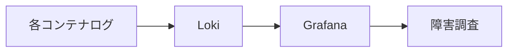
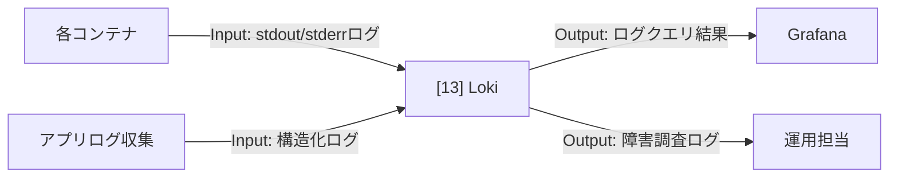

# 002-13. Loki

[前: 002-12.Prometheus.md](002-12.Prometheus.md) | [一覧](../README.md) | 次: なし

目次（クリックで展開）

- [1. 対応番号](#1-対応番号)
- [2. 主な機能](#2-主な機能)
- [3. 運用想定](#3-運用想定)
- [4. 動作イメージ](#4-動作イメージ)
- [5. 入出力フロー](#5-入出力フロー)
- [6. 運用ルール](#6-運用ルール)

## 1. 対応番号

- 3章/4章の対応番号: 13

## 2. 主な機能

- ログ集約
- ラベルベース検索
- Grafana での横断分析
- 障害調査時の時系列追跡

**利用観点**

- 主要ユースケース: 障害発生時の原因調査、運用監査、異常挙動の追跡
- 呼び出し目的: 分散するコンテナログを一元化し、検索性と追跡性を確保するため
- Output活用目的: ログクエリ結果を Grafana で可視化し、再発防止策と運用手順改善に活用するため

## 3. 運用想定

- 実行場所: Linux サーバの obs ネットワーク
- 入力元: 各コンテナの標準出力、必要なアプリログ
- 利用先: Grafana、運用調査
- 監査: 重要ログは保存期間を分離管理

## 4. 動作イメージ

## 5. 入出力フロー

## 6. 運用ルール

- ラベル設計を先に定義して検索性を確保する
- 重要ログと一般ログで保持期間を分ける
- 個人情報が含まれるログは収集前にマスクする