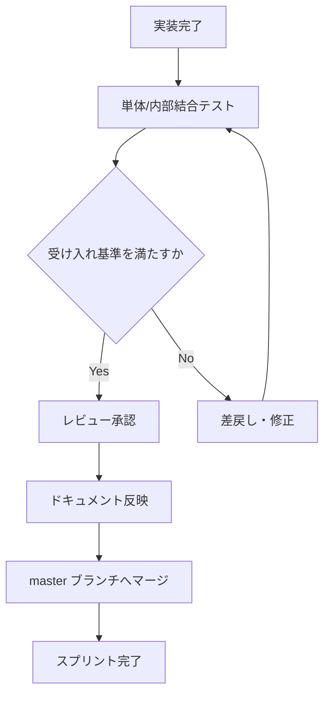

# 受け入れ基準

[前: 003-02.機能要件一覧.md](003-02.機能要件一覧.md) | [一覧](../README.md) | [次: 003-04.用語集・前提定義.md](003-04.用語集・前提定義.md)

目次（クリックで展開）

- [1. 目的](#1-目的)
- [2. 判定ルール](#2-判定ルール)
- [3. 受け入れ基準一覧](#3-受け入れ基準一覧)
- [4. 受け入れ判定フロー](#4-受け入れ判定フロー)
- [5. 判定記録テンプレート](#5-判定記録テンプレート)
- [6. 未達時の対応](#6-未達時の対応)
- [7. リリース判定基準](#7-リリース判定基準)
- [8. 更新履歴](#8-更新履歴)

## 1. 目的

本ドキュメントは、Musuhi の要件に対する完了判定基準を明確化し、レビュー観点を統一する。

## 2. 判定ルール

- 受け入れ基準は機能IDに紐付ける
- すべての Must 要件は受け入れ基準を満たすこと
- 判定結果は Pass/Fail/Blocked で記録する
- 判定エビデンスは Git のコミット、スクリーンショット、テスト結果を必須とする
- 受け入れ判定は各スプリント終端で実施する
- 各スプリントでは master マージ前に仕様ドキュメントを更新する
- AC-004 は Qdrant 類似度スコアによる自動ゲートを一次判定に使い、閾値未満または重要変更時は手動レビューで最終判定する

## 3. 受け入れ基準一覧

| AC-ID | 機能ID | 観点 | 受け入れ条件 | 判定方法 | 担当 |
| --- | --- | --- | --- | --- | --- |
| AC-001 | FR-001 | 機能 | 必須項目入力で作成成功し、一覧へ即時反映される | 自動テスト | PO / 開発 |
| AC-002 | FR-002 | 永続性 | アプリ再起動後に同一セッションログを再表示できる | 自動テスト | 開発 |
| AC-003 | FR-003 | 履歴 | Markdown 更新後に履歴が時系列で参照できる | 自動テスト | 開発 |
| AC-004 | FR-004 | 連携 | aider へ指示を渡し、差分生成まで到達できる | 自動+手動 (Qdrant類似度ゲート >= 0.75 + 重要変更レビュー) | 開発 |
| AC-005 | FR-005 | 可視化 | 進捗ステータスがダッシュボードに表示される | 自動テスト | PO |
| AC-006 | FR-006 | 利便性 | テンプレート選択で指示文が生成される | 自動テスト | 開発 |
| AC-007 | FR-007 | 出力 | 指定期間の進捗レポートを生成できる | 自動テスト | 開発 |
| AC-008 | FR-008 | 機能 | 対象コード・ドキュメントから不足ドキュメント一覧・改善提案・問題点一覧・修正案・テストコード・テスト仕様書・テスト結果レポート・Coverage・IaC テンプレートを生成できる | 手動+自動 | 開発 |

**AC-004 判定補足 (部分自動化)**

- 自動判定: 生成差分を要件・設計チャンクと照合し、Qdrant の類似度スコアが閾値以上であること
- 自動判定: 類似度閾値は 0.75 に固定し、スコア >= 0.75 を Pass 候補とする
- 自動判定: 差分適用後に構文エラーがなく、既存の自動テストが通過すること
- 手動判定: 閾値未満、または重要変更 (認証/権限/データ永続化/外部公開経路) を含む場合はレビューで最終判定する

**自動テスト実装方式 (AC-001/002/003/005/006/007)**

- AC-001: API テストで作成・一覧 API のレスポンスを検証し、CI で毎回実行する
- AC-002: 再起動を伴う統合テストでセッション永続化と復元 API の整合性を検証し、CI で毎回実行する
- AC-003: API テストで文書更新後の履歴取得 API の時系列整合性を検証し、CI で毎回実行する
- AC-005: E2E テストでダッシュボードの進捗ステータス表示を検証し、CI で毎回実行する
- AC-006: E2E テストでテンプレート選択から指示文生成までの画面操作と出力内容を検証し、CI で毎回実行する
- AC-007: API テストで指定期間レポートの生成結果 (件数・期間・出力形式) を検証し、CI で毎回実行する

**手動判定を残す理由 (AC-008)**

- AC-008 は生成物の妥当性・有効性・実運用適合性の評価が必要なため、機械判定のみでの完了判定は行わず手動レビューを併用する

## 4. 受け入れ判定フロー

## 5. 判定記録テンプレート

| 日付 | AC-ID | 判定 | エビデンス | 判定者 | コメント |
| --- | --- | --- | --- | --- | --- |
| YYYY-MM-DD | AC-001 | Pass/Fail/Blocked | commit hash / test report / screenshot | | |

## 6. 未達時の対応

- Fail 時は不具合または要件不足として Issue 化
- Blocked 時は依存関係を明記してエスカレーション
- 再判定日を設定して追跡する

## 7. リリース判定基準

- Sprint 3 時点で AC-001 から AC-004 の Pass が必須 (Phase 0 完了条件)
- Sprint 6 時点で AC-005 と AC-006 の Pass が必須 (Phase 1 完了条件)
- Sprint 9 時点で AC-007 の Pass が必須 (Phase 2 完了条件)
- Sprint 5 時点で AC-008 の Pass が必須 (Phase 1 レガシー改修支援完了条件)

## 8. 更新履歴

| 日付 | 版 | 変更内容 | 作成者 |
| --- | --- | --- | --- |
| 2026-04-29 | 0.1 | 初版ドラフト値を反映 | Copilot |
| 2026-04-30 | 0.2 | AC-008 レガシーシステム改修支援を追加 | Copilot |
| 2026-04-30 | 0.3 | AC-008 にテスト自動化・IaC化の受け入れ条件を追記 | Copilot |
| 2026-04-29 | 0.2 | リリース判定をスプリント基準へ変更 | Copilot |
| 2026-04-29 | 0.3 | 判定フローをドキュメント反映先行へ統一 | Copilot |
| 2026-04-30 | 0.4 | AC-004 に Qdrant 類似度ゲート + 手動レビューの部分自動化判定を追加 | Copilot |
| 2026-04-30 | 0.5 | AC-004 の Qdrant 類似度閾値を 0.75 で固定 | Copilot |
| 2026-04-30 | 0.6 | 自動化可能な判定方法 (AC-001/003/005/006) を自動テストへ更新 | Copilot |
| 2026-04-30 | 0.7 | AC-001/003/005/006 の自動テスト実装方式 (API/E2E/CI) を追記 | Copilot |
| 2026-04-30 | 0.8 | AC-002/007 を自動テストへ更新し、AC-008 の手動併用理由を明記 | Copilot |
