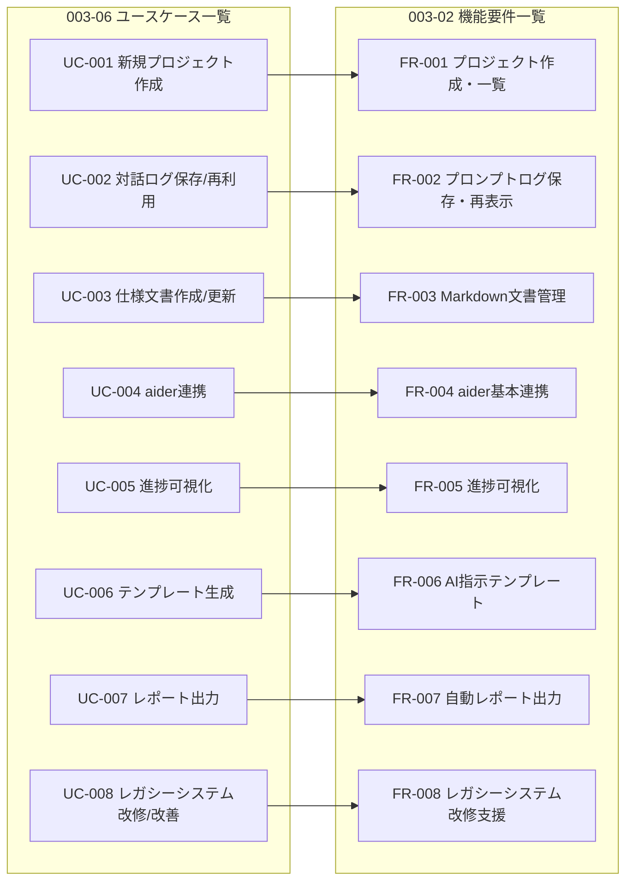
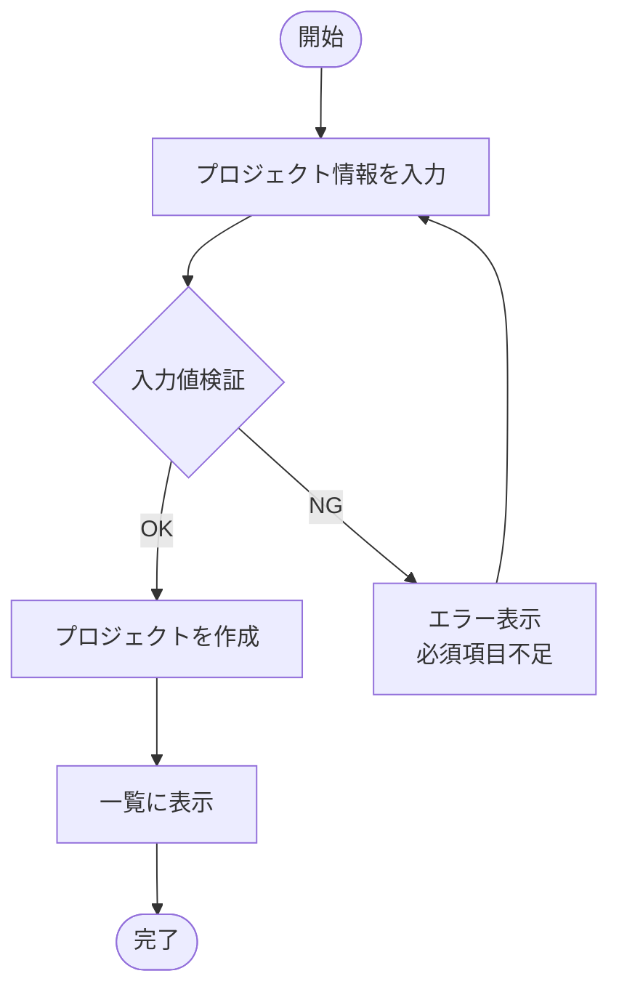
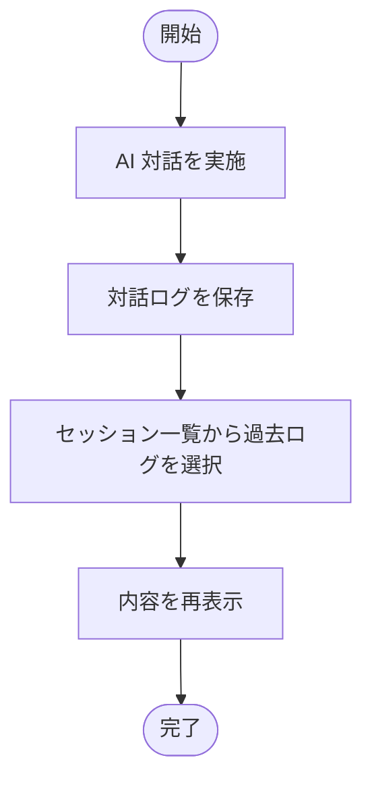
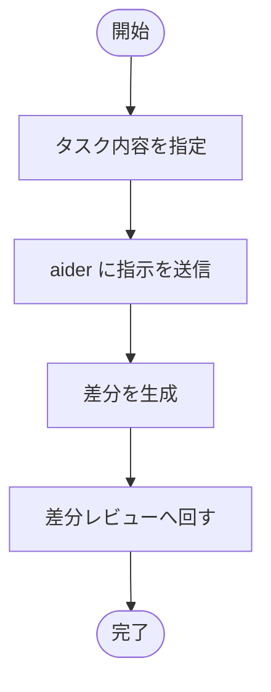
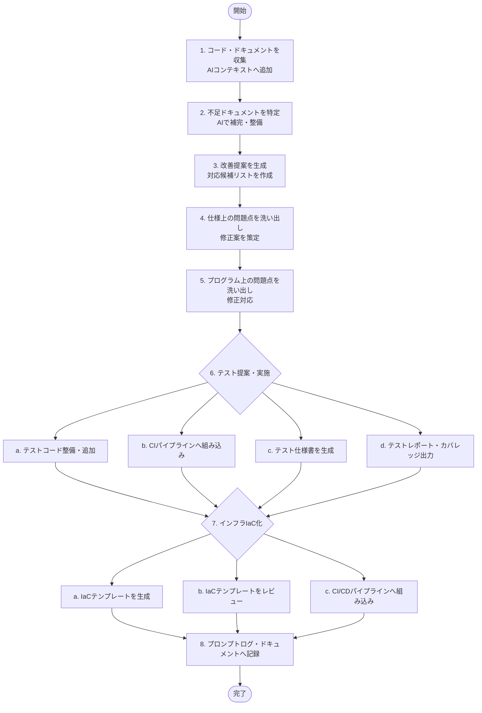

# ユースケース一覧

[前: 003-05.ステークホルダー定義.md](003-05.ステークホルダー定義.md) | [一覧](../README.md) | [次: 003-07.非機能要件.md](003-07.非機能要件.md)

目次（クリックで展開）

- [1. 目的](#1-目的)
- [2. 優先順位基準](#2-優先順位基準)
- [3. ユースケース一覧](#3-ユースケース一覧)
- [4. UC-FR 対応図 (レビュー用)](#4-uc-fr-対応図-レビュー用)
- [5. 上位ユースケース詳細](#5-上位ユースケース詳細)
  - [5.1 UC-001 新規プロジェクト作成](#51-uc-001-新規プロジェクト作成)
  - [5.2 UC-002 プロンプトログ保存・再利用](#52-uc-002-プロンプトログ保存再利用)
  - [5.3 UC-004 aider 連携](#53-uc-004-aider-連携)
  - [5.4 UC-008 レガシーシステム改修・改善](#54-uc-008-レガシーシステム改修改善)
- [6. 優先順位見直しルール](#6-優先順位見直しルール)
- [7. 更新履歴](#7-更新履歴)

## 1. 目的

本ドキュメントは、Musuhi の利用シナリオを整理し、機能実装順の判断軸を定める。

## 2. 優先順位基準

- 価値: 開発効率に与える影響
- 頻度: 利用頻度の高さ
- 依存性: 他ユースケースへの前提度
- 複雑度: 実装/運用コスト

優先度は P1 (最優先) / P2 / P3 で表す。

## 3. ユースケース一覧

| UC-ID | ユースケース | 主利用者 | 関連FR | 優先度 | 目標イテレーション |
| --- | --- | --- | --- | --- | --- |
| UC-001 | 新規プロジェクトを作成する | 開発者 | FR-001 | P1 | Iteration 1 |
| UC-002 | AI 対話ログを保存し再利用する | 開発者 | FR-002 | P1 | Iteration 2 |
| UC-003 | 仕様文書を作成・更新する | 開発者 | FR-003 | P1 | Iteration 2 |
| UC-004 | aider へ実装指示を連携する | 開発者 | FR-004 | P1 | Iteration 3 |
| UC-005 | 進捗状態を可視化する | PO/開発者 | FR-005 | P2 | Iteration 5 |
| UC-006 | 指示テンプレートを選択して生成する | 開発者 | FR-006 | P2 | Iteration 6 |
| UC-007 | 進捗レポートを出力する | PO | FR-007 | P3 | Iteration 9 |
| UC-008 | レガシーシステムを改修・改善する | 開発者 | FR-008 | P2 | Iteration 5 |

## 4. UC-FR 対応図 (レビュー用)

## 5. 上位ユースケース詳細

### 5.1 UC-001 新規プロジェクト作成

- 事前条件: 利用者がシステムへアクセス可能
- 基本フロー:
1. プロジェクト情報を入力する
2. 入力値を検証する
3. プロジェクトを作成する
4. 一覧に表示する
- 成功条件: 一覧画面で新規プロジェクトが確認できる
- 失敗条件: 必須項目不足時は作成不可

### 5.2 UC-002 プロンプトログ保存・再利用

- 事前条件: プロジェクトが存在する
- 基本フロー:
1. AI 対話を実施する
2. 対話ログを保存する
3. セッション一覧から過去ログを選択する
4. 内容を再表示する
- 成功条件: 再起動後も同一セッションを再表示できる

### 5.3 UC-004 aider 連携

- 事前条件: 対象タスクと対象リポジトリが存在する
- 基本フロー:
1. タスク内容を指定する
2. aider に指示を送信する
3. 差分を生成する
4. 差分レビューへ回す
- 成功条件: 差分生成まで到達する

### 5.4 UC-008 レガシーシステム改修・改善

- 事前条件: 対象システムのソースコードまたは既存ドキュメントが追加済みであること
- 基本フロー:
1. 対象コード・ドキュメントを収集し、AI コンテキストへ追加する
2. 不足ドキュメントを特定し、AI で補完・整備する
3. 改善提案を生成し、対応候補リストを作成する
4. 仕様上の問題点（曖昧・矛盾・抜け漏れ）を洗い出し、修正案を策定する
5. プログラム上の問題点（バグ・技術的負債・セキュリティ懸念）を洗い出し、修正対応する
6. 各種テストの提案と実施を行う
   a. 既存テストを分析しテストコードとして整備・追加する
   b. CI パイプラインへ組み込み自動実施化する
   c. テスト観点（正常系・異常系・境界値・セキュリティ等）を明示したテスト仕様書を生成する
   d. テスト実施結果レポートおよびカバレッジレポートを出力し品質を可視化する
7. インフラの IaC 化を提案・実施する
   a. 既存環境を分析し IaC テンプレート（Docker Compose / Terraform / Bicep 等）を生成する
   b. IaC テンプレートをレビューし環境再現性・冪等性を確認する
   c. IaC を CI/CD パイプラインへ組み込み構成変更の自動適用・検証を実現する
8. 変更内容と知見をプロンプトログ・ドキュメントに記録し再利用可能な状態で蓄積する
- 成功条件: 問題点一覧・修正案・テストレポート・Coverage・IaC テンプレートが生成され対応候補リストが確認できる
- 失敗条件: 対象コード・ドキュメントが未追加の場合は実行不可

## 6. 優先順位見直しルール

- 各イテレーション終了時に優先度を再評価する
- 新規ユースケース追加時は UC-ID を採番して本書へ追記する
- 影響範囲が大きい変更は PO 承認を必須とする

## 7. 更新履歴

| 日付 | 版 | 変更内容 | 作成者 |
| --- | --- | --- | --- |
| 2026-04-29 | 0.1 | 初版作成 | Copilot |
| 2026-04-29 | 0.2 | 003-02との対応関係をMermaid図で追加 | Copilot |
| 2026-04-30 | 0.3 | UC-008 レガシーシステム改修・改善を追加 | Copilot |
| 2026-04-30 | 0.4 | UC-008 にテスト提案・自動化・IaC化を追加 | Copilot |
| 2026-04-30 | 0.5 | 各UCにMermaidフロー図を追加 | Copilot |
