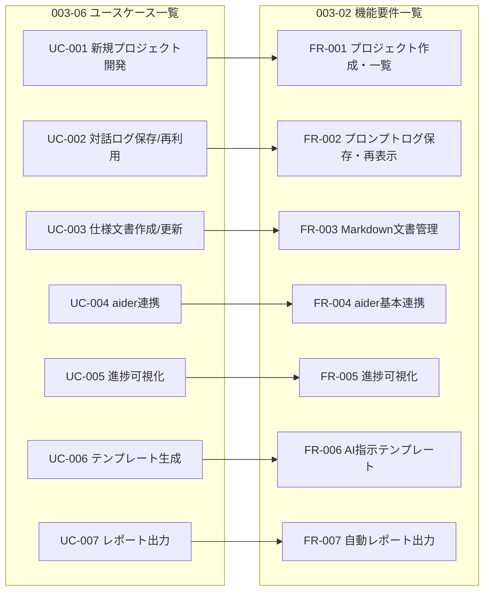

# 要件トレーサビリティ

[前: 003-08.リスク・制約・依存関係.md](003-08.リスク・制約・依存関係.md) | [一覧](../README.md) | [次: 003-10.変更管理ルール.md](003-10.変更管理ルール.md)

目次（クリックで展開）

- [1. 目的](#1-目的)
- [2. トレーサビリティ方針](#2-トレーサビリティ方針)
- [3. 上位トレーサビリティ表](#3-上位トレーサビリティ表)
  - [3.1 UC-FR 対応図 (003-06/003-02)](#31-uc-fr-対応図-003-06003-02)
- [4. 非機能トレーサビリティ](#4-非機能トレーサビリティ)
- [5. 更新トリガー](#5-更新トリガー)
- [6. 更新履歴](#6-更新履歴)

## 1. 目的

本ドキュメントは、提案から要件、設計、実装、テストまでの追跡可能性を確保する。

## 2. トレーサビリティ方針

- すべての FR は AC に紐付ける
- 設計/実装/テストの各成果物へID連携する
- master マージ時に追跡表を更新する

## 3. 上位トレーサビリティ表

| 提案項目 | 要件ID (FR) | 受け入れ基準 (AC) | 設計 | 実装 | テスト | 目標Iteration |
| --- | --- | --- | --- | --- | --- | --- |
| プロジェクト管理の一元化 | FR-001 | AC-001 | 004.設計 (予定) | Project Module (予定) | TC-FR001 | Iteration 1 |
| プロンプトログの永続保存 | FR-002 | AC-002 | 004.設計 (予定) | Prompt Log Module (予定) | TC-FR002 | Iteration 2 |
| 文書管理と履歴管理 | FR-003 | AC-003 | 004.設計 (予定) | Document Module (予定) | TC-FR003 | Iteration 2 |
| aider 連携による実装効率化 | FR-004 | AC-004 | 004.設計 (予定) | Aider Adapter (予定) | TC-FR004 | Iteration 3 |
| 進捗の可視化 | FR-005 | AC-005 | 004.設計 (予定) | Dashboard Module (予定) | TC-FR005 | Iteration 5 |
| 指示テンプレート活用 | FR-006 | AC-006 | 004.設計 (予定) | Template Module (予定) | TC-FR006 | Iteration 6 |
| 自動レポート出力 | FR-007 | AC-007 | 004.設計 (予定) | Report Module (予定) | TC-FR007 | Iteration 9 |

### 3.1 UC-FR 対応図 (003-06/003-02)

## 4. 非機能トレーサビリティ

| 非機能要件ID | 関連FR | 関連AC | 監視/測定 | 備考 |
| --- | --- | --- | --- | --- |
| NFR-PERF-001 | FR-003 | AC-003 | 応答時間メトリクス | p95 1秒以内 |
| NFR-PERF-002 | FR-004 | AC-004 | API遅延計測 | p95 3秒以内 |
| NFR-REL-001 | FR-002 | AC-002 | 永続性テスト | ログ欠損0件 |
| NFR-OPS-004 | FR-001〜FR-007 | AC-001〜AC-007 | 判定記録 | master マージ時更新 |

## 5. 更新トリガー

- FR/AC 追加・変更時
- 設計書追加時
- 実装モジュール確定時
- テストケース追加時
- 各イテレーション終端

## 6. 更新履歴

| 日付 | 版 | 変更内容 | 作成者 |
| --- | --- | --- | --- |
| 2026-04-29 | 0.1 | 初版作成 | Copilot |
| 2026-04-29 | 0.2 | 003-06と003-02のUC-FR対応図を追加 | Copilot |
