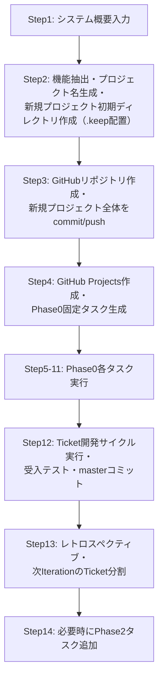
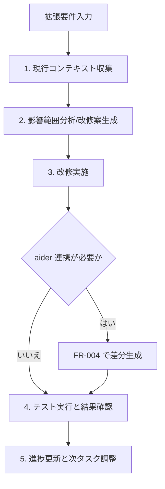
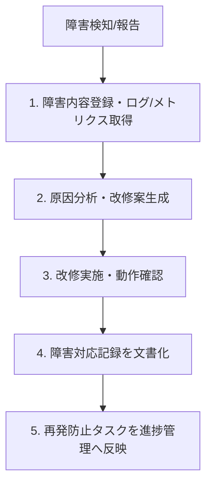
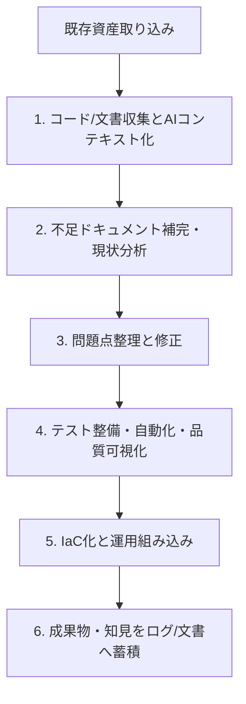
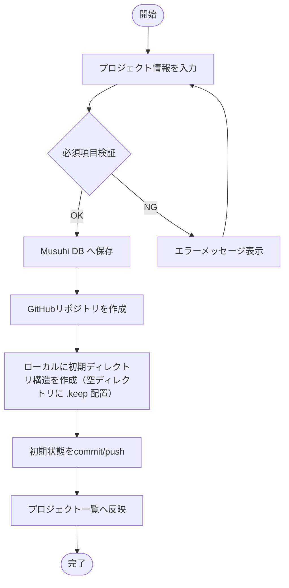
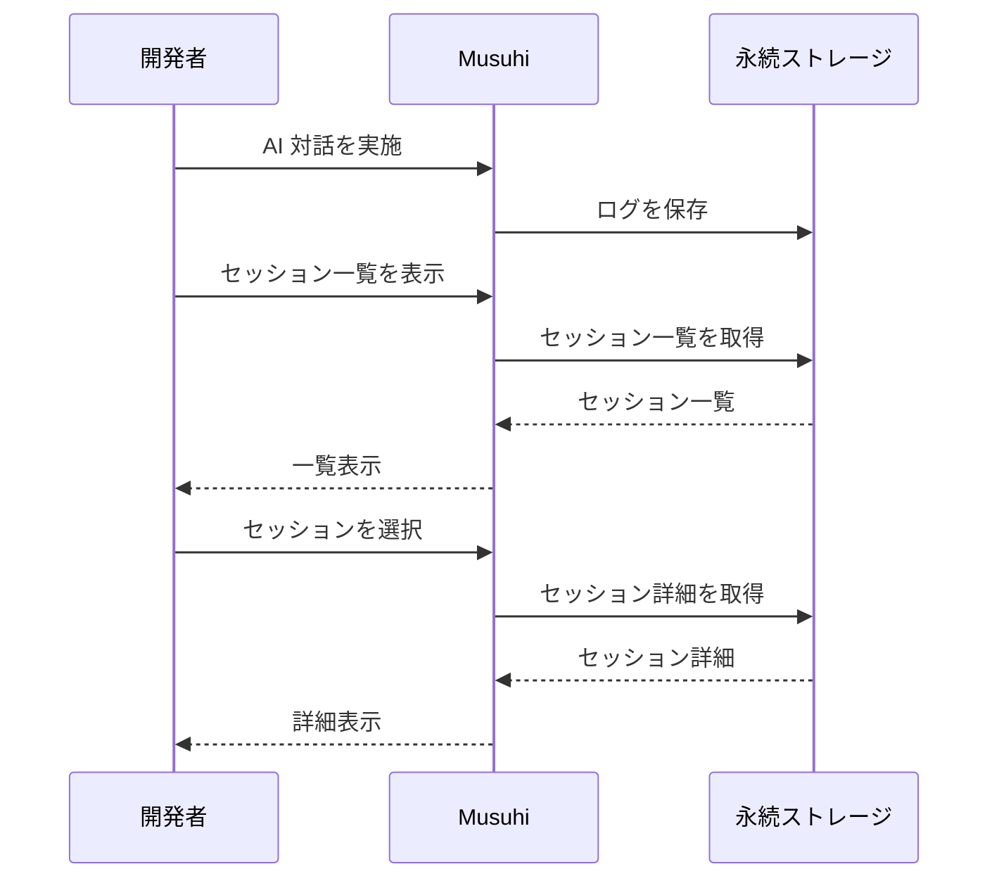
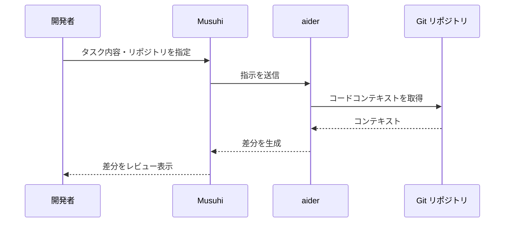
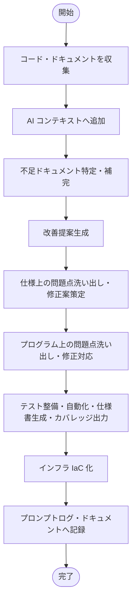

# 機能要件定義書

[前: なし](../README.md) | [一覧](../README.md) | [次: 001-02.非機能要件定義書.md](001-02.非機能要件定義書.md)

目次（クリックで展開）

- [1. 目的](#1-目的)
- [2. 要件定義の方針](#2-要件定義の方針)
- [3. ユースケース](#3-ユースケース)
- [4. 標準ワークフロー](#4-標準ワークフロー)
    - [4.1 UC-01 新規プロジェクト開発](#41-uc-01-新規プロジェクト開発)
    - [4.2 UC-02 既存プロジェクト拡張](#42-uc-02-既存プロジェクト拡張)
    - [4.3 UC-03 障害対応](#43-uc-03-障害対応)
    - [4.4 UC-04 レガシーシステムの改修・改善](#44-uc-04-レガシーシステムの改修改善)
- [5. 機能一覧](#5-機能一覧)
- [6. 機能詳細](#6-機能詳細)
    - [6.1 FR-001 プロジェクト作成・一覧](#61-fr-001-プロジェクト作成一覧)
    - [6.2 FR-002 プロンプトログ保存・再表示](#62-fr-002-プロンプトログ保存再表示)
    - [6.3 FR-003 Markdown 文書管理](#63-fr-003-markdown-文書管理)
    - [6.4 FR-004 aider 基本連携](#64-fr-004-aider-基本連携)
    - [6.5 FR-005 進捗可視化](#65-fr-005-進捗可視化)
    - [6.6 FR-006 AI 指示テンプレート](#66-fr-006-ai-指示テンプレート)
    - [6.7 FR-007 自動レポート出力](#67-fr-007-自動レポート出力)
    - [6.8 FR-008 レガシーシステム改修支援](#68-fr-008-レガシーシステム改修支援)
- [7. 画面一覧](#7-画面一覧)
- [8. API エンドポイント一覧](#8-api-エンドポイント一覧)
- [9. 要件変更管理](#9-要件変更管理)
- [10. 更新履歴](#10-更新履歴)

## 1. 目的

本ドキュメントは、001.提案・要求仕様フェーズの機能要件一覧 (003-02) を要件定義フェーズで詳細化し、設計・実装・テストへ引き渡す基準を確立する。

## 2. 要件定義の方針

- 001.提案・要求仕様フェーズの FR-001〜FR-008 を引き継ぎ、詳細化する
- 各 FR に画面・API・データ定義との紐付けを明示する
- 優先度 Must の要件は Phase 0 (Iteration 1〜3) で確定させる
- 本書で扱う `Phase` は開発実行フェーズを指し、提案・要求仕様フェーズの「プロジェクト立ち上げフェーズ0」と区別する
- 001フェーズ成果物のユーザレビュー時要約提示、UI 承認、GitHub/Projects 反映は本フェーズで機能仕様として定義・管理する

## 3. ユースケース

| UC-ID | ユースケース名 | 概要 |
| --- | --- | --- |
| UC-01 | 新規プロジェクト開発 | ユーザが新規テーマを入力し、提案・要求仕様から要件定義、設計、実装指示までを段階的に進める。AI 生成結果は要約確認と承認を挟み、外部ツール連携（GitHub / Projects）まで含めて実行する |
| UC-02 | 既存プロジェクト拡張 | 既存コード/設計を取り込み、拡張要件に対する影響範囲分析と改修案作成を行う。修正後はテストを実行し、結果をもとに次アクションを決定する |
| UC-03 | 障害対応 | 障害情報と運用ログを収集し、原因分析と改修方針策定を行う。対応内容はナレッジとして記録し、再発防止に活用する |
| UC-04 | レガシーシステムの改修・改善 | 既存資産（コード/文書）を取り込み、欠落文書補完、改善提案、修正、テスト、IaC 化まで一連で実施する。改修知見をログ/文書へ蓄積し、次回以降の改善サイクルに再利用する |

## 4. 標準ワークフロー

### 4.1 UC-01 新規プロジェクト開発

1. ユーザが UI でシステム概要を箇条書き・メモ形式で入力する
2. Musuhi が機能・構成要素を抽出し、プロジェクト名生成、新規プロジェクトの初期ディレクトリを作成する（空ディレクトリには `.keep` 配置）
3. Musuhi が GitHub に新規リポジトリを作成し、不明項目はユーザへ問い合わせた上で、新規プロジェクト全体を commit / push する
4. Musuhi が GitHub Projects を作成し、Phase 0 固定タスクを生成する
5. TK0-1-1〜TK0-4-2 を順次実行し、タスク完了ごとに `新規プロジェクト/_document/000.進捗状況` へ進捗ファイルを出力して commit / push する
6. TK1-1-1 以降は Ticket 開発サイクルを実行し、受入テスト・master ブランチコミットまで完了する
7. レトロスペクティブを実施し、結果を保存して次 Iteration の Ticket 分割へ反映する
8. 必要時は Phase 2（リリース・運用）タスクを追加して実施する

### 4.2 UC-02 既存プロジェクト拡張

1. 拡張要件入力と現行コンテキスト収集
2. 影響範囲分析と改修案生成
3. 改修実施（必要時は aider 連携）
4. テスト実行と結果確認
5. 進捗更新と次タスク調整

### 4.3 UC-03 障害対応

1. 障害内容登録と関連ログ/メトリクス取得
2. 原因分析と改修案生成
3. 改修実施と動作確認
4. 障害対応記録の文書化
5. 再発防止タスクを進捗管理へ反映

### 4.4 UC-04 レガシーシステムの改修・改善

1. 対象コード/文書を収集し AI コンテキストへ追加
2. 不足ドキュメント補完と現状分析
3. 仕様/実装の問題点整理と修正
4. テスト整備・自動化・品質可視化
5. インフラ IaC 化と運用へ組み込み
6. 成果物と知見をログ/文書へ蓄積

## 5. 機能一覧

| 要件ID | 機能名 | 優先度 | Phase | 目標Iteration | 前フェーズ対応FR | 対応ユースケース | 標準ワークフローでの利用箇所 |
| --- | --- | --- | --- | --- | --- | --- | --- |
| FR-001 | プロジェクト作成・一覧 | Must | Phase 0 | Iteration 1 | FR-001 | UC-01 | 4.1-1 |
| FR-002 | プロンプトログ保存・再表示 | Must | Phase 0 | Iteration 2 | FR-002 | UC-01, UC-02, UC-03, UC-04 | 4.1-2〜4.1-3, 4.2-1〜4.2-2, 4.3-1〜4.3-2, 4.4-1〜4.4-2, 4.4-6 |
| FR-003 | Markdown 文書管理 | Must | Phase 0 | Iteration 2 | FR-003 | UC-01, UC-03, UC-04 | 4.1-2〜4.1-3, 4.3-4, 4.4-2, 4.4-6 |
| FR-004 | aider 基本連携 | Must | Phase 0 | Iteration 3 | FR-004 | UC-01, UC-02, UC-03, UC-04 | 4.1-5, 4.2-3, 4.3-3, 4.4-3 |
| FR-005 | 進捗可視化 | Should | Phase 1 | Iteration 5 | FR-005 | UC-01, UC-02, UC-03, UC-04 | 4.1-5, 4.2-5, 4.3-5, 4.4-6 |
| FR-006 | AI 指示テンプレート | Should | Phase 1 | Iteration 6 | FR-006 | UC-01, UC-02, UC-03, UC-04 | 4.1-2〜4.1-3, 4.2-2, 4.3-2, 4.4-2 |
| FR-007 | 自動レポート出力 | Could | Phase 2 | Iteration 9 | FR-007 | UC-01, UC-02, UC-03, UC-04 | 4.1-5, 4.2-5, 4.3-5, 4.4-6 |
| FR-008 | レガシーシステム改修支援 | Should | Phase 1 | Iteration 5 | FR-008 | UC-04 | 4.4-1〜4.4-6 |

## 6. 機能詳細

### 6.1 FR-001 プロジェクト作成・一覧

**概要:** Musuhi 内プロジェクト作成と GitHub への新規リポジトリ作成、および初期ディレクトリ生成を行う基盤機能

**入力項目:**

| 項目名 | 種別 | 必須 | 最大長 | 備考 |
| --- | --- | --- | --- | --- |
| プロジェクト名 | 文字列 | ○ | 128文字 | AI が候補名を自動提案。ユーザが未修正のまま確定した場合は提案名を採用。重複不可 |
| 説明 | テキスト | — | 1024文字 | |
| 開始日 | 日付 | ○ | — | システム日付（当日）を自動入力。ユーザによる変更可。ISO 8601 形式 |
| 外部連携先 | Enum | ○ | — | github 固定（GitHub 相当ツールは本フェーズ対象外） |
| 外部組織・所有者 | 文字列 | ○ | 128文字 | GitHub の owner（ユーザまたは組織） |
| 初期構造テンプレート | Enum | ○ | — | 外部側の初期ディレクトリ・ボード・マイルストーンを作成 |
| ローカル作成先パス | 文字列 | ○ | 1024文字 | `Musuhi` ディレクトリと同階層に新規プロジェクトを作成 |

**出力項目:**

| 項目名 | 種別 | 備考 |
| --- | --- | --- |
| プロジェクトID | UUID | 自動採番 |
| 外部プロジェクトID | 文字列 | GitHub リポジトリID |
| 外部プロジェクトURL | URL | GitHub 上の参照先 |
| 作成日時 | Timestamp | JST（ローカル時刻） |
| 外部作成状態 | Enum | pending / success / failed |
| ステータス | Enum | active / archived |
| 初期ディレクトリ作成状態 | Enum | pending / success / failed |

**正常系フロー:**

**例外系:**
- 必須項目不足: バリデーションエラーを表示
- プロジェクト名重複: 重複エラーを表示
- GitHub リポジトリ作成失敗: リトライキューへ登録し、状態を `failed` で表示
- 初期構造作成失敗: 失敗対象を表示し、再実行操作を提供

**関連:** 画面: SCR-001 / API: POST /projects/with-external, GET /projects, GET /projects/{id}, POST /projects/{id}/external-setup / AC: AC-001

**注記:** GitHub 相当ツール選択（github-compatible）は本フェーズ対象外とし、GitHub 固定で運用する。

---

### 6.2 FR-002 プロンプトログ保存・再表示

**概要:** AI 対話全体を記録し、再利用と監査に対応する

**入力項目:**

| 項目名 | 種別 | 必須 | 備考 |
| --- | --- | --- | --- |
| セッションID | UUID | ○ | 自動採番 |
| プロジェクトID | UUID | ○ | FR-001 で作成済み |
| 発話内容 | テキスト | ○ | |
| 応答内容 | テキスト | ○ | |
| タイムスタンプ | Timestamp | ○ | JST（ローカル時刻） |

**出力項目:**

| 項目名 | 種別 | 備考 |
| --- | --- | --- |
| セッション一覧 | リスト | プロジェクト単位でフィルタ可能 |
| セッション詳細 | テキスト | 発話/応答を時系列表示 |

**正常系フロー:**

**例外系:**
- 保存失敗: リトライまたはエラー通知
- セッション未存在: 404 エラー

**関連:** 画面: SCR-002 / API: POST /sessions, GET /sessions, GET /sessions/{id} / AC: AC-002

---

### 6.3 FR-003 Markdown 文書管理

**概要:** 要求仕様・要件定義・設計書を一元管理する

**入力項目:**

| 項目名 | 種別 | 必須 | 備考 |
| --- | --- | --- | --- |
| 文書タイトル | 文字列 | ○ | 128文字以内 |
| 本文 | Markdown テキスト | ○ | |
| プロジェクトID | UUID | ○ | |
| 更新コメント | 文字列 | — | 256文字以内 |

**出力項目:**

| 項目名 | 種別 | 備考 |
| --- | --- | --- |
| 文書ID | UUID | 自動採番 |
| 本文 | Markdown テキスト | |
| 更新履歴 | リスト | 更新日時・更新者・コメント |
| 文書要約 | テキスト | レビュー用の要点表示 |
| 承認状態 | Enum | draft / in_review / approved |

**正常系フロー:**
1. 文書を作成・更新する
2. 変更内容を履歴へ記録する
3. Markdown プレビューで確認する
4. レビュー用要約を生成し確認する
5. 承認操作を実行して状態を更新する
6. リファクタリング・レビュー・修正完了後、承認済み本文を外部ツールへ保存する
7. 時系列で履歴参照できる

**例外系:**
- 同時編集競合: 差分提示とマージ選択

**関連:** 画面: SCR-003 / API: POST /documents, PUT /documents/{id}, GET /documents/{id}/history, GET /documents/{id}/summary, POST /documents/{id}/approve, POST /documents/{id}/publish-external / AC: AC-003

---

### 6.4 FR-004 aider 基本連携

**概要:** 実装タスクを aider に引き渡し、差分生成まで自動化する

**入力項目:**

| 項目名 | 種別 | 必須 | 備考 |
| --- | --- | --- | --- |
| タスク内容 | テキスト | ○ | |
| 対象リポジトリ | URL / パス | ○ | |
| 指示テンプレートID | UUID | — | FR-006 と連携 |

**出力項目:**

| 項目名 | 種別 | 備考 |
| --- | --- | --- |
| 差分 (Diff) | テキスト | unified diff 形式 |
| 実行ログ | テキスト | aider 実行ログ |

**正常系フロー:**

**例外系:**
- aider 実行エラー: エラーログを表示し再実行を促す
- リポジトリ未存在: エラー表示

**自動判定補足 (AC-004):**
- 生成差分を Qdrant で要件・設計チャンクと照合し、類似度スコア >= 0.75 を Pass 候補とする
- 認証/権限/データ永続化/外部公開経路に関わる変更は手動レビューを必須とする

**関連:** 画面: SCR-004 / API: POST /tasks/aider / AC: AC-004

---

### 6.5 FR-005 進捗可視化

**概要:** マイルストーン・Iteration 単位で進捗を確認できるダッシュボード

**入力項目:**
- プロジェクトID
- 表示対象 Phase / Iteration

**出力項目:**

| 項目名 | 種別 | 備考 |
| --- | --- | --- |
| 進捗ステータス | Enum | 未着手 / 進行中 / 完了 |
| タスク一覧 | リスト | FR・AC・イテレーション別 |
| 完了率 | 数値 | % 表示 |
| 外部同期ステータス | リスト | GitHub Issue / Projects への反映状態 |

**関連:** 画面: SCR-005 / API: GET /projects/{id}/progress, GET /projects/{id}/sync-status / AC: AC-005

---

### 6.6 FR-006 AI 指示テンプレート

**概要:** フェーズ別テンプレートを選択して AI 指示文を生成する

**入力項目:**
- テンプレートID
- パラメータ（プロジェクト名・タスク内容）

**出力項目:**
- 生成された指示文

**関連:** 画面: SCR-006 / API: GET /templates, POST /templates/{id}/generate / AC: AC-006

---

### 6.7 FR-007 自動レポート出力

**概要:** 指定期間のプロジェクト進捗レポートを生成する

**入力項目:**
- プロジェクトID
- 対象期間（開始日・終了日）
- 出力形式（Markdown / PDF）

**出力項目:**
- 進捗レポートファイル

**関連:** 画面: SCR-007 / API: POST /reports/generate / AC: AC-007

---

### 6.8 FR-008 レガシーシステム改修支援

**概要:** 既存システムのコード・ドキュメントを分析し、改善提案・テスト整備・IaC 化を支援する

**入力項目:**

| 項目名 | 種別 | 必須 | 備考 |
| --- | --- | --- | --- |
| 対象コード | ファイルパス / ZIP | ○ | |
| 既存ドキュメント | Markdown / テキスト | — | |
| 分析視点 | 複数選択 | ○ | ドキュメント / バグ / セキュリティ / テスト / IaC |

**出力項目:**

| 出力物 | 種別 | 備考 |
| --- | --- | --- |
| 不足ドキュメント一覧 | リスト | |
| 改善提案リスト | リスト | |
| 問題点一覧・修正案 | テキスト | |
| テストコード | コード | |
| テスト仕様書 | Markdown | |
| テスト結果レポート | テキスト | |
| カバレッジレポート | HTML / JSON | |
| IaC テンプレート | YAML / HCL | Docker Compose / Terraform / Bicep |

**正常系フロー:**

**例外系:**
- 対象コード未追加: 入力要求エラーを表示

**関連:** 画面: SCR-008 / API: POST /legacy/analyze / AC: AC-008

## 7. 画面一覧

| 画面ID | 画面名 | 関連FR | 概要 |
| --- | --- | --- | --- |
| SCR-001 | プロジェクト一覧・作成 | FR-001 | プロジェクト作成フォームと一覧表示 |
| SCR-002 | プロンプトログ一覧・詳細 | FR-002 | セッション一覧とチャット形式の詳細表示 |
| SCR-003 | 文書管理 | FR-003 | Markdown エディタ・プレビュー・履歴 |
| SCR-004 | aider 連携 | FR-004 | タスク入力・差分表示 |
| SCR-005 | 進捗ダッシュボード | FR-005 | マイルストーン・タスク進捗表示 |
| SCR-006 | テンプレート選択・生成 | FR-006 | テンプレート一覧・生成フォーム |
| SCR-007 | レポート生成 | FR-007 | 期間指定・出力形式選択 |
| SCR-008 | レガシー改修支援 | FR-008 | コード追加・分析視点選択・結果表示 |

## 8. API エンドポイント一覧

| HTTP メソッド | パス | 機能 | 関連FR |
| --- | --- | --- | --- |
| GET | /projects/suggest-name | AI によるプロジェクト名候補取得 | FR-001 |
| POST | /projects/with-external | Musuhi と外部ツールへプロジェクト同時作成 | FR-001 |
| GET | /projects | プロジェクト一覧 | FR-001 |
| GET | /projects/{id} | プロジェクト詳細 | FR-001 |
| POST | /projects/{id}/external-setup | 外部側の初期構造（ディレクトリ/ボード/マイルストーン）を作成 | FR-001 |
| POST | /sessions | セッション作成 | FR-002 |
| GET | /sessions | セッション一覧 | FR-002 |
| GET | /sessions/{id} | セッション詳細 | FR-002 |
| POST | /documents | 文書作成 | FR-003 |
| PUT | /documents/{id} | 文書更新 | FR-003 |
| GET | /documents/{id}/history | 文書履歴 | FR-003 |
| GET | /documents/{id}/summary | 文書要約取得 | FR-003 |
| POST | /documents/{id}/approve | 文書承認 | FR-003 |
| POST | /documents/{id}/publish-external | 承認済み本文を外部ツールへ保存 | FR-003 |
| POST | /tasks/aider | aider 連携 | FR-004 |
| GET | /projects/{id}/progress | 進捗取得 | FR-005 |
| GET | /projects/{id}/sync-status | 外部同期状態取得 | FR-005 |
| GET | /templates | テンプレート一覧 | FR-006 |
| POST | /templates/{id}/generate | 指示文生成 | FR-006 |
| POST | /reports/generate | レポート生成 | FR-007 |
| POST | /legacy/analyze | レガシー分析 | FR-008 |

## 9. 要件変更管理

- 要件変更は [003-10.変更管理ルール](../../001.提案・要求仕様フェーズ/003.要求仕様共通/003-10.変更管理ルール.md) に従い Issue 起票・承認後に反映する
- FR の追加・変更時は本書・トレーサビリティ表を同時更新する

## 10. 更新履歴

| 日付 | 版 | 変更内容 | 作成者 |
| --- | --- | --- | --- |
| 2026-05-02 | 0.9 | 「新規プロジェクト作成」を「新規プロジェクト開発」へ名称変更 | Copilot |
| 2026-05-02 | 0.8 | UC-01 を「新規プロジェクト開発」へ名称統一し、標準ワークフロー（UC-01〜UC-04）にフロー図を追加 | Copilot |
| 2026-05-02 | 0.7 | ユースケース・標準ワークフローを新設し、機能一覧をワークフロー紐付け付きへ再編 | Copilot |
| 2026-05-02 | 0.6 | FR-001 を外部初期構造作成へ修正し、承認完了時の外部本文保存を FR-003 へ移管 | Copilot |
| 2026-05-02 | 0.5 | FR-001 に外部プロジェクト同時作成と初期ドキュメント保存を追加 | Copilot |
| 2026-05-01 | 0.1 | 初版作成（FR-001〜FR-008 詳細化） | Copilot |
| 2026-05-01 | 0.4 | FR-001 プロジェクト名をAI自動提案・開始日をシステム日付自動入力に変更 | Copilot |
| 2026-05-01 | 0.3 | Timestamp の時刻表記を UTC からローカル時刻（JST）に変更 | Copilot |
| 2026-05-01 | 0.2 | 文書要約・承認・外部同期状態の要件を追記 | Copilot |
