# 機能要件定義書

[前: なし](../README.md) | [一覧](../README.md) | [次: 001-02.非機能要件定義書.md](001-02.非機能要件定義書.md)

目次（クリックで展開）

- [1. 目的](#1-目的)
- [2. 要件定義の方針](#2-要件定義の方針)
    - [2.1 バージョンスコープ定義](#21-バージョンスコープ定義)
- [3. ユースケース](#3-ユースケース)
- [4. 標準ワークフロー](#4-標準ワークフロー)
    - [4.1 UC-01 新規プロジェクト開発](#41-uc-01-新規プロジェクト開発)
    - [4.2 UC-02 既存プロジェクト拡張](#42-uc-02-既存プロジェクト拡張)
    - [4.3 UC-03 障害対応](#43-uc-03-障害対応)
    - [4.4 UC-04 レガシーシステムの改修・改善](#44-uc-04-レガシーシステムの改修改善)
- [5. 機能一覧](#5-機能一覧)
- [6. 機能詳細](#6-機能詳細)
    - [6.1 FR-001 システム概要入力・保存機能](#61-fr-001-システム概要入力保存機能)
    - [6.2 FR-002 機能抽出・プロジェクト名生成・初期ディレクトリ作成機能](#62-fr-002-機能抽出プロジェクト名生成初期ディレクトリ作成機能)
    - [6.3 FR-003 GitHubリポジトリ作成・commitpush機能](#63-fr-003-githubリポジトリ作成commitpush機能)
    - [6.4 FR-004 GitHub Projects作成・Phase0タスク生成機能](#64-fr-004-github-projects作成phase0タスク生成機能)
    - [6.5 FR-005 提案・要求仕様書自動生成機能](#65-fr-005-提案要求仕様書自動生成機能)
    - [6.6 FR-006 ドキュメントユーザレビュー・承認機能](#66-fr-006-ドキュメントユーザレビュー承認機能)
    - [6.7 FR-007 要件定義書自動生成機能](#67-fr-007-要件定義書自動生成機能)
    - [6.8 FR-008 タスク分割・GitHub Projects登録機能](#68-fr-008-タスク分割github-projects登録機能)
    - [6.9 FR-009 開発規約自動生成機能](#69-fr-009-開発規約自動生成機能)
    - [6.10 FR-010 tools準備機能](#610-fr-010-tools準備機能)
    - [6.11 FR-011 Ticket開発サイクル実行機能](#611-fr-011-ticket開発サイクル実行機能)
    - [6.12 FR-012 レトロスペクティブ・次Sprint計画機能](#612-fr-012-レトロスペクティブ次sprint計画機能)
    - [6.13 FR-013 リリース・運用タスク管理機能](#613-fr-013-リリース運用タスク管理機能)
- [7. 画面一覧](#7-画面一覧)
- [8. API エンドポイント一覧](#8-api-エンドポイント一覧)
- [9. 要件変更管理](#9-要件変更管理)
- [10. 更新履歴](#10-更新履歴)

## 1. 目的

本ドキュメントは、001.提案・要求仕様フェーズの機能要件一覧 (003-02) を要件定義フェーズで詳細化し、設計・実装・テストへ引き渡す基準を確立する。

## 2. 要件定義の方針

- 001.提案・要求仕様フェーズの機能要求を引き継ぎ、Version 1.0.0（UC-01）向けの FR-001〜FR-013 として詳細化する
- 各 FR に画面・API・データ定義との紐付けを明示する
- 優先度 Must の要件は Phase 0 (Sprint 1〜3) で確定させる
- 本書で扱う `Phase` は開発実行フェーズを指し、提案・要求仕様フェーズの「プロジェクト立ち上げフェーズ0」と区別する
- 001フェーズ成果物のユーザレビュー時要約提示、UI 承認、GitHub/Projects 反映は本フェーズで機能仕様として定義・管理する

### 2.1 バージョンスコープ定義

今回の開発完了時にリリースする対象を **Musuhi Version 1.0.0** とし、スコープは **UC-01（新規プロジェクト開発）** とする。

| Version | 対応ユースケース | スコープ方針 |
| --- | --- | --- |
| 1.0.0 | UC-01 新規プロジェクト開発 | 今回の開発対象（実装・設計・テスト・運用文書の対象） |
| 2.0.0 | UC-02 既存プロジェクト拡張 | 将来リリース対象（要件定義のみ先行記載） |
| 3.0.0 | UC-03 障害対応 | 将来リリース対象（要件定義のみ先行記載） |
| 4.0.0 | UC-04 レガシーシステムの改修・改善 | 将来リリース対象（要件定義のみ先行記載） |

> 本書（要件定義書）は Version 4.0.0 までを記載対象とする。以降の下流ドキュメント（設計・開発・テストフェーズ文書）は Version 1.0.0 を対象として記載する。

## 3. ユースケース

| UC-ID | ユースケース名 | 概要 |
| --- | --- | --- |
| UC-01 | 新規プロジェクト開発 | ユーザが新規テーマを入力し、提案・要求仕様から要件定義、設計、実装指示までを段階的に進める。AI 生成結果は要約確認と承認を挟み、外部ツール連携（GitHub / Projects）まで含めて実行する |
| UC-02 | 既存プロジェクト拡張 | 既存コード/設計を取り込み、拡張要件に対する影響範囲分析と改修案作成を行う。修正後はテストを実行し、結果をもとに次アクションを決定する |
| UC-03 | 障害対応 | 障害情報と運用ログを収集し、原因分析と改修方針策定を行う。対応内容はナレッジとして記録し、再発防止に活用する |
| UC-04 | レガシーシステムの改修・改善 | 既存資産（コード/文書）を取り込み、欠落文書補完、改善提案、修正、テスト、IaC 化まで一連で実施する。改修知見をログ/文書へ蓄積し、次回以降の改善サイクルに再利用する |

## 4. 標準ワークフロー

### 4.1 UC-01 新規プロジェクト開発

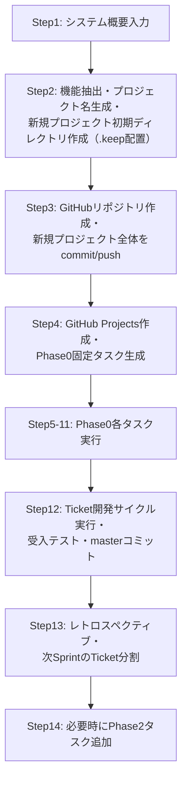

1. ユーザが UI でシステム概要を箇条書き・メモ形式で入力する
2. Musuhi が機能・構成要素を抽出し、プロジェクト名生成、新規プロジェクトの初期ディレクトリを作成する（空ディレクトリには `.keep` 配置）
3. Musuhi が GitHub に新規リポジトリを作成し、不明項目はユーザへ問い合わせた上で、新規プロジェクト全体を commit / push する
4. Musuhi が GitHub Projects を作成し、Phase 0 固定タスクを生成する
5. TK0-1-1〜TK0-4-2 を順次実行し、タスク完了ごとに `新規プロジェクト/_document/000.進捗状況` へ進捗ファイルを出力して commit / push する
6. TK1-1-1 以降は Ticket 開発サイクルを実行し、受入テスト・master ブランチコミットまで完了する
7. レトロスペクティブを実施し、結果を保存して次 Sprint の Ticket 分割へ反映する
8. 必要時は Phase 2（リリース・運用）タスクを追加して実施する

### 4.2 UC-02 既存プロジェクト拡張

1. 拡張要件入力と現行コンテキスト収集
2. 影響範囲分析と改修案生成
3. 改修実施（必要時は aider 連携）
4. テスト実行と結果確認
5. 進捗更新と次タスク調整

### 4.3 UC-03 障害対応

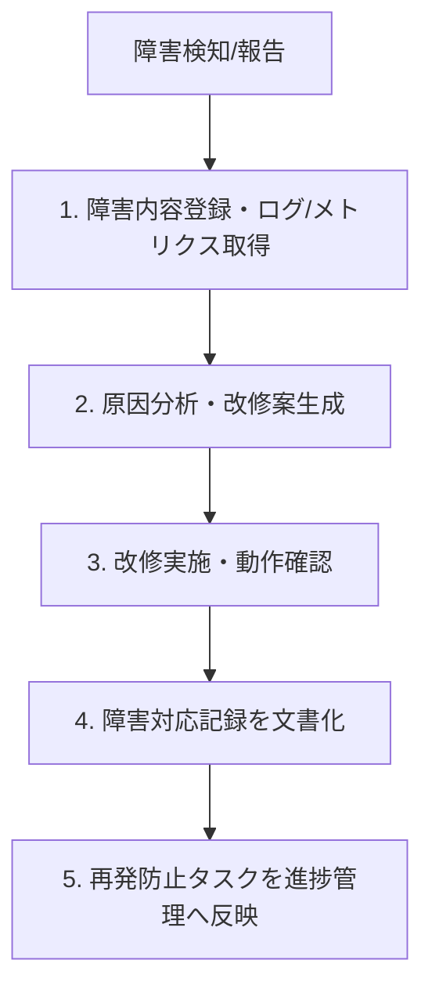

1. 障害内容登録と関連ログ/メトリクス取得
2. 原因分析と改修案生成
3. 改修実施と動作確認
4. 障害対応記録の文書化
5. 再発防止タスクを進捗管理へ反映

### 4.4 UC-04 レガシーシステムの改修・改善

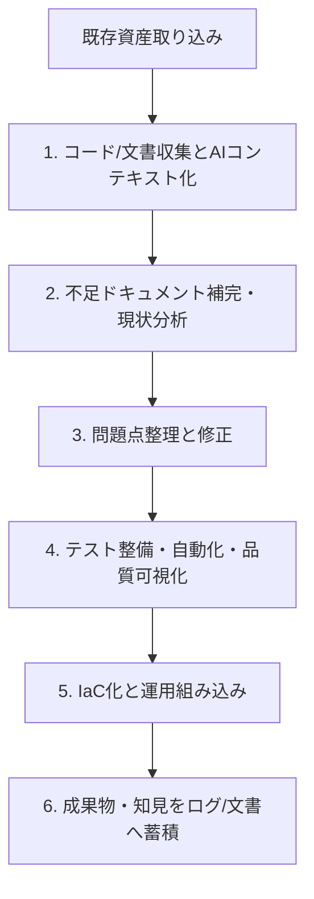

1. 対象コード/文書を収集し AI コンテキストへ追加
2. 不足ドキュメント補完と現状分析
3. 仕様/実装の問題点整理と修正
4. テスト整備・自動化・品質可視化
5. インフラ IaC 化と運用へ組み込み
6. 成果物と知見をログ/文書へ蓄積

## 5. 機能一覧

対象: **Version 1.0.0（UC-01 新規プロジェクト開発）**

> Version 2.0.0 以降（UC-02〜UC-04）の機能は [2.1 バージョンスコープ定義](#21-バージョンスコープ定義) に従い将来バージョンで対応する。

| 要件ID | 機能名 | 対応Step | 優先度 | 概要 |
| --- | --- | --- | --- | --- |
| FR-001 | システム概要入力・保存機能 | Step1 | Must | UI でシステム概要を箇条書き・メモ形式で入力し保存する |
| FR-002 | 機能抽出・プロジェクト名生成・初期ディレクトリ作成機能 | Step2 | Must | 入力内容から機能・構成要素を抽出し、プロジェクト名を生成、初期ディレクトリ構造を作成する（空ディレクトリに `.keep` 配置） |
| FR-003 | GitHubリポジトリ作成・commit/push機能 | Step3 | Must | GitHub に新規リポジトリを作成し、不明項目はユーザへ問い合わせた上で新規プロジェクト全体を commit/push する |
| FR-004 | GitHub Projects作成・Phase0タスク生成機能 | Step4 | Must | 新規プロジェクト配下に GitHub Projects を作成し、Phase0 の固定タスクを生成する |
| FR-005 | 提案・要求仕様書自動生成機能 | Step5（TK0-1-1） | Must | 入力内容をもとに提案・要求仕様書を自動生成し、リファクタリングを繰り返す。完了後に進捗ファイルを出力して commit/push する |
| FR-006 | ドキュメントユーザレビュー・承認機能 | Step6（TK0-1-2） Step8（TK0-2-2） | Must | Musuhi とユーザがドキュメントをレビューし、リファクタリングとユーザレビューを繰り返す。修正・指摘項目がなくなれば承認完了とする |
| FR-007 | 要件定義書自動生成機能 | Step7（TK0-2-1） | Must | 承認済み提案・要求仕様書をもとに要件定義書を自動生成し、リファクタリングを繰り返す |
| FR-008 | タスク分割・GitHub Projects登録機能 | Step9（TK0-3-1） | Must | Phase 分割・Sprint 分割・Ticket 分割を行い GitHub Projects へ登録する |
| FR-009 | 開発規約自動生成機能 | Step10（TK0-4-1） | Must | プロジェクトに合わせた開発規約を自動生成する |
| FR-010 | tools準備機能 | Step11（TK0-4-2） | Must | 新規プロジェクトで必要な `Musuhi/tools` 配下のツールを `新規プロジェクト/tools` 配下にコピーする |
| FR-011 | Ticket開発サイクル実行機能 | Step12 | Must | TK1-1-1 から受入テスト・master ブランチコミットまでを実施する。各 Ticket で設計・実装・単体テスト・内部結合テスト・外部結合テストをリファクタリングを挟みながら完結させる |
| FR-012 | レトロスペクティブ・次Sprint計画機能 | Step13 | Must | レトロスペクティブを実施し結果を保存する。次 Sprint の Ticket 分割とタスク登録を実施する |
| FR-013 | リリース・運用タスク管理機能 | Step14 | Should | 必要時に Phase2（リリース・運用）タスク（IaC生成・起動停止手順・エンドユーザドキュメント）を追加・実施する |

## 6. 機能詳細

### 6.1 FR-001 システム概要入力・保存機能

**概要:** UI でシステム概要を箇条書き・メモ形式で入力・編集し、Musuhi 内に保存する

**入力項目:**

| 項目名 | 種別 | 必須 | 最大長 | 備考 |
| --- | --- | --- | --- | --- |
| システム概要テキスト | テキスト | ○ | 4096文字 | 箇条書き・メモ形式で自由入力 |

**出力項目:**

| 項目名 | 種別 | 備考 |
| --- | --- | --- |
| 概要ID | UUID | 自動採番 |
| 保存済みテキスト | テキスト | FR-002 の入力として利用 |
| 保存日時 | Timestamp | JST（ローカル時刻） |

**正常系フロー:**

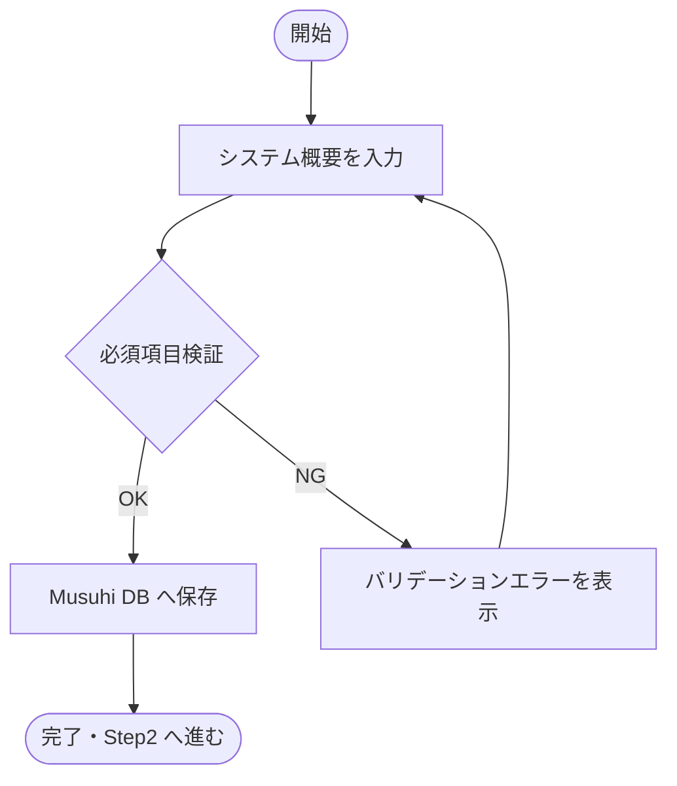

**例外系:**
- 入力が空: バリデーションエラーを表示

**関連:** 画面: SCR-001 / API: POST /system-overviews, GET /system-overviews/{id}

---

### 6.2 FR-002 機能抽出・プロジェクト名生成・初期ディレクトリ作成機能

**概要:** 保存済みシステム概要から機能・構成要素を AI で抽出し、プロジェクト名候補を生成、ローカルに初期ディレクトリ構造を作成する

**入力項目:**

| 項目名 | 種別 | 必須 | 備考 |
| --- | --- | --- | --- |
| 概要ID | UUID | ○ | FR-001 で保存済み |
| ローカル作成先パス | 文字列 | ○ | `Musuhi` ディレクトリと同階層 |
| 初期構造テンプレート | Enum | ○ | Musuhi 標準テンプレート固定 |

**出力項目:**

| 項目名 | 種別 | 備考 |
| --- | --- | --- |
| 機能リスト | リスト | AI 抽出結果 |
| プロジェクト名候補 | リスト | AI が複数候補を提案 |
| 確定プロジェクト名 | 文字列 | ユーザ選択または提案名を自動採用 |
| 初期ディレクトリ作成状態 | Enum | pending / success / failed |

**正常系フロー:**

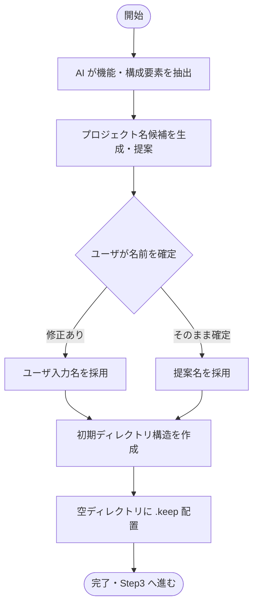

**例外系:**
- ローカルパス不正: エラー表示
- ディレクトリ作成失敗: 失敗対象を表示し再実行を提供

**関連:** 画面: SCR-002 / API: POST /projects/extract-features, POST /projects/suggest-name, POST /projects/init-directory

---

### 6.3 FR-003 GitHubリポジトリ作成・commit/push機能

**概要:** GitHub に新規リポジトリを作成し、不明項目はユーザへ問い合わせた上で新規プロジェクト全体を commit/push する

**入力項目:**

| 項目名 | 種別 | 必須 | 最大長 | 備考 |
| --- | --- | --- | --- | --- |
| 外部組織・所有者 | 文字列 | ○ | 128文字 | GitHub の owner（ユーザまたは組織） |
| リポジトリ公開設定 | Enum | ○ | — | public / private |
| コミットメッセージ | 文字列 | ○ | 256文字 | 初回 commit メッセージ |

**出力項目:**

| 項目名 | 種別 | 備考 |
| --- | --- | --- |
| リポジトリURL | URL | GitHub 上の参照先 |
| 外部プロジェクトID | 文字列 | GitHub リポジトリID |
| commit/push状態 | Enum | pending / success / failed |

**正常系フロー:**

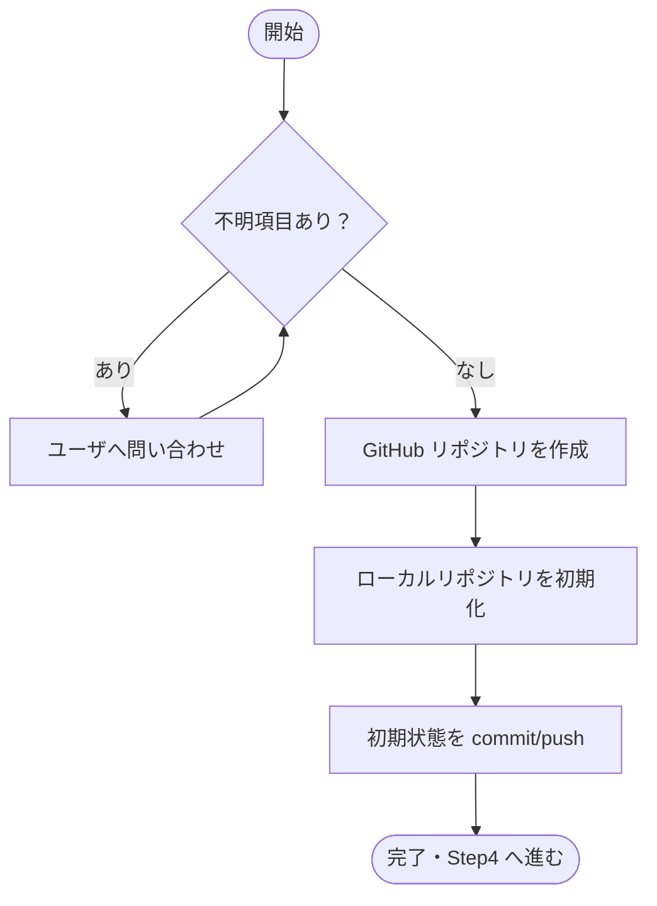

**例外系:**
- GitHub 認証失敗: 認証エラーを表示
- リポジトリ名重複: 重複エラーを表示
- commit/push 失敗: リトライキューへ登録し状態を `failed` で表示

**関連:** 画面: SCR-003 / API: POST /projects/with-external, POST /projects/{id}/external-setup

---

### 6.4 FR-004 GitHub Projects作成・Phase0タスク生成機能

**概要:** 新規プロジェクトに紐づく GitHub Projects を作成し、Phase0 の固定タスクを自動生成・登録する

**入力項目:**

| 項目名 | 種別 | 必須 | 備考 |
| --- | --- | --- | --- |
| プロジェクトID | UUID | ○ | FR-002 で生成済み |
| リポジトリURL | URL | ○ | FR-003 で取得済み |

**出力項目:**

| 項目名 | 種別 | 備考 |
| --- | --- | --- |
| GitHub Projects URL | URL | 作成された Projects ボード |
| 生成タスク一覧 | リスト | TK0-1-1〜TK0-4-2 の固定タスク |
| タスク登録状態 | Enum | pending / success / failed |

**正常系フロー:**

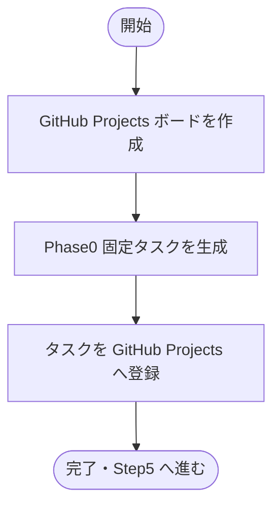

**例外系:**
- Projects 作成失敗: エラー表示とリトライ提供
- タスク登録失敗: 失敗タスクを表示し個別再実行を提供

**関連:** 画面: SCR-004 / API: POST /projects/{id}/github-projects, POST /projects/{id}/phase0-tasks

---

### 6.5 FR-005 提案・要求仕様書自動生成機能

**概要:** 保存済みシステム概要・機能リストをもとに提案・要求仕様書を AI で自動生成し、リファクタリングを繰り返す。完了後に進捗ファイルを出力して commit/push する（TK0-1-1）

**入力項目:**

| 項目名 | 種別 | 必須 | 備考 |
| --- | --- | --- | --- |
| 概要ID | UUID | ○ | FR-001 で保存済み |
| 機能リスト | リスト | ○ | FR-002 で抽出済み |

**出力項目:**

| 項目名 | 種別 | 備考 |
| --- | --- | --- |
| 提案・要求仕様書 | Markdown | `_document/001.提案・要求仕様フェーズ/` 配下に出力 |
| 進捗ファイル | Markdown | `_document/000.進捗状況/` 配下に出力 |
| commit/push状態 | Enum | pending / success / failed |

**正常系フロー:**

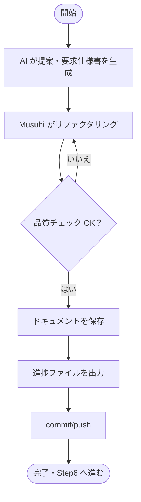

**例外系:**
- 生成失敗: エラーログを表示し再実行を促す
- commit/push 失敗: リトライキューへ登録

**関連:** 画面: SCR-005 / API: POST /documents/generate-proposal, POST /projects/{id}/progress-file

---

### 6.6 FR-006 ドキュメントユーザレビュー・承認機能

**概要:** Musuhi とユーザがドキュメントをレビューし、リファクタリングとユーザレビューを繰り返す。修正・指摘項目がなくなれば承認完了とする（TK0-1-2 / TK0-2-2）

**入力項目:**

| 項目名 | 種別 | 必須 | 備考 |
| --- | --- | --- | --- |
| 文書ID | UUID | ○ | レビュー対象ドキュメント |
| レビューコメント | テキスト | — | ユーザの指摘・修正依頼 |
| 承認操作 | Boolean | — | 指摘なしで承認する場合 |

**出力項目:**

| 項目名 | 種別 | 備考 |
| --- | --- | --- |
| 文書要約 | テキスト | レビュー用の要点表示 |
| 修正履歴 | リスト | 更新日時・変更内容 |
| 承認状態 | Enum | draft / in_review / approved |

**正常系フロー:**

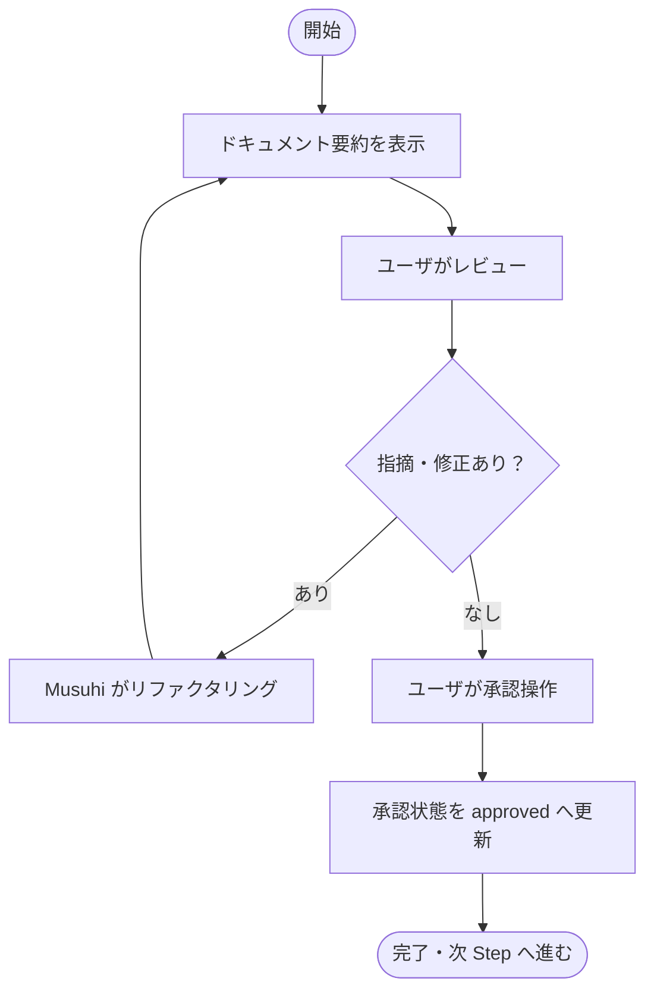

**例外系:**
- リファクタリング回数上限（10回）超過時にユーザへアラート

**関連:** 画面: SCR-006 / API: GET /documents/{id}/summary, PUT /documents/{id}, POST /documents/{id}/approve

---

### 6.7 FR-007 要件定義書自動生成機能

**概要:** 承認済み提案・要求仕様書をもとに要件定義書を AI で自動生成し、リファクタリングを繰り返す（TK0-2-1）

**入力項目:**

| 項目名 | 種別 | 必須 | 備考 |
| --- | --- | --- | --- |
| 提案・要求仕様書ID | UUID | ○ | FR-006 で承認済み |

**出力項目:**

| 項目名 | 種別 | 備考 |
| --- | --- | --- |
| 要件定義書 | Markdown | `_document/002.要件定義フェーズ/` 配下に出力 |
| 進捗ファイル | Markdown | `_document/000.進捗状況/` 配下に更新 |

**正常系フロー:**

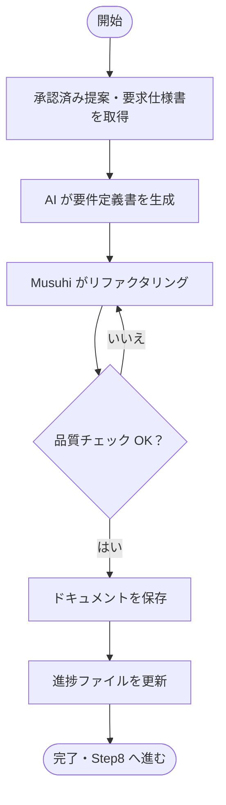

**例外系:**
- 承認済みドキュメント未存在: エラー表示

**関連:** 画面: SCR-005 / API: POST /documents/generate-requirements, POST /projects/{id}/progress-file

---

### 6.8 FR-008 タスク分割・GitHub Projects登録機能

**概要:** 承認済み要件定義書をもとに Phase/Sprint/Ticket 分割を行い、GitHub Projects へ登録する（TK0-3-1）

**入力項目:**

| 項目名 | 種別 | 必須 | 備考 |
| --- | --- | --- | --- |
| 要件定義書ID | UUID | ○ | FR-006 で承認済み |
| Phase数 | 数値 | ○ | |
| Sprint数 / Phase | 数値 | ○ | |

**出力項目:**

| 項目名 | 種別 | 備考 |
| --- | --- | --- |
| Phase/Sprint/Ticket一覧 | リスト | 階層構造で表示 |
| GitHub Projects 登録状態 | Enum | pending / success / failed |

**正常系フロー:**

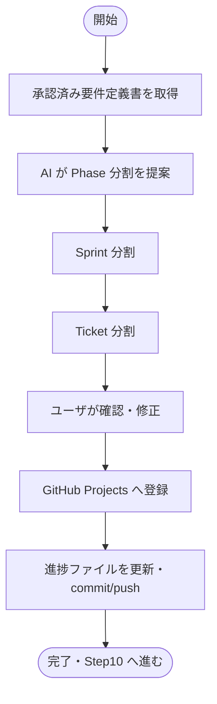

**例外系:**
- Projects 登録失敗: 失敗 Ticket を表示し個別再登録を提供

**関連:** 画面: SCR-008 / API: POST /projects/{id}/task-breakdown, POST /projects/{id}/register-tasks

---

### 6.9 FR-009 開発規約自動生成機能

**概要:** プロジェクトの技術スタック・構成に合わせた開発規約を AI で自動生成する（TK0-4-1）

**入力項目:**

| 項目名 | 種別 | 必須 | 備考 |
| --- | --- | --- | --- |
| プロジェクトID | UUID | ○ | |
| 使用技術スタック | リスト | ○ | 言語・フレームワーク・インフラ等 |

**出力項目:**

| 項目名 | 種別 | 備考 |
| --- | --- | --- |
| 開発規約文書 | Markdown | `_document/003.設計・開発・テストフェーズ/001.開発規約/` 配下に出力 |

**正常系フロー:**

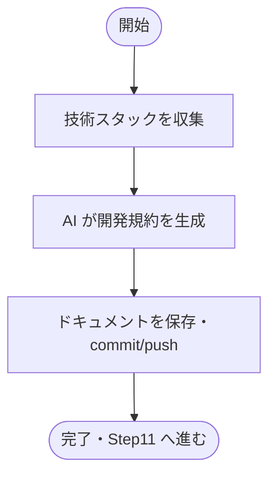

**例外系:**
- 技術スタック未入力: バリデーションエラー

**関連:** 画面: SCR-009 / API: POST /documents/generate-conventions

---

### 6.10 FR-010 tools準備機能

**概要:** 新規プロジェクトで必要な `Musuhi/tools` 配下のツールを `新規プロジェクト/tools` 配下にコピーする（TK0-4-2）

**入力項目:**

| 項目名 | 種別 | 必須 | 備考 |
| --- | --- | --- | --- |
| プロジェクトID | UUID | ○ | |
| コピー対象ツール | 複数選択 | ○ | save_promptinglog 等 |

**出力項目:**

| 項目名 | 種別 | 備考 |
| --- | --- | --- |
| コピー済みツール一覧 | リスト | コピー先パスを含む |
| コピー状態 | Enum | pending / success / failed |

**正常系フロー:**

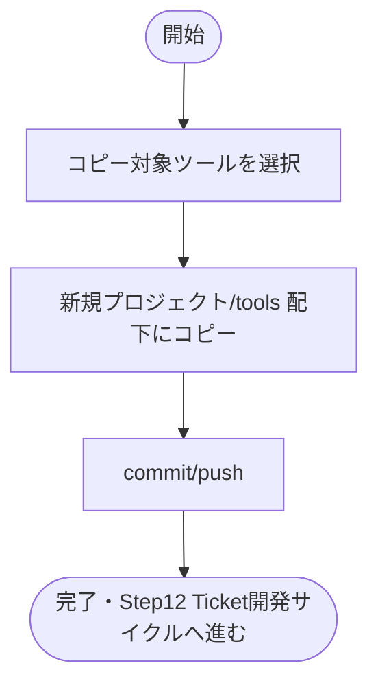

**例外系:**
- ファイルコピー失敗: 失敗ファイルを表示し再実行を提供

**関連:** 画面: SCR-009 / API: POST /projects/{id}/tools-setup

---

### 6.11 FR-011 Ticket開発サイクル実行機能

**概要:** TK1-1-1 から受入テスト・master ブランチコミットまでを実施する。各 Ticket で設計・実装・単体テスト・内部結合テストをリファクタリングを挟みながら完結させる（Step12）

**入力項目:**

| 項目名 | 種別 | 必須 | 備考 |
| --- | --- | --- | --- |
| Ticket情報 | オブジェクト | ○ | Ticket ID・タイトル・受入条件 |
| 対象リポジトリ | URL / パス | ○ | |

**出力項目:**

| 項目名 | 種別 | 備考 |
| --- | --- | --- |
| 実装差分 (Diff) | テキスト | unified diff 形式 |
| テスト結果 | テキスト | 単体テスト・内部結合テスト結果 |
| commit/push ログ | テキスト | |
| Ticket完了状態 | Enum | in_progress / done |

**正常系フロー:**

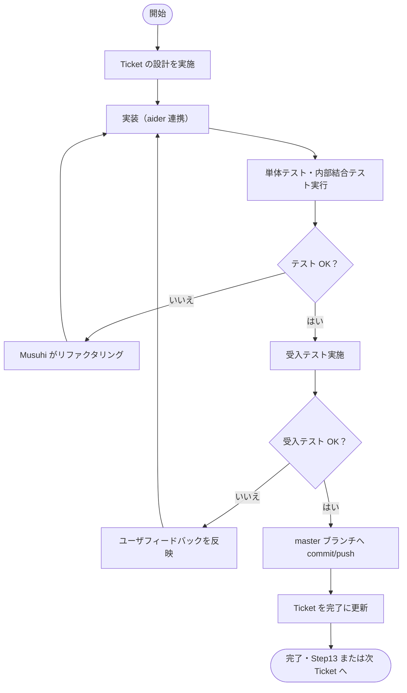

**例外系:**
- テスト失敗が継続する場合: ユーザへアラートし手動対応を促す
- aider 実行エラー: エラーログを表示し再実行を促す

**関連:** 画面: SCR-011 / API: POST /tickets/{id}/start-cycle, POST /tasks/aider, POST /tickets/{id}/complete

---

### 6.12 FR-012 レトロスペクティブ・次Sprint計画機能

**概要:** Sprint 完了後にレトロスペクティブを実施して結果を保存し、次 Sprint の Ticket 分割とタスク登録を実施する（Step13）

**入力項目:**

| 項目名 | 種別 | 必須 | 備考 |
| --- | --- | --- | --- |
| Sprint ID | UUID | ○ | 完了 Sprint |
| 振り返り内容 | テキスト | ○ | KPT 等 |

**出力項目:**

| 項目名 | 種別 | 備考 |
| --- | --- | --- |
| レトロスペクティブ記録 | Markdown | `_document/000.進捗状況/` 配下に出力 |
| 次 Sprint Ticket一覧 | リスト | GitHub Projects へ登録 |

**正常系フロー:**

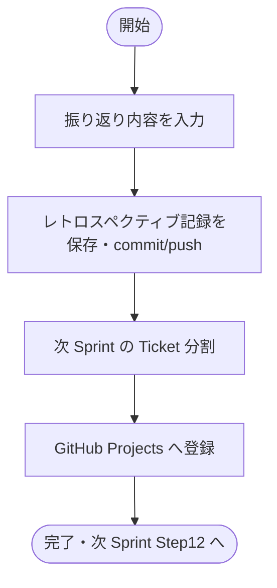

**例外系:**
- 振り返り未入力: バリデーションエラー

**関連:** 画面: SCR-012 / API: POST /sprints/{id}/retrospective, POST /sprints/{id}/next-tickets

---

### 6.13 FR-013 リリース・運用タスク管理機能

**概要:** 必要時に Phase2（リリース・運用）タスク（IaC生成・起動停止手順・エンドユーザドキュメント）を追加・実施する（Step14）

**入力項目:**

| 項目名 | 種別 | 必須 | 備考 |
| --- | --- | --- | --- |
| プロジェクトID | UUID | ○ | |
| 追加タスク種別 | 複数選択 | ○ | IaC生成 / 起動停止手順 / エンドユーザドキュメント |

**出力項目:**

| 項目名 | 種別 | 備考 |
| --- | --- | --- |
| IaC テンプレート | YAML / HCL | Docker Compose / Terraform 等 |
| 起動停止手順書 | Markdown | |
| エンドユーザドキュメント | Markdown | |

**正常系フロー:**

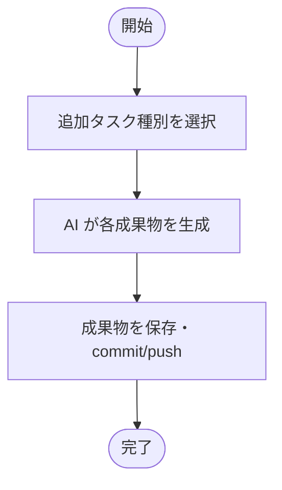

**例外系:**
- 生成失敗: エラーログを表示し再実行を促す

**関連:** 画面: SCR-013 / API: POST /projects/{id}/release-tasks

## 7. 画面一覧

| 画面ID | 画面名 | 関連FR | 概要 |
| --- | --- | --- | --- |
| SCR-001 | システム概要入力 | FR-001 | システム概要テキストの入力・編集・保存フォーム |
| SCR-002 | 機能抽出・プロジェクト名確認 | FR-002 | AI 抽出機能リストとプロジェクト名候補の確認・確定 |
| SCR-003 | GitHub連携設定 | FR-003 | リポジトリ作成設定・commit/push 状態表示 |
| SCR-004 | GitHub Projects確認 | FR-004 | Projects ボード作成確認・Phase0 タスク一覧表示 |
| SCR-005 | ドキュメント生成・確認 | FR-005, FR-007 | 自動生成ドキュメントのプレビューとcommit/push 操作 |
| SCR-006 | ドキュメントレビュー・承認 | FR-006 | ドキュメント要約表示・コメント入力・承認操作 |
| SCR-008 | タスク分割確認・登録 | FR-008 | Phase/Sprint/Ticket 一覧の確認・修正・GitHub Projects 登録 |
| SCR-009 | 開発規約・tools準備 | FR-009, FR-010 | 開発規約生成確認・ツールコピー選択 |
| SCR-011 | Ticket開発サイクル | FR-011 | Ticket 実行・差分表示・テスト結果・受入テスト操作 |
| SCR-012 | レトロスペクティブ・次Sprint計画 | FR-012 | 振り返り入力・次 Sprint Ticket 確認 |
| SCR-013 | リリース・運用タスク管理 | FR-013 | Phase2 タスク選択・生成成果物確認 |

## 8. API エンドポイント一覧

| HTTP メソッド | パス | 機能 | 関連FR |
| --- | --- | --- | --- |
| POST | /system-overviews | システム概要を保存 | FR-001 |
| GET | /system-overviews/{id} | システム概要を取得 | FR-001 |
| POST | /projects/extract-features | システム概要から機能抽出 | FR-002 |
| POST | /projects/suggest-name | プロジェクト名候補を生成 | FR-002 |
| POST | /projects/init-directory | 初期ディレクトリ構造を作成 | FR-002 |
| POST | /projects/with-external | GitHub リポジトリを作成・commit/push | FR-003 |
| POST | /projects/{id}/external-setup | 外部側の初期構造を作成 | FR-003 |
| POST | /projects/{id}/github-projects | GitHub Projects ボードを作成 | FR-004 |
| POST | /projects/{id}/phase0-tasks | Phase0 固定タスクを生成・登録 | FR-004 |
| POST | /documents/generate-proposal | 提案・要求仕様書を生成 | FR-005 |
| POST | /projects/{id}/progress-file | 進捗ファイルを出力・commit/push | FR-005, FR-007 |
| GET | /documents/{id}/summary | 文書要約を取得 | FR-006 |
| PUT | /documents/{id} | 文書を更新（リファクタリング） | FR-006 |
| POST | /documents/{id}/approve | 文書を承認 | FR-006 |
| POST | /documents/generate-requirements | 要件定義書を生成 | FR-007 |
| POST | /projects/{id}/task-breakdown | Phase/Sprint/Ticket 分割を実施 | FR-008 |
| POST | /projects/{id}/register-tasks | タスクを GitHub Projects へ登録 | FR-008 |
| POST | /documents/generate-conventions | 開発規約を生成 | FR-009 |
| POST | /projects/{id}/tools-setup | tools を新規プロジェクトへコピー | FR-010 |
| POST | /tickets/{id}/start-cycle | Ticket 開発サイクルを開始 | FR-011 |
| POST | /tasks/aider | aider 連携で実装差分を生成 | FR-011 |
| POST | /tickets/{id}/complete | Ticket を完了に更新 | FR-011 |
| POST | /sprints/{id}/retrospective | レトロスペクティブを記録 | FR-012 |
| POST | /sprints/{id}/next-tickets | 次 Sprint Ticket を分割・登録 | FR-012 |
| POST | /projects/{id}/release-tasks | Phase2 リリース・運用タスクを追加 | FR-013 |

## 9. 要件変更管理

- 要件変更は [003-10.変更管理ルール](../../001.提案・要求仕様フェーズ/003.要求仕様共通/003-10.変更管理ルール.md) に従い Issue 起票・承認後に反映する
- FR の追加・変更時は本書・トレーサビリティ表を同時更新する

## 10. 更新履歴

| 日付 | 版 | 変更内容 | 作成者 |
| --- | --- | --- | --- || 2026-05-05 | 1.3 | UC-02フロー図のFR参照をFR-004→FR-011に修正 | Copilot || 2026-05-05 | 1.2 | 機能詳細（Section6）をFR-001〜FR-013で全面書き換え、画面一覧・API一覧も整合更新 | Copilot |
| 2026-05-05 | 1.1 | 機能一覧をVersion 1.0.0（UC-01）のStepベースで再定義（FR-001〜FR-013） | Copilot |
| 2026-05-04 | 1.0 | Version1.0.0〜4.0.0のユースケース対応スコープを追加（開発対象はVersion1.0.0/UC-01） | Copilot |
| 2026-05-02 | 0.9 | 「新規プロジェクト作成」を「新規プロジェクト開発」へ名称変更 | Copilot |
| 2026-05-02 | 0.8 | UC-01 を「新規プロジェクト開発」へ名称統一し、標準ワークフロー（UC-01〜UC-04）にフロー図を追加 | Copilot |
| 2026-05-02 | 0.7 | ユースケース・標準ワークフローを新設し、機能一覧をワークフロー紐付け付きへ再編 | Copilot |
| 2026-05-02 | 0.6 | FR-001 を外部初期構造作成へ修正し、承認完了時の外部本文保存を FR-003 へ移管 | Copilot |
| 2026-05-02 | 0.5 | FR-001 に外部プロジェクト同時作成と初期ドキュメント保存を追加 | Copilot |
| 2026-05-01 | 0.1 | 初版作成（FR-001〜FR-008 詳細化） | Copilot |
| 2026-05-01 | 0.4 | FR-001 プロジェクト名をAI自動提案・開始日をシステム日付自動入力に変更 | Copilot |
| 2026-05-01 | 0.3 | Timestamp の時刻表記を UTC からローカル時刻（JST）に変更 | Copilot |
| 2026-05-01 | 0.2 | 文書要約・承認・外部同期状態の要件を追記 | Copilot |
