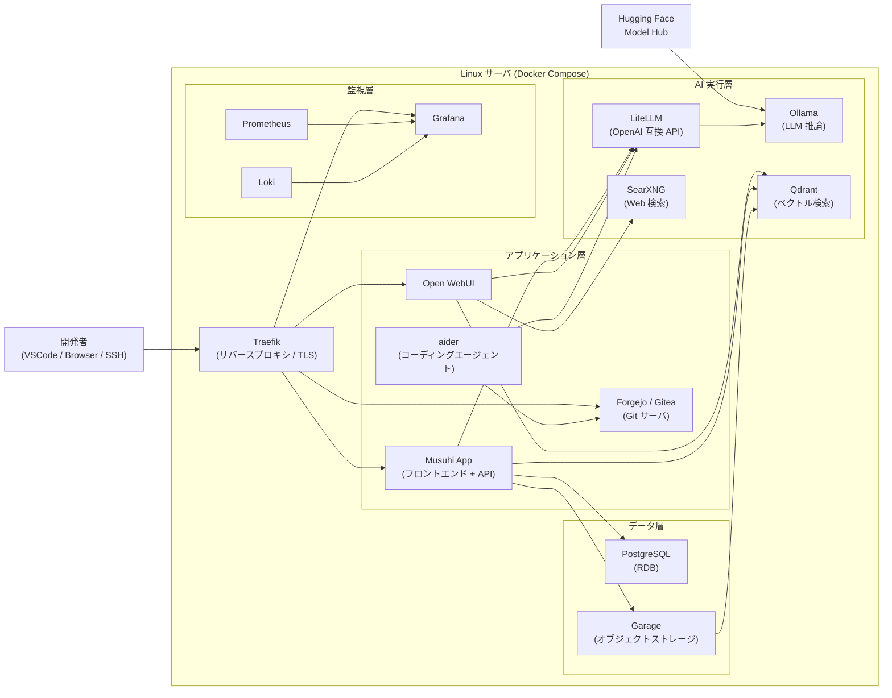
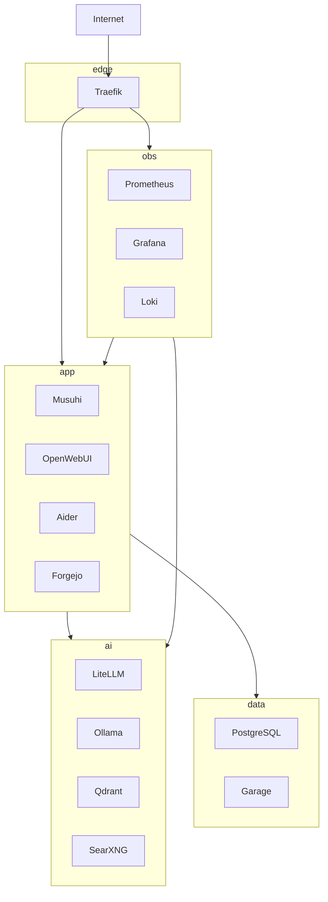

# システム構成定義書

[前: 001-02.非機能要件定義書.md](001-02.非機能要件定義書.md) | [一覧](../README.md) | [次: 001-04.インターフェース定義書.md](001-04.インターフェース定義書.md)

<details>
<summary>目次（クリックで展開）</summary>

- [1. 目的](#1-目的)
- [2. 全体アーキテクチャ](#2-全体アーキテクチャ)
- [3. コンポーネント構成](#3-コンポーネント構成)
  - [3.1 アプリケーション層](#31-アプリケーション層)
  - [3.2 AI 実行層](#32-ai-実行層)
  - [3.3 データ層](#33-データ層)
  - [3.4 監視層](#34-監視層)
- [4. ネットワーク設計](#4-ネットワーク設計)
- [5. コンテナ構成](#5-コンテナ構成)
- [6. ディレクトリ構成](#6-ディレクトリ構成)
- [7. 環境別構成](#7-環境別構成)
- [8. セキュリティ設計](#8-セキュリティ設計)
- [9. 参照ドキュメント](#9-参照ドキュメント)
- [10. 更新履歴](#10-更新履歴)

</details>

## 1. 目的

本ドキュメントは、Musuhi のシステム構成を詳細定義し、設計・実装・インフラ整備の基準とする。
提案フェーズの [002-00.ローカルバイブコーディング環境インフラ案](../../001.提案・要求仕様フェーズ/002.インフラ構成案/002-00.ローカルバイブコーディング環境インフラ案.md) を要件定義レベルで詳細化する。

## 2. 全体アーキテクチャ



## 3. コンポーネント構成

### 3.1 アプリケーション層

| コンポーネント | 役割 | 技術スタック | 備考 |
| --- | --- | --- | --- |
| Musuhi フロントエンド | UI 提供 | SvelteKit / TypeScript | |
| Musuhi API | ビジネスロジック・データ管理 | Go (net/http) | RESTful API |
| Open WebUI | AI チャット UI / ワークフロー | Open WebUI (OSS) | |
| aider | コーディングエージェント | Python / aider (OSS) | |
| Forgejo / Gitea | Git サーバ・Issue 管理 | Forgejo (OSS) | |

### 3.2 AI 実行層

| コンポーネント | 役割 | 技術スタック | 備考 |
| --- | --- | --- | --- |
| LiteLLM | OpenAI 互換 API ゲートウェイ | LiteLLM (OSS) | モデル抽象化 |
| Ollama | LLM ローカル推論 | Ollama (OSS) | GPU 利用 |
| Qdrant | ベクトル検索 / RAG | Qdrant (OSS) | |
| SearXNG | Web 検索メタエンジン | SearXNG (OSS) | |

### 3.3 データ層

| コンポーネント | 役割 | 技術スタック | 備考 |
| --- | --- | --- | --- |
| PostgreSQL | 構造化データ永続化 | PostgreSQL 16+ | プロジェクト・ログ・文書管理 |
| Garage | オブジェクトストレージ | Garage (S3 互換 OSS) | 成果物・プロンプトログ |

### 3.4 監視層

| コンポーネント | 役割 | 技術スタック | 備考 |
| --- | --- | --- | --- |
| Prometheus | メトリクス収集 | Prometheus (OSS) | |
| Grafana | ダッシュボード可視化 | Grafana (OSS) | |
| Loki | ログ集約 | Loki (OSS) | |

## 4. ネットワーク設計

Docker Compose 内のネットワークを以下に分割し、責務を分離する。

| ネットワーク名 | 役割 | 参加コンテナ |
| --- | --- | --- |
| edge | 外部入口（Traefik 公開） | Traefik |
| app | 業務系サービス | Musuhi、Open WebUI、aider、Forgejo |
| ai | AI 推論系サービス | LiteLLM、Ollama、Qdrant、SearXNG |
| data | データ永続化系サービス | PostgreSQL、Garage |
| obs | 監視系サービス | Prometheus、Grafana、Loki |



## 5. コンテナ構成

| サービス名 | イメージ | CPU | メモリ | ポート | ボリューム |
| --- | --- | --- | --- | --- | --- |
| musuhi-app | musuhi:latest | 0.5 core | 512MB | 3000 (frontend) | — |
| musuhi-api | musuhi-api:latest | 0.5 core | 256MB | 8080 | — |
| open-webui | ghcr.io/open-webui/open-webui | 0.5 core | 512MB | 8080 | open-webui-data |
| aider | aider:latest | 0.25 core | 256MB | — | workspace |
| forgejo | codeberg.org/forgejo/forgejo | 0.5 core | 512MB | 3000, 22 | forgejo-data |
| litellm | ghcr.io/berriai/litellm | 0.25 core | 256MB | 4000 | litellm-config |
| ollama | ollama/ollama | 2+ core (GPU) | 8GB+ | 11434 | ollama-models |
| qdrant | qdrant/qdrant | 0.5 core | 1GB | 6333, 6334 | qdrant-data |
| searxng | searxng/searxng | 0.25 core | 256MB | 8080 | searxng-config |
| postgres | postgres:16 | 0.5 core | 1GB | 5432 | postgres-data |
| garage | dxflrs/garage | 0.25 core | 256MB | 3900, 3902 | garage-data |
| traefik | traefik:v3 | 0.25 core | 128MB | 80, 443 | traefik-config |
| prometheus | prom/prometheus | 0.25 core | 256MB | 9090 | prometheus-data |
| grafana | grafana/grafana | 0.25 core | 256MB | 3000 | grafana-data |
| loki | grafana/loki | 0.25 core | 256MB | 3100 | loki-data |

## 6. ディレクトリ構成

> **注記（将来構成案）**: 下記の `_compose/` および `services/` は将来構成案であり、現時点ではリポジトリに未作成です。

```
Musuhi/
├── _document/                     # ドキュメント群
├── _compose/                      # Docker Compose 構成（将来構成案）
│   ├── docker-compose.yml
│   ├── docker-compose.override.yml  # ローカル開発用
│   └── .env.example               # Compose向け環境変数テンプレート
├── services/                      # サービス実装群（Dockerfile・設定・ソース）（将来構成案）
│   ├── musuhi-frontend/
│   │   ├── Dockerfile
│   │   ├── config/
│   │   └── src/
│   ├── musuhi-api/
│   │   ├── Dockerfile
│   │   ├── config/
│   │   └── src/
│   ├── open-webui/
│   │   ├── Dockerfile
│   │   └── config/
│   └── litellm/
│       ├── Dockerfile
│       └── config/
├── tools/                         # 補助スクリプト
└── README.md
```

## 7. 環境別構成

| 環境 | 目的 | 構成 | 備考 |
| --- | --- | --- | --- |
| ローカル開発 | 開発・デバッグ | docker-compose.override.yml | ホットリロード有効 |
| ステージング | 受け入れテスト | docker-compose.yml | Phase 0 完了条件の検証 |
| 本番（将来） | 運用 | docker-compose.yml / Kubernetes | Phase 2 以降 |

## 8. セキュリティ設計

- Traefik で TLS を終端し、内部通信は HTTP とする
- 管理系エンドポイントは認証ミドルウェアで保護する
- `.env` ファイルへの機密情報の平文保存を禁止し、Docker Secret を利用する
- Trivy による CI でのコンテナ脆弱性スキャンを必須とする
- 入力バリデーションはすべての API エンドポイントで実施する（OWASP Top 10 準拠）

## 9. 参照ドキュメント

- [002-00.ローカルバイブコーディング環境インフラ案](../../001.提案・要求仕様フェーズ/002.インフラ構成案/002-00.ローカルバイブコーディング環境インフラ案.md)
- [001-02.非機能要件定義書](001-02.非機能要件定義書.md)
- [001-04.インターフェース定義書](001-04.インターフェース定義書.md)

## 10. 更新履歴

| 日付 | 版 | 変更内容 | 作成者 |
| --- | --- | --- | --- |
| 2026-05-02 | 0.4 | 6章のディレクトリ構成に将来構成案注記を追加 | Copilot |
| 2026-05-02 | 0.3 | .env.example の配置方針を _compose 配下に変更 | Copilot |
| 2026-05-02 | 0.2 | 6章のディレクトリ構成に services 配下を明記。参照ドキュメント番号を現行に更新 | Copilot |
| 2026-05-01 | 0.1 | 初版作成（002-00 インフラ案を詳細化） | Copilot |
