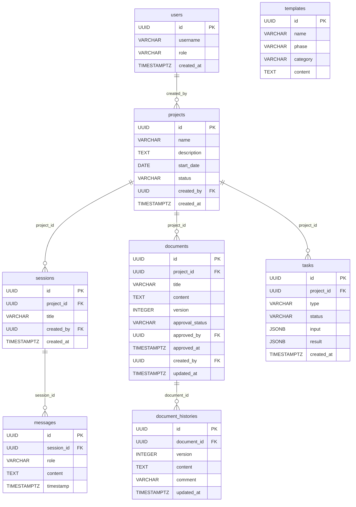

# データ定義書

[前: 001-04.インターフェース定義書.md](001-04.インターフェース定義書.md) | [一覧](../README.md) | [次: 001-06.画面遷移定義書.md](001-06.画面遷移定義書.md)

<details>
<summary>目次（クリックで展開）</summary>

- [1. 目的](#1-目的)
- [2. データ管理方針](#2-データ管理方針)
- [3. エンティティ一覧](#3-エンティティ一覧)
- [4. テーブル定義](#4-テーブル定義)
  - [4.1 projects（プロジェクト）](#41-projectsプロジェクト)
  - [4.2 sessions（プロンプトセッション）](#42-sessionsプロンプトセッション)
  - [4.3 messages（プロンプトメッセージ）](#43-messagesプロンプトメッセージ)
  - [4.4 documents（文書）](#44-documents文書)
  - [4.5 document_histories（文書履歴）](#45-document_histories文書履歴)
  - [4.6 tasks（タスク）](#46-tasksタスク)
  - [4.7 templates（テンプレート）](#47-templatesテンプレート)
  - [4.8 users（ユーザー）](#48-usersユーザー)
- [5. ER 図](#5-er-図)
- [6. オブジェクトストレージ設計](#6-オブジェクトストレージ設計)
- [7. データ移行・バックアップ方針](#7-データ移行バックアップ方針)
- [8. 更新履歴](#8-更新履歴)

</details>

## 1. 目的

本ドキュメントは、Musuhi が管理するデータのエンティティ・テーブル構造・ストレージ設計を定義し、データ設計の基準とする。

## 2. データ管理方針

- 構造化データは PostgreSQL で管理する
- バイナリ・大容量ファイルは Garage（S3 互換）に保管する
- 全テーブルに `created_at`, `updated_at` を設ける
- 削除は論理削除（`deleted_at`）を基本とする
- UUID を主キーとして採用する
- データマイグレーションは可逆的に実装する

## 3. エンティティ一覧

| エンティティ | テーブル名 | 概要 | 関連FR |
| --- | --- | --- | --- |
| プロジェクト | projects | プロジェクト情報 | FR-001/FR-002/FR-003/FR-004 |
| セッション | sessions | プロンプトセッション | FR-011 |
| メッセージ | messages | プロンプトメッセージ（発話/応答） | FR-011 |
| 文書 | documents | Markdown 文書 | FR-005/FR-006/FR-007 |
| 文書履歴 | document_histories | 文書変更履歴 | FR-006 |
| タスク | tasks | aider・分割・生成タスク | FR-008/FR-011/FR-013 |
| テンプレート | templates | AI 指示テンプレート | FR-005/FR-007/FR-009/FR-011 |
| ユーザー | users | ユーザーアカウント | 全FR |

## 4. テーブル定義

### 4.1 projects（プロジェクト）

| カラム名 | 型 | NOT NULL | デフォルト | 説明 |
| --- | --- | --- | --- | --- |
| id | UUID | ○ | gen_random_uuid() | 主キー |
| name | VARCHAR(128) | ○ | — | プロジェクト名（UNIQUE） |
| description | TEXT | — | NULL | 説明 |
| start_date | DATE | ○ | — | 開始日 |
| status | VARCHAR(16) | ○ | 'active' | active / archived |
| created_by | UUID | ○ | — | ユーザーID (FK: users.id) |
| created_at | TIMESTAMPTZ | ○ | NOW() | 作成日時 |
| updated_at | TIMESTAMPTZ | ○ | NOW() | 更新日時 |
| deleted_at | TIMESTAMPTZ | — | NULL | 論理削除日時 |

### 4.2 sessions（プロンプトセッション）

| カラム名 | 型 | NOT NULL | デフォルト | 説明 |
| --- | --- | --- | --- | --- |
| id | UUID | ○ | gen_random_uuid() | 主キー |
| project_id | UUID | ○ | — | プロジェクトID (FK: projects.id) |
| title | VARCHAR(256) | — | NULL | セッションタイトル |
| created_by | UUID | ○ | — | ユーザーID (FK: users.id) |
| created_at | TIMESTAMPTZ | ○ | NOW() | 作成日時 |
| updated_at | TIMESTAMPTZ | ○ | NOW() | 更新日時 |
| deleted_at | TIMESTAMPTZ | — | NULL | 論理削除日時 |

### 4.3 messages（プロンプトメッセージ）

| カラム名 | 型 | NOT NULL | デフォルト | 説明 |
| --- | --- | --- | --- | --- |
| id | UUID | ○ | gen_random_uuid() | 主キー |
| session_id | UUID | ○ | — | セッションID (FK: sessions.id) |
| role | VARCHAR(16) | ○ | — | user / assistant |
| content | TEXT | ○ | — | メッセージ内容 |
| timestamp | TIMESTAMPTZ | ○ | — | 発話・応答日時 |
| created_at | TIMESTAMPTZ | ○ | NOW() | 作成日時 |

**インデックス:** `session_id`, `timestamp`

### 4.4 documents（文書）

| カラム名 | 型 | NOT NULL | デフォルト | 説明 |
| --- | --- | --- | --- | --- |
| id | UUID | ○ | gen_random_uuid() | 主キー |
| project_id | UUID | ○ | — | プロジェクトID (FK: projects.id) |
| title | VARCHAR(128) | ○ | — | 文書タイトル |
| content | TEXT | ○ | — | Markdown 本文 |
| version | INTEGER | ○ | 1 | 現在バージョン |
| approval_status | VARCHAR(16) | ○ | 'draft' | draft / in_review / approved |
| approved_by | UUID | — | NULL | 承認ユーザーID (FK: users.id) |
| approved_at | TIMESTAMPTZ | — | NULL | 承認日時 |
| created_by | UUID | ○ | — | ユーザーID (FK: users.id) |
| updated_by | UUID | ○ | — | 最終更新ユーザーID |
| created_at | TIMESTAMPTZ | ○ | NOW() | 作成日時 |
| updated_at | TIMESTAMPTZ | ○ | NOW() | 更新日時 |
| deleted_at | TIMESTAMPTZ | — | NULL | 論理削除日時 |

### 4.5 document_histories（文書履歴）

| カラム名 | 型 | NOT NULL | デフォルト | 説明 |
| --- | --- | --- | --- | --- |
| id | UUID | ○ | gen_random_uuid() | 主キー |
| document_id | UUID | ○ | — | 文書ID (FK: documents.id) |
| version | INTEGER | ○ | — | バージョン番号 |
| content | TEXT | ○ | — | 当該バージョン本文 |
| comment | VARCHAR(256) | — | NULL | 更新コメント |
| updated_by | UUID | ○ | — | 更新ユーザーID |
| updated_at | TIMESTAMPTZ | ○ | NOW() | 更新日時 |

**インデックス:** `document_id`, `version`

### 4.6 tasks（タスク）

| カラム名 | 型 | NOT NULL | デフォルト | 説明 |
| --- | --- | --- | --- | --- |
| id | UUID | ○ | gen_random_uuid() | 主キー |
| project_id | UUID | ○ | — | プロジェクトID (FK: projects.id) |
| type | VARCHAR(32) | ○ | — | aider / report / legacy_analyze |
| status | VARCHAR(16) | ○ | 'pending' | pending / running / completed / failed |
| input | JSONB | ○ | — | タスク入力パラメータ |
| result | JSONB | — | NULL | タスク結果 |
| log | TEXT | — | NULL | 実行ログ |
| created_by | UUID | ○ | — | ユーザーID (FK: users.id) |
| created_at | TIMESTAMPTZ | ○ | NOW() | 作成日時 |
| updated_at | TIMESTAMPTZ | ○ | NOW() | 更新日時 |

### 4.7 templates（テンプレート）

| カラム名 | 型 | NOT NULL | デフォルト | 説明 |
| --- | --- | --- | --- | --- |
| id | UUID | ○ | gen_random_uuid() | 主キー |
| name | VARCHAR(128) | ○ | — | テンプレート名 |
| phase | VARCHAR(16) | ○ | — | phase0 / phase1 / phase2 |
| category | VARCHAR(64) | ○ | — | カテゴリ（実装 / テスト / 設計 など） |
| content | TEXT | ○ | — | テンプレート本文（パラメータプレースホルダ含む） |
| created_at | TIMESTAMPTZ | ○ | NOW() | 作成日時 |
| updated_at | TIMESTAMPTZ | ○ | NOW() | 更新日時 |

### 4.8 users（ユーザー）

| カラム名 | 型 | NOT NULL | デフォルト | 説明 |
| --- | --- | --- | --- | --- |
| id | UUID | ○ | gen_random_uuid() | 主キー |
| username | VARCHAR(64) | ○ | — | ユーザー名（UNIQUE） |
| role | VARCHAR(16) | ○ | 'developer' | po / developer / reviewer / operator |
| created_at | TIMESTAMPTZ | ○ | NOW() | 作成日時 |
| updated_at | TIMESTAMPTZ | ○ | NOW() | 更新日時 |
| deleted_at | TIMESTAMPTZ | — | NULL | 論理削除日時 |

## 5. ER 図



## 6. オブジェクトストレージ設計

Garage (S3 互換) に以下のバケットを設ける。

| バケット名 | 用途 | 保持期間 | 備考 |
| --- | --- | --- | --- |
| musuhi-documents | Markdown ドキュメントバックアップ | 無期限 | |
| musuhi-artifacts | 生成物（レポート・IaC テンプレート） | 無期限 | |
| musuhi-prompt-logs | プロンプトログアーカイブ | 無期限 | セッション単位でエクスポート |
| musuhi-backups | PostgreSQL バックアップ | 90日 | 日次取得 |

**オブジェクトキー命名規則:**

```
{バケット名}/{projectId}/{YYYY-MM-DD}/{uuid}.{ext}
```

## 7. データ移行・バックアップ方針

- DB マイグレーションは `goose` を使用し、up/down を必ず実装する
- 本番マイグレーション前はバックアップを取得してから適用する
- バックアップは日次で Garage へ保管し、90日間保持する
- 復旧手順書を整備し、Iteration 3 終了までにドリルを実施する

## 8. 更新履歴

| 日付 | 版 | 変更内容 | 作成者 |
| --- | --- | --- | --- |
| 2026-05-01 | 0.1 | 初版作成（全エンティティの初期定義） | Copilot |
| 2026-05-05 | 0.3 | エンティティ一覧のF R参照をFR-001～FR-013対応に更新 | Copilot |
| 2026-05-01 | 0.2 | documents に承認状態カラムを追加 | Copilot |
