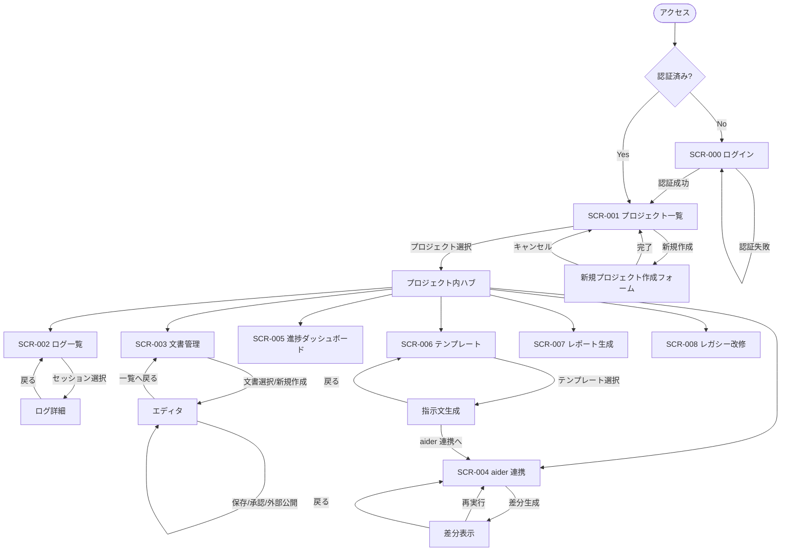
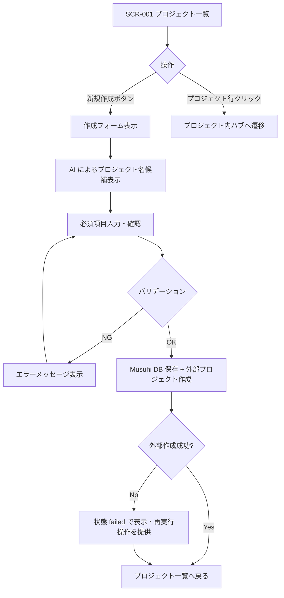
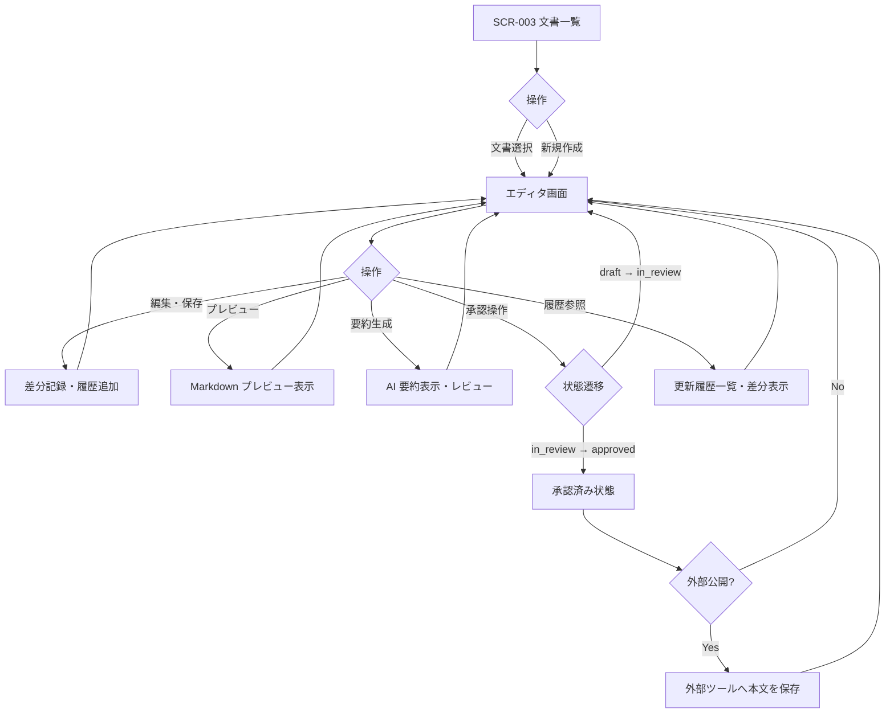
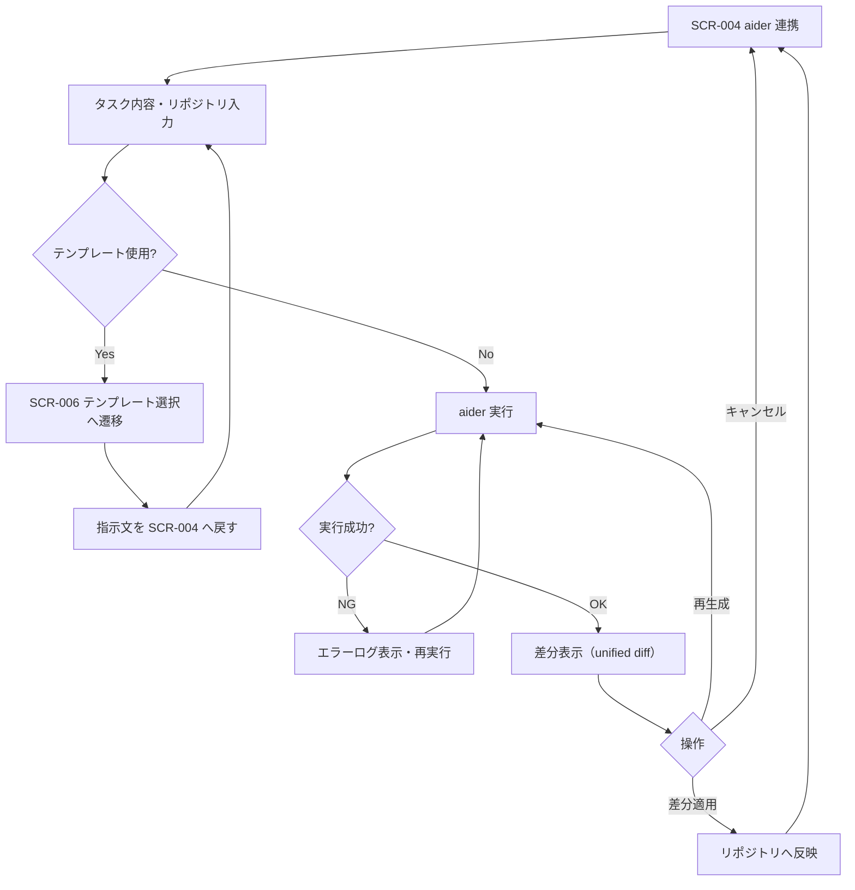

# 画面遷移定義書

[前: 001-05.データ定義書.md](001-05.データ定義書.md) | [一覧](../README.md) | 次: なし

目次（クリックで展開）

- [1. 目的](#1-目的)
- [2. 画面一覧](#2-画面一覧)
- [3. 画面遷移図](#3-画面遷移図)
  - [3.1 全体遷移図](#31-全体遷移図)
  - [3.2 プロジェクト操作フロー](#32-プロジェクト操作フロー)
  - [3.3 文書管理フロー](#33-文書管理フロー)
  - [3.4 aider 連携フロー](#34-aider-連携フロー)
- [4. 画面遷移詳細](#4-画面遷移詳細)
  - [4.1 SCR-000 ログイン](#41-scr-000-ログイン)
  - [4.2 SCR-001 プロジェクト一覧・作成](#42-scr-001-プロジェクト一覧作成)
  - [4.3 SCR-002 プロンプトログ一覧・詳細](#43-scr-002-プロンプトログ一覧詳細)
  - [4.4 SCR-003 文書管理](#44-scr-003-文書管理)
  - [4.5 SCR-004 aider 連携](#45-scr-004-aider-連携)
  - [4.6 SCR-005 進捗ダッシュボード](#46-scr-005-進捗ダッシュボード)
  - [4.7 SCR-006 テンプレート選択・生成](#47-scr-006-テンプレート選択生成)
  - [4.8 SCR-007 レポート生成](#48-scr-007-レポート生成)
  - [4.9 SCR-008 レガシー改修支援](#49-scr-008-レガシー改修支援)
- [5. 認証状態による遷移制御](#5-認証状態による遷移制御)
- [6. エラー画面・共通ダイアログ](#6-エラー画面共通ダイアログ)
- [7. 更新履歴](#7-更新履歴)

## 1. 目的

本ドキュメントは、Musuhi フロントエンドにおける画面一覧・画面間の遷移ルール・認証状態による制御を定義する。
機能要件定義書（001-01）の「7. 画面一覧」を遷移フローとして詳細化し、UI 設計・実装の基準を確立する。

## 2. 画面一覧

| 画面ID | 画面名 | 対応FR | 概要 | 認証要否 |
| --- | --- | --- | --- | --- |
| SCR-000 | ログイン | - | 認証情報入力・ログイン実行 | 不要（未認証専用） |
| SCR-001 | プロジェクト一覧・作成 | FR-001 | プロジェクト一覧表示・新規作成フォーム | 要 |
| SCR-002 | プロンプトログ一覧・詳細 | FR-002 | セッション一覧・チャット形式の詳細表示 | 要 |
| SCR-003 | 文書管理 | FR-003 | Markdown エディタ・プレビュー・履歴・承認 | 要 |
| SCR-004 | aider 連携 | FR-004 | タスク入力・差分表示・適用操作 | 要 |
| SCR-005 | 進捗ダッシュボード | FR-005 | マイルストーン・Iteration 別タスク進捗表示 | 要 |
| SCR-006 | テンプレート選択・生成 | FR-006 | AI 指示テンプレート一覧・生成フォーム | 要 |
| SCR-007 | レポート生成 | FR-007 | 期間指定・出力形式選択・ダウンロード | 要 |
| SCR-008 | レガシー改修支援 | FR-008 | コード追加・分析視点選択・結果表示 | 要 |
| SCR-ERR | エラー画面 | - | 404 / 500 等のエラー表示 | 問わない |

## 3. 画面遷移図

### 3.1 全体遷移図

### 3.2 プロジェクト操作フロー

### 3.3 文書管理フロー

### 3.4 aider 連携フロー

## 4. 画面遷移詳細

### 4.1 SCR-000 ログイン

| 項目 | 内容 |
| --- | --- |
| URL パス | `/login` |
| 遷移元 | 未認証状態でのアクセス全般 |
| 遷移先（成功） | 認証前にアクセスしようとした画面、または SCR-001 |
| 遷移先（失敗） | SCR-000（エラーメッセージ表示） |
| 備考 | 認証済みユーザが直接アクセスした場合は SCR-001 へリダイレクト |

### 4.2 SCR-001 プロジェクト一覧・作成

| 項目 | 内容 |
| --- | --- |
| URL パス | `/projects` |
| 遷移元 | SCR-000（認証後）、全画面のグローバルナビ |
| 遷移先 | プロジェクト内ハブ（`/projects/{id}`）、新規作成フォーム |
| 主要操作 | プロジェクト一覧表示、新規作成、アーカイブ済み切替 |
| 備考 | ログアウト操作もこの画面から実行可能 |

### 4.3 SCR-002 プロンプトログ一覧・詳細

| 項目 | 内容 |
| --- | --- |
| URL パス | `/projects/{id}/sessions`、詳細: `/projects/{id}/sessions/{sessionId}` |
| 遷移元 | プロジェクト内ハブ |
| 遷移先 | ログ詳細（セッション選択時）、ハブ（戻るボタン） |
| 主要操作 | セッション一覧表示（プロジェクト単位フィルタ）、詳細表示 |

### 4.4 SCR-003 文書管理

| 項目 | 内容 |
| --- | --- |
| URL パス | `/projects/{id}/documents`、エディタ: `/projects/{id}/documents/{docId}` |
| 遷移元 | プロジェクト内ハブ |
| 遷移先 | エディタ画面（文書選択・新規作成）、ハブ（戻るボタン） |
| 主要操作 | 文書作成・編集・保存・プレビュー・要約生成・承認・外部公開・履歴参照 |
| 承認状態遷移 | `draft` → `in_review` → `approved` |

### 4.5 SCR-004 aider 連携

| 項目 | 内容 |
| --- | --- |
| URL パス | `/projects/{id}/tasks/aider` |
| 遷移元 | プロジェクト内ハブ、SCR-006（指示文生成後） |
| 遷移先 | 差分表示（インページ）、SCR-006（テンプレート選択時）、ハブ（完了・キャンセル） |
| 主要操作 | タスク入力・テンプレート選択・aider 実行・差分表示・適用 |

### 4.6 SCR-005 進捗ダッシュボード

| 項目 | 内容 |
| --- | --- |
| URL パス | `/projects/{id}/progress` |
| 遷移元 | プロジェクト内ハブ |
| 遷移先 | ハブ（戻るボタン） |
| 主要操作 | Phase / Iteration フィルタ・タスク進捗表示・外部同期状態確認 |

### 4.7 SCR-006 テンプレート選択・生成

| 項目 | 内容 |
| --- | --- |
| URL パス | `/projects/{id}/templates` |
| 遷移元 | プロジェクト内ハブ、SCR-004（テンプレート選択時） |
| 遷移先 | 指示文生成結果（インページ）、SCR-004（指示文渡し）、ハブ（戻るボタン） |
| 主要操作 | テンプレート一覧・選択・パラメータ入力・指示文生成 |

### 4.8 SCR-007 レポート生成

| 項目 | 内容 |
| --- | --- |
| URL パス | `/projects/{id}/reports` |
| 遷移元 | プロジェクト内ハブ |
| 遷移先 | ダウンロード（生成完了後）、ハブ（戻るボタン） |
| 主要操作 | 期間指定・出力形式選択（Markdown / PDF）・生成・ダウンロード |

### 4.9 SCR-008 レガシー改修支援

| 項目 | 内容 |
| --- | --- |
| URL パス | `/projects/{id}/legacy` |
| 遷移元 | プロジェクト内ハブ |
| 遷移先 | 分析結果表示（インページ）、ハブ（完了・戻るボタン） |
| 主要操作 | コード/文書追加・分析視点選択・分析実行・結果表示・成果物ダウンロード |

## 5. 認証状態による遷移制御

| 状態 | 対応 |
| --- | --- |
| 未認証で保護画面へアクセス | SCR-000 へリダイレクト。認証後、元の URL へ戻す |
| 認証済みで SCR-000 へアクセス | SCR-001 へリダイレクト |
| セッション期限切れ | 現在の操作をキャンセルし SCR-000 へリダイレクト（データ消失なし） |
| 権限不足の操作 | 403 エラーダイアログを表示。画面遷移は行わない |

## 6. エラー画面・共通ダイアログ

| 種別 | 表示条件 | 内容 |
| --- | --- | --- |
| 404 Not Found | 存在しないリソース/URLへのアクセス | SCR-ERR（404 メッセージ + SCR-001 へのリンク） |
| 500 Internal Server Error | サーバエラー | SCR-ERR（500 メッセージ + リロードボタン） |
| バリデーションエラー | フォーム送信時の入力不正 | 各フォーム内インラインエラー表示 |
| 確認ダイアログ | 削除・アーカイブ・外部公開等の不可逆操作 | モーダルダイアログ（操作名・対象名・キャンセル/実行ボタン） |
| 処理中インジケータ | API 呼び出し中 | スピナーまたはプログレスバー（操作ブロック） |

## 7. 更新履歴

| 日付 | 版 | 変更内容 | 作成者 |
| --- | --- | --- | --- |
| 2026-05-02 | 0.1 | 初版作成（SCR-000〜SCR-008 および遷移フロー定義） | Copilot |
