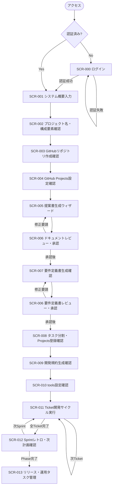
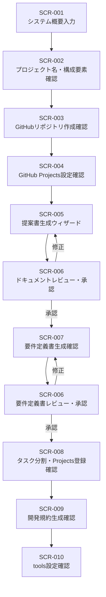
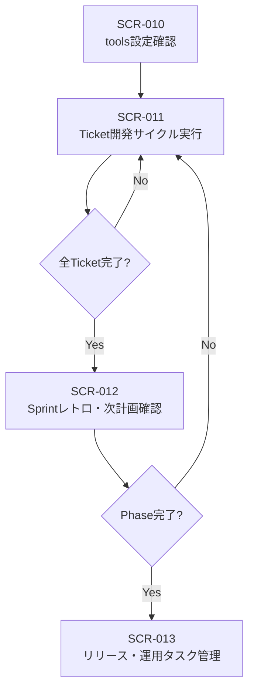

# 画面遷移定義書

[前: 001-05.データ定義書.md](001-05.データ定義書.md) | [一覧](../README.md) | 次: なし

目次（クリックで展開）

- [1. 目的](#1-目的)
- [2. 画面一覧](#2-画面一覧)
- [3. 画面遷移図](#3-画面遷移図)
  - [3.1 全体遷移図](#31-全体遷移図)
  - [3.2 UC-01 ワークフロー（Phase 0）](#32-uc-01-ワークフローフェーズ-0)
  - [3.3 UC-01 ワークフロー（Phase 1）](#33-uc-01-ワークフローフェーズ-1)
- [4. 画面遷移詳細](#4-画面遷移詳細)
  - [4.1 SCR-000 ログイン](#41-scr-000-ログイン)
  - [4.2 SCR-001 システム概要入力](#42-scr-001-システム概要入力)
  - [4.3 SCR-002 プロジェクト名・構成要素確認](#43-scr-002-プロジェクト名構成要素確認)
  - [4.4 SCR-003 GitHubリポジトリ作成確認](#44-scr-003-githubリポジトリ作成確認)
  - [4.5 SCR-004 GitHub Projects設定確認](#45-scr-004-github-projects設定確認)
  - [4.6 SCR-005 提案書・要求仕様書生成ウィザード](#46-scr-005-提案書要求仕様書生成ウィザード)
  - [4.7 SCR-006 ドキュメントレビュー・承認](#47-scr-006-ドキュメントレビュー承認)
  - [4.8 SCR-007 要件定義書生成確認](#48-scr-007-要件定義書生成確認)
  - [4.9 SCR-008 タスク分割・GitHub Projects登録確認](#49-scr-008-タスク分割github-projects登録確認)
  - [4.10 SCR-009 開発規約生成確認](#410-scr-009-開発規約生成確認)
  - [4.11 SCR-010 tools設定確認](#411-scr-010-tools設定確認)
  - [4.12 SCR-011 Ticket開発サイクル実行](#412-scr-011-ticket開発サイクル実行)
  - [4.13 SCR-012 Sprintレトロ・次計画確認](#413-scr-012-sprintレトロ次計画確認)
  - [4.14 SCR-013 リリース・運用タスク管理](#414-scr-013-リリース運用タスク管理)
- [5. 認証状態による遷移制御](#5-認証状態による遷移制御)
- [6. エラー画面・共通ダイアログ](#6-エラー画面共通ダイアログ)
- [7. 更新履歴](#7-更新履歴)

## 1. 目的

本ドキュメントは、Musuhi フロントエンドにおける画面一覧・画面間の遷移ルール・認証状態による制御を定義する。
機能要件定義書（001-01）の「7. 画面一覧」を遷移フローとして詳細化し、UI 設計・実装の基準を確立する。

## 2. 画面一覧

| 画面ID | 画面名 | 対応FR | 概要 | 認証要否 |
| --- | --- | --- | --- | --- |
| SCR-000 | ログイン | - | 認証情報入力・ログイン実行 | 不要（未認証専用） |
| SCR-001 | システム概要入力 | FR-001 | サービスのシステム概要を自由記述して保存 | 要 |
| SCR-002 | プロジェクト名・構成要素確認 | FR-002 | AI抽出機能リスト・名前候補確認・初期ディレクトリ作成 | 要 |
| SCR-003 | GitHubリポジトリ作成確認 | FR-003 | リポジトリ作成・ commit/push確認 | 要 |
| SCR-004 | GitHub Projects設定確認 | FR-004 | ボード作成・Phase0固定タスク登録確認 | 要 |
| SCR-005 | 提案書・要求仕様書生成ウィザード | FR-005 | 提案書自動生成・進捗ファイル生成確認 | 要 |
| SCR-006 | ドキュメントレビュー・承認 | FR-006 | Markdownエディタ・プレビュー・要約・承認操作 | 要 |
| SCR-007 | 要件定義書生成確認 | FR-007 | 要件定義書自動生成・ commit/push確認 | 要 |
| SCR-008 | タスク分割・GitHub Projects登録確認 | FR-008 | Phase/Sprint/Ticket分割・登録確認 | 要 |
| SCR-009 | 開発規約生成確認 | FR-009 | コーディング規約自動生成確認 | 要 |
| SCR-010 | tools設定確認 | FR-010 | toolsコピー・設定確認 | 要 |
| SCR-011 | Ticket開発サイクル実行 | FR-011 | Ticket選択・aider連携・差分確認・テスト・完了 | 要 |
| SCR-012 | Sprintレトロスペクティブ・次計画確認 | FR-012 | KPT記録・次Sprintチケット分割確認 | 要 |
| SCR-013 | リリース・運用タスク管理 | FR-013 | IaC・ガイド・エンドユーザー文書等のリリース・運用タスク管理 | 要 |
| SCR-ERR | エラー画面 | - | 404 / 500 等のエラー表示 | 問わない |

## 3. 画面遷移図

### 3.1 全体遷移図

### 3.2 UC-01 ワークフロー（Phase 0）

### 3.3 UC-01 ワークフロー（Phase 1）

## 4. 画面遷移詳細

### 4.1 SCR-000 ログイン

| 項目 | 内容 |
| --- | --- |
| URL パス | `/login` |
| 遷移元 | 未認証状態でのアクセス全般 |
| 遷移先（成功） | 認証前にアクセスしようとした画面、または SCR-001 |
| 遷移先（失敗） | SCR-000（エラーメッセージ表示） |
| 備考 | 認証済みユーザが直接アクセスした場合は SCR-001 へリダイレクト |

### 4.2 SCR-001 システム概要入力

| 項目 | 内容 |
| --- | --- |
| URL パス | `/overview` |
| 遷移元 | SCR-000（認証後）、SCR-002（戻る操作） |
| 遷移先 | SCR-002（保存後） |
| 主要操作 | システム概要の自由記述・保存、`overviewId` 指定時の保存済み概要再表示 |
| 備考 | FR-001対応。入力内容は後続ステップでAI処理に利用される |

### 4.3 SCR-002 プロジェクト名・構成要素確認

| 項目 | 内容 |
| --- | --- |
| URL パス | `/projects/setup` |
| 遷移元 | SCR-001 |
| 遷移先 | SCR-001（戻る操作）、SCR-003（確認完了後） |
| 主要操作 | AI抽出機能リスト・名前候補確認・AI候補由来表示・初期ディレクトリ作成 |
| 備考 | FR-002対応。画面表示時に概要IDを使って自動抽出する |

### 4.4 SCR-003 GitHubリポジトリ作成確認

| 項目 | 内容 |
| --- | --- |
| URL パス | `/projects/{id}/repository` |
| 遷移元 | SCR-002 |
| 遷移先 | SCR-004（commit/push完了後）|
| 主要操作 | GitHubリポジトリ作成・ visibility選択・ commit/push実行・結果確認 |
| 備考 | FR-003対応 |

### 4.5 SCR-004 GitHub Projects設定確認

| 項目 | 内容 |
| --- | --- |
| URL パス | `/projects/{id}/github-projects` |
| 遷移元 | SCR-003 |
| 遷移先 | SCR-005（ボード・タスク登録完了後）|
| 主要操作 | GitHub Projectsボード作成・Phase0固定タスク生成・登録実行・結果確認 |
| 備考 | FR-004対応 |

### 4.6 SCR-005 提案書・要求仕様書生成ウィザード

| 項目 | 内容 |
| --- | --- |
| URL パス | `/projects/{id}/documents/proposal/generate` |
| 遷移元 | SCR-004 |
| 遷移先 | SCR-006（完了後）|
| 主要操作 | AI生成実行・進捗表示・完了後 commit/push確認 |
| 備考 | FR-005対応 |

### 4.7 SCR-006 ドキュメントレビュー・承認

| 項目 | 内容 |
| --- | --- |
| URL パス | `/projects/{id}/documents/{docId}/review` |
| 遷移元 | SCR-005（提案書後）または SCR-007（要件定義書後）|
| 遷移先 | 承認後: SCR-007または SCR-008、修正要請: 前ステップ |
| 主要操作 | Markdownエディタ・プレビュー・要約生成・差分記録・承認操作 |
| 承認状態遷移 | `draft` → `in_review` → `approved` |
| 備考 | FR-006対応 |

### 4.8 SCR-007 要件定義書生成確認

| 項目 | 内容 |
| --- | --- |
| URL パス | `/projects/{id}/documents/requirements/generate` |
| 遷移元 | SCR-006（提案書承認後）|
| 遷移先 | SCR-006（要件定義書レビュー）|
| 主要操作 | AI生成実行・進捗表示・ commit/push確認 |
| 備考 | FR-007対応 |

### 4.9 SCR-008 タスク分割・GitHub Projects登録確認

| 項目 | 内容 |
| --- | --- |
| URL パス | `/projects/{id}/task-breakdown` |
| 遷移元 | SCR-006（要件定義書承認後）|
| 遷移先 | SCR-009（登録完了後）|
| 主要操作 | Phase/Sprint/Ticket分割・修正・GitHub Projectsへ登録実行 |
| 備考 | FR-008対応 |

### 4.10 SCR-009 開発規約生成確認

| 項目 | 内容 |
| --- | --- |
| URL パス | `/projects/{id}/conventions/generate` |
| 遷移元 | SCR-008 |
| 遷移先 | SCR-010（完了後）|
| 主要操作 | 技術スタック入力・コーディング規約自動生成・結果確認 |
| 備考 | FR-009対応 |

### 4.11 SCR-010 tools設定確認

| 項目 | 内容 |
| --- | --- |
| URL パス | `/projects/{id}/tools-setup` |
| 遷移元 | SCR-009 |
| 遷移先 | SCR-011（完了後）|
| 主要操作 | コピー対象tools選択・コピー実行・結果確認 |
| 備考 | FR-010対応 |

### 4.12 SCR-011 Ticket開発サイクル実行

| 項目 | 内容 |
| --- | --- |
| URL パス | `/projects/{id}/sprints/{itId}/tickets/{ticketId}` |
| 遷移元 | SCR-010（Phase 0完了後）または SCR-012（次Sprint開始）|
| 遷移先 | SCR-012（全Ticket完了後）|
| 主要操作 | Ticket選択・aider実行・差分表示・テスト・完了操作 |
| 備考 | FR-011対応。プロンプトログはこの画面内で自動保存 |

### 4.13 SCR-012 Sprintレトロスペクティブ・次計画確認

| 項目 | 内容 |
| --- | --- |
| URL パス | `/projects/{id}/sprints/{itId}/retrospective` |
| 遷移元 | SCR-011（全Ticket完了後）|
| 遷移先 | SCR-011（次Sprint開始）または SCR-013（Phase完了時）|
| 主要操作 | KPT入力・レトロスペクティブ記録・次Sprint Ticket分割・登録実行 |
| 備考 | FR-012対応 |

### 4.14 SCR-013 リリース・運用タスク管理

| 項目 | 内容 |
| --- | --- |
| URL パス | `/projects/{id}/release` |
| 遷移元 | SCR-012（Phase完了後）|
| 遷移先 | 各タスク完了で次タスクへ、全タスク完了にてプロジェクト完了 |
| 主要操作 | IaC・起動ガイド・エンドユーザー文書などリリース・運用タスクの管理・実行 |
| 備考 | FR-013対応 |

## 5. 認証状態による遷移制御

| 状態 | 対応 |
| --- | --- |
| 未認証で保護画面へアクセス | SCR-000 へリダイレクト。認証後、元の URL へ戻す |
| 認証済みで SCR-000 へアクセス | SCR-001 へリダイレクト |
| セッション期限切れ | 現在の操作をキャンセルし SCR-000 へリダイレクト（データ消失なし） |
| 権限不足の操作 | 403 エラーダイアログを表示。画面遷移は行わない |

## 6. エラー画面・共通ダイアログ

| 種別 | 表示条件 | 内容 |
| --- | --- | --- |
| 404 Not Found | 存在しないリソース/URLへのアクセス | SCR-ERR（404 メッセージ + SCR-001 へのリンク） |
| 500 Internal Server Error | サーバエラー | SCR-ERR（500 メッセージ + リロードボタン） |
| バリデーションエラー | フォーム送信時の入力不正 | 各フォーム内インラインエラー表示 |
| 確認ダイアログ | 削除・アーカイブ・外部公開等の不可逆操作 | モーダルダイアログ（操作名・対象名・キャンセル/実行ボタン） |
| 処理中インジケータ | API 呼び出し中 | スピナーまたはプログレスバー（操作ブロック） |

## 7. 更新履歴

| 日付 | 版 | 変更内容 | 作成者 |
| --- | --- | --- | --- |
| 2026-05-05 | 0.2 | 画面一覧・遷移図・詳細をSCR-001～SCR-013対応に全面更新（UC-01ステップベース） | Copilot |
