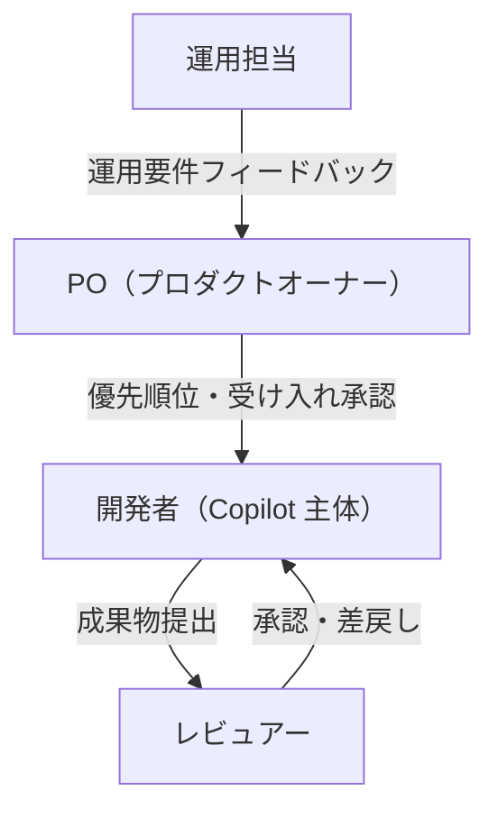
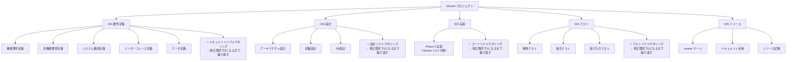

# プロジェクト計画書

前: なし | [一覧](../README.md) | 次: [002-02.Phase別リリース概要](002-02.Phase別リリース概要.md)

目次（クリックで展開）

- [1. 目的](#1-目的)
- [2. プロジェクト概要](#2-プロジェクト概要)
- [3. 体制・役割](#3-体制役割)
  - [3.1 体制図](#31-体制図)
  - [3.2 役割と責務](#32-役割と責務)
- [4. マイルストーンとスケジュール](#4-マイルストーンとスケジュール)
  - [4.1 Phase・Iteration 計画](#41-phaseとiteration-計画)
  - [4.2 マイルストーン一覧](#42-マイルストーン一覧)
- [5. WBS（作業分解構造）](#5-wbs作業分解構造)
- [6. コミュニケーション計画](#6-コミュニケーション計画)
- [7. リスク管理方針](#7-リスク管理方針)
- [8. 前提・制約](#8-前提制約)
- [9. 参照ドキュメント](#9-参照ドキュメント)
- [10. 更新履歴](#10-更新履歴)

## 1. 目的

本ドキュメントは、Musuhi 要件定義フェーズにおけるプロジェクト計画を定義する。
体制、スケジュール、作業分解、コミュニケーション方針を一元管理し、関係者間の認識を揃える。

## 2. プロジェクト概要

| 項目 | 内容 |
| --- | --- |
| プロジェクト名 | Musuhi |
| フェーズ | 002.要件定義フェーズ |
| 目標 | ローカルバイブコーディング環境アプリケーションの要件を確定し、設計・実装へ引き渡す |
| 前フェーズ | 001.提案・要求仕様フェーズ |
| 開始条件 | 001フェーズ成果物がユーザ承認済みで、GitHub へ保存済み |
| 次フェーズ | 003.設計フェーズ（予定） |
| 対象リリース | Musuhi Version 1.0.0（UC-01 新規プロジェクト開発） |

## 3. 体制・役割

### 3.1 体制図

### 3.2 役割と責務

| 役割 | 責務 | 主な成果物 |
| --- | --- | --- |
| PO | 要件優先順位決定、Iteration 単位の受け入れ承認 | スコープ承認記録 |
| 開発者 | Copilot 活用で要件定義・実装・テストを推進 | 要件定義書・実装コード・テスト |
| レビュアー | 要件定義・設計・コードの品質レビュー | レビュー記録・マージ承認 |
| 運用担当 | 運用観点でのフィードバック提供 | 運用要件コメント |

## 4. マイルストーンとスケジュール

### 4.1 Phase・Iteration 計画

本セクションの `Phase` は開発実行フェーズを意味し、
[001.提案・要求仕様フェーズ](../../001.提案・要求仕様フェーズ/README.md) の「プロジェクト立ち上げフェーズ0」とは区別する。

| Phase | Iteration | 主要目標 | 完了条件 |
| --- | --- | --- | --- |
| Phase 0 | Iteration 1 | システム概要入力→GitHub Projectsタスク生成 (FR-001～FR-004) | AC-001～AC-004 Pass / リファクタリングPass / master マージ |
| Phase 0 | Iteration 2 | 提案書自動生成→要件定義書自動生成 (FR-005～FR-007) | AC-005～AC-007 Pass / リファクタリングPass / master マージ |
| Phase 0 | Iteration 3 | タスク分割・tools準備 (FR-008～FR-010) | AC-008～AC-010 Pass / リファクタリングPass / master マージ |
| Phase 1 | Iteration 1～N | Ticket開発サイクル (FR-011) | AC-011 Pass / リファクタリングPass / master マージ |
| Phase 1 | Iteration N+1 | レトロスペクティブ・次Iteration計画 (FR-012) | AC-012 Pass |
| Phase 2 | 決済み時 | リリース・運用タスク管理 (FR-013) | AC-013 Pass |

> 本計画書の対象は Version 1.0.0（UC-01）のみとする。Version 2.0.0 以降（UC-02〜UC-04）は [001-01.機能要件定義書](../001.要件定義/001-01.機能要件定義書.md) で管理する。

### 4.2 マイルストーン一覧

| MS-ID | マイルストーン | 条件 |
| --- | --- | --- |
| MS-001 | Version 1.0.0（UC-01）完了 | AC-001～AC-013 全 Pass |

## 5. WBS（作業分解構造）

## 6. コミュニケーション計画

| 種別 | タイミング | 参加者 | 目的 | 記録 |
| --- | --- | --- | --- | --- |
| Iteration 計画会議 | Iteration 開始時 | PO・開発者・レビュアー | 目標 FR/AC 合意 | Issue / ドキュメント |
| 日次進捗確認 | 随時（非同期） | 開発者 | 進行状況共有 | Git コミットログ |
| Iteration レビュー | Iteration 終端 | PO・開発者・レビュアー | 受け入れ判定 | 判定記録 |
| 変更管理会議 | 必要時 | PO・関係者 | スコープ・要件変更承認 | 変更管理記録 |

## 7. リスク管理方針

- 詳細は [001.提案・要求仕様フェーズ 003-08.リスク・制約・依存関係](../../001.提案・要求仕様フェーズ/003.要求仕様共通/003-08.リスク・制約・依存関係.md) を継承する
- 要件定義フェーズ固有リスクを下表に追記する

| RISK-ID | リスク内容 | 発生確率 | 影響度 | 対策 |
| --- | --- | --- | --- | --- |
| R-RD-001 | 要件定義の詳細化で In Scope が肥大化 | High | High | PO 承認なしのスコープ追加を禁止 |
| R-RD-002 | 設計前提の不明確さで手戻り発生 | Medium | High | インターフェース・データ定義を要件定義フェーズで確定 |
| R-RD-003 | ステークホルダー合意遅延 | Medium | Medium | Iteration 計画会議で事前合意を確定 |

## 8. 前提・制約

- 001.提案・要求仕様フェーズで定義したスコープ・要件・用語を引き継ぐ
- Linux サーバ + Docker Compose 環境を利用可能であること
- OSS 優先採用方針を維持する
- Copilot 主体の開発体制とする
- `Musuhi/tools/` を各種バッチ・補助スクリプトの保管場所として運用し、追加資材には `README.md`（概要・目的・利用方法・運用手順）を付与する

## 9. 参照ドキュメント

- [001.提案・要求仕様フェーズ README](../../001.提案・要求仕様フェーズ/README.md)
- [003-01.スコープ定義](../../001.提案・要求仕様フェーズ/003.要求仕様共通/003-01.スコープ定義.md)
- [003-05.ステークホルダー定義](../../001.提案・要求仕様フェーズ/003.要求仕様共通/003-05.ステークホルダー定義.md)
- [003-08.リスク・制約・依存関係](../../001.提案・要求仕様フェーズ/003.要求仕様共通/003-08.リスク・制約・依存関係.md)

## 10. 更新履歴

| 日付 | 版 | 変更内容 | 作成者 |
| --- | --- | --- | --- |
| 2026-05-04 | 0.5 | 対象スコープをVersion 1.0.0（UC-01）のみに限定し、Phase/マイルストーンを再整理 | Copilot |
| 2026-05-01 | 0.4 | `tools` ディレクトリの取り扱い前提を追記 | Copilot |
| 2026-05-01 | 0.1 | 初版作成 | Copilot |
| 2026-05-01 | 0.2 | 前フェーズ承認済み前提と開発Phase定義を追記 | Copilot |
| 2026-05-01 | 0.3 | WBSに各工程のリファクタリングノード追加・Iteration完了条件にリファクタリングPass追加 | Copilot |
