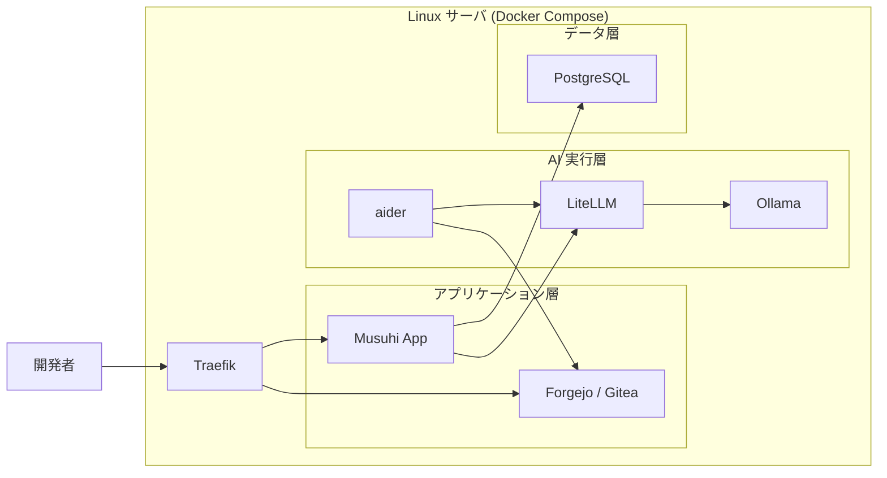

# Phase 別リリース概要

前: [002-01.プロジェクト計画書](002-01.プロジェクト計画書.md) | [一覧](../README.md) | 次: [002-03.Phase-Iteration-Ticket分割基準](002-03.Phase-Iteration-Ticket分割基準.md)

目次（クリックで展開）

- [1. 目的](#1-目的)
- [2. 本版の対象スコープ](#2-本版の対象スコープ)
- [3. Version 1.0.0（UC-01）リリース概要](#3-version-100uc-01リリース概要)
  - [3.1 サーバ構成](#31-サーバ構成)
  - [3.2 できること](#32-できること)
  - [3.3 完了条件](#33-完了条件)
- [4. 将来バージョンの扱い](#4-将来バージョンの扱い)
- [5. 参照ドキュメント](#5-参照ドキュメント)
- [6. 更新履歴](#6-更新履歴)

## 1. 目的

本ドキュメントは、**Musuhi Version 1.0.0** のリリース時点で、
どの構成で動作し、何が実現できるかを明確化する。

## 2. 本版の対象スコープ

- 対象Version: **1.0.0**
- 対象ユースケース: **UC-01 新規プロジェクト開発**
- 対象FR: **FR-001, FR-002, FR-003, FR-004**

> Version 2.0.0（UC-02）、Version 3.0.0（UC-03）、Version 4.0.0（UC-04）は本ドキュメントの対象外とし、[001-01.機能要件定義書](../001.要件定義/001-01.機能要件定義書.md)で管理する。

## 3. Version 1.0.0（UC-01）リリース概要

### 3.1 サーバ構成

### 3.2 できること

| 操作 | 実現する機能 | 対応 FR |
| --- | --- | --- |
| プロジェクト作成・一覧 | 新規プロジェクト作成と一覧表示 | FR-001 |
| プロンプトログ保存・再表示 | セッション単位で保存・再表示 | FR-002 |
| Markdown 文書管理 | 文書作成・更新・履歴参照 | FR-003 |
| aider 基本連携 | タスク指示から差分生成まで実行 | FR-004 |

### 3.3 完了条件

| AC-ID | 内容 | 判定方法 |
| --- | --- | --- |
| AC-001 | 必須項目入力でプロジェクト作成成功し一覧へ反映 | 自動テスト |
| AC-002 | 再起動後も同一セッションログを再表示できる | 自動テスト |
| AC-003 | Markdown 更新後に履歴を時系列で参照できる | 自動テスト |
| AC-004 | aider へ指示を渡し差分生成まで到達できる | 自動 + 手動 |

## 4. 将来バージョンの扱い

| Version | 対応ユースケース | 取り扱い |
| --- | --- | --- |
| 2.0.0 | UC-02 既存プロジェクト拡張 | 要件定義書のみ記載 |
| 3.0.0 | UC-03 障害対応 | 要件定義書のみ記載 |
| 4.0.0 | UC-04 レガシーシステムの改修・改善 | 要件定義書のみ記載 |

## 5. 参照ドキュメント

- [002-01.プロジェクト計画書](002-01.プロジェクト計画書.md)
- [002-03.Phase-Iteration-Ticket分割基準](002-03.Phase-Iteration-Ticket分割基準.md)
- [001-01.機能要件定義書](../001.要件定義/001-01.機能要件定義書.md)

## 6. 更新履歴

| 日付 | 版 | 変更内容 | 作成者 |
| --- | --- | --- | --- |
| 2026-05-04 | 0.2 | Version 1.0.0（UC-01）対象へ限定し再構成 | Copilot |
| 2026-05-01 | 0.1 | 初版作成 | Copilot |
