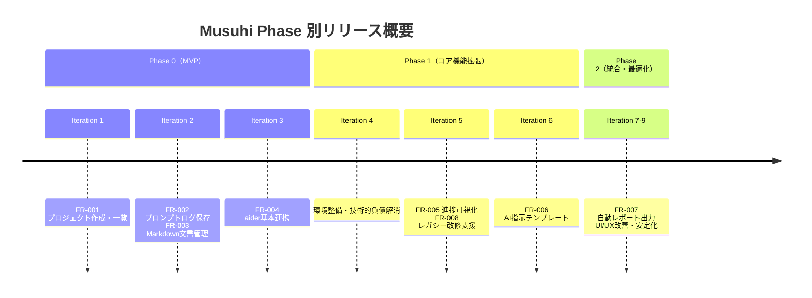
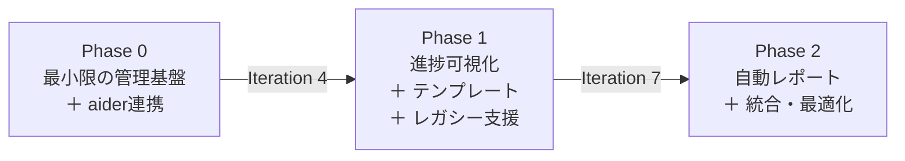
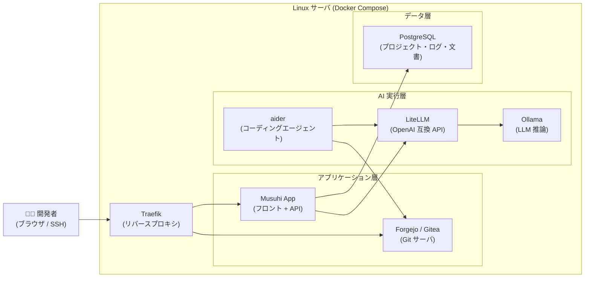
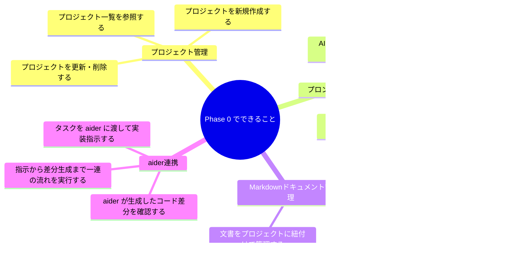
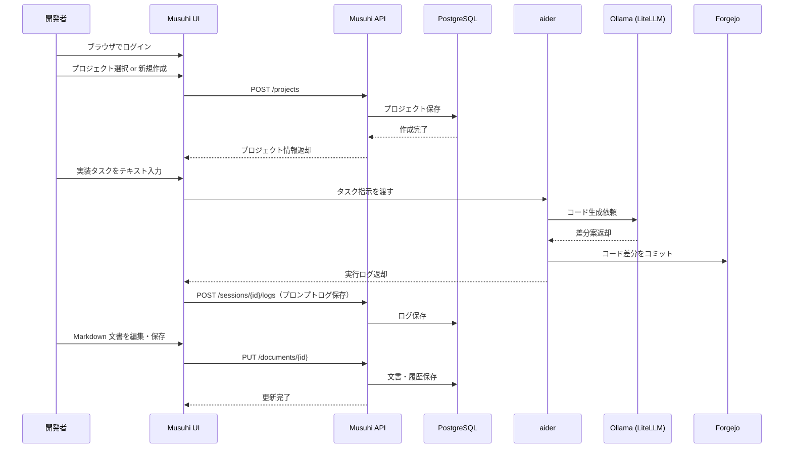
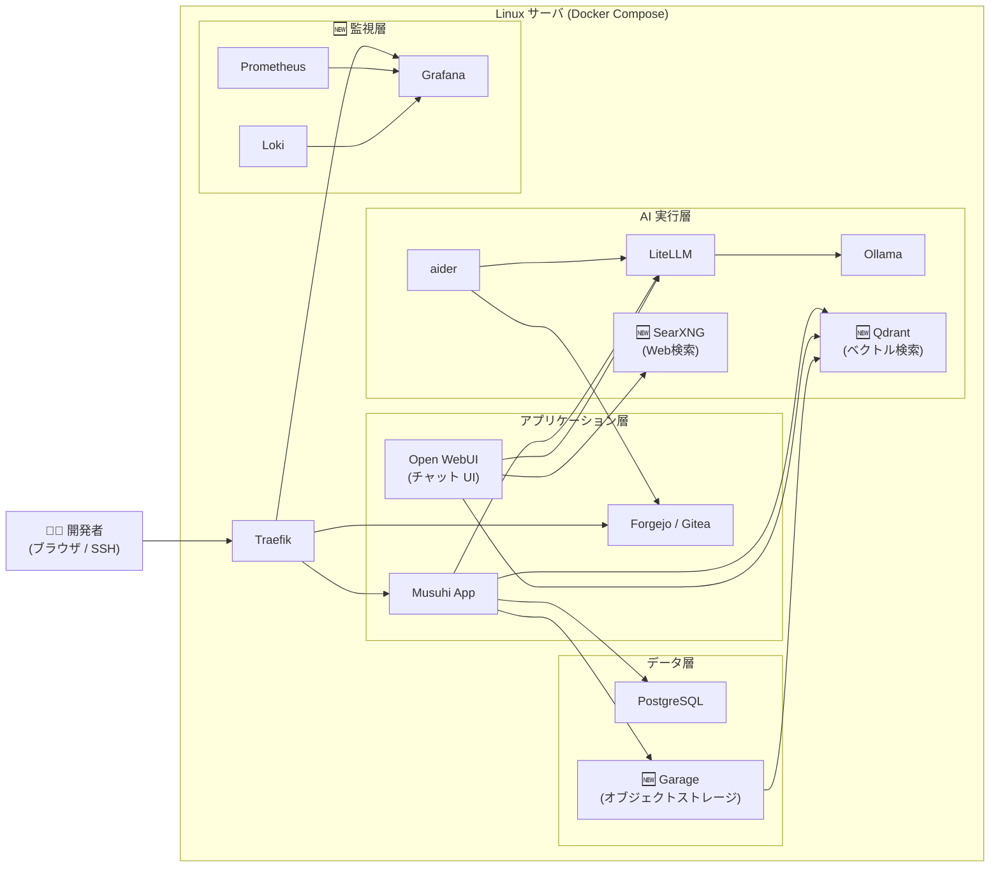
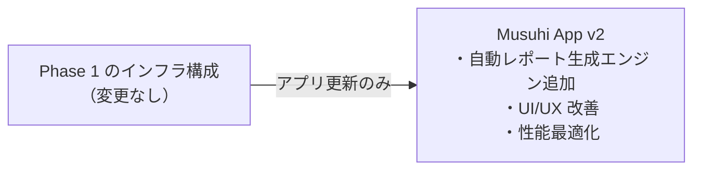
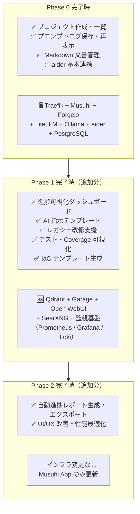

# Phase 別リリース概要

前: [002-01.プロジェクト計画書](002-01.プロジェクト計画書.md) | [一覧](../README.md) | 次: なし

目次（クリックで展開）

- [1. 目的](#1-目的)
- [2. Phase 全体像](#2-phase-全体像)
- [3. Phase 0 (MVP)](#3-phase-0-mvp)
  - [3.1 サーバ構成](#31-サーバ構成)
  - [3.2 できること](#32-できること)
  - [3.3 操作フロー](#33-操作フロー)
  - [3.4 完了条件](#34-完了条件)
- [4. Phase 1: コア機能拡張](#4-phase-1-コア機能拡張)
  - [4.1 サーバ構成（Phase 0 からの差分）](#41-サーバ構成phase-0-からの差分)
  - [4.2 できること](#42-できること)
  - [4.3 完了条件](#43-完了条件)
- [5. Phase 2: 統合・最適化](#5-phase-2-統合最適化)
  - [5.1 サーバ構成（Phase 1 からの差分）](#51-サーバ構成phase-1-からの差分)
  - [5.2 できること](#52-できること)
  - [5.3 完了条件](#53-完了条件)
- [6. Phase 間の差分まとめ](#6-phase-間の差分まとめ)
- [7. 参照ドキュメント](#7-参照ドキュメント)
- [8. 更新履歴](#8-更新履歴)

## 1. 目的

本ドキュメントは、各 Phase（開発実行フェーズ）完了時点において **どのサーバ構成で動作し、何が操作・実現できるか** を明確にする。
プロジェクト計画書の Iteration テーブルを補完し、リリース判断・受け入れ確認の参照資料とする。

> **前提**: 本書の `Phase 0/1/2` は開発実行フェーズを指す。001.提案・要求仕様フェーズの「プロジェクト立ち上げフェーズ0」とは異なる概念である。

---

## 2. Phase 全体像

---

## 3. Phase 0 (MVP)

**対象 Iteration**: 1〜3 **対象 FR**: FR-001, FR-002, FR-003, FR-004

### 3.1 サーバ構成

Phase 0 は最小構成で起動する。GPU・大容量ストレージ・監視基盤は不要。

| コンテナ | 役割 | 備考 |
|---|---|---|
| Traefik | エンドポイント統一・TLS | 開発環境は HTTP でも可 |
| Musuhi App | フロントエンド UI + REST API | SvelteKit + Go |
| Forgejo | Git サーバ・Issue 管理 | または GitHub |
| LiteLLM | OpenAI 互換 API ゲートウェイ | モデル切替を抽象化 |
| Ollama | LLM ローカル推論 | GPU なしも可（CPU 推論） |
| aider | AI コーディングエージェント | CLI / コンテナ実行 |
| PostgreSQL | 構造化データ永続化 | プロジェクト・ログ・文書 |

### 3.2 できること

| 操作 | 実現する機能 | 対応 FR |
|---|---|---|
| Musuhi UI でプロジェクトを作成 | 名前・説明・開始日を入力し即時一覧に反映 | FR-001 |
| プロジェクト一覧を参照 | 全プロジェクトを一覧表示・検索 | FR-001 |
| AI 対話後にログを確認 | セッション単位で保存し再起動後も復元 | FR-002 |
| Markdown 文書を作成・編集 | リアルタイムプレビュー付きエディタで操作 | FR-003 |
| 文書の更新履歴を参照 | 変更内容を時系列で確認 | FR-003 |
| aider にタスクを渡す | Musuhi UI からタスク指示を入力 → aider が差分を生成 | FR-004 |

### 3.3 操作フロー

**典型的な 1 日の操作例（Phase 0 完了後）**

### 3.4 完了条件

| AC-ID | 内容 | 判定方法 |
|---|---|---|
| AC-001 | 必須項目入力でプロジェクト作成成功し一覧へ即時反映 | 自動テスト |
| AC-002 | 再起動後も同一セッションログを再表示できる | 自動テスト |
| AC-003 | Markdown 更新後に履歴が時系列で参照できる | 自動テスト |
| AC-004 | aider へ指示を渡し差分生成まで到達できる | 自動 + 手動（Qdrant 類似度ゲート） |

---

## 4. Phase 1: コア機能拡張

**対象 Iteration**: 4〜6 **対象 FR**: FR-005, FR-006, FR-008

### 4.1 サーバ構成（Phase 0 からの差分）

Phase 1 では **Qdrant（ベクトル検索）・Garage（オブジェクトストレージ）・監視基盤** を追加する。

| 追加コンテナ | 役割 | Phase 0 との違い |
|---|---|---|
| Qdrant | 文書・ログのベクトル検索 / RAG | Phase 0 は全文検索のみ |
| Garage | 成果物・ログの永続オブジェクト保管 | Phase 0 は PG のみ |
| Open WebUI | AI チャット UI（補助） | Phase 0 は Musuhi UI のみ |
| SearXNG | Web 検索補助 | 新規追加 |
| Prometheus / Grafana / Loki | メトリクス・ログ監視 | 新規追加 |

### 4.2 できること

Phase 0 の全機能に加えて以下が追加される。

| 操作 | 実現する機能 | 対応 FR |
|---|---|---|
| ダッシュボードで進捗確認 | マイルストーン・タスクの進捗ステータス（未着手 / 進行中 / 完了）を表示 | FR-005 |
| 外部同期ステータス確認 | Forgejo との同期状態を一覧表示 | FR-005 |
| テンプレートから指示文を生成 | フェーズ別テンプレートを選択し、AI 指示文を自動生成 | FR-006 |
| レガシーコードを解析 | 既存コード・文書を取り込み、問題点一覧・修正案・テストコードを生成 | FR-008 |
| テストレポート・Coverage 確認 | 自動テスト結果と Coverage レポートを UI で参照 | FR-008 |
| IaC テンプレート生成 | 既存環境を Docker Compose / Terraform 形式で出力 | FR-008 |
| Grafana でシステム監視 | CPU・メモリ・ログをダッシュボードで確認 | 監視基盤 |

### 4.3 完了条件

| AC-ID | 内容 | 判定方法 |
|---|---|---|
| AC-005 | 進捗ステータスがダッシュボードに表示される | 自動テスト（E2E） |
| AC-006 | テンプレート選択で指示文が生成される | 自動テスト（E2E） |
| AC-008 | 問題点一覧・修正案・テストレポート・Coverage・IaC テンプレートを生成できる | 手動 + 自動 |

---

## 5. Phase 2: 統合・最適化

**対象 Iteration**: 7〜9 **対象 FR**: FR-007

### 5.1 サーバ構成（Phase 1 からの差分）

Phase 2 では主に **アプリケーション側の機能追加と UI/UX 改善** が中心となる。インフラ構成は Phase 1 と同一。

### 5.2 できること

Phase 1 の全機能に加えて以下が追加される。

| 操作 | 実現する機能 | 対応 FR |
|---|---|---|
| 期間を指定してレポート生成 | 指定期間のプロジェクト進捗レポートを自動生成・出力 | FR-007 |
| レポートをエクスポート | Markdown / PDF 形式で出力・Garage へ保管 | FR-007 |

### 5.3 完了条件

| AC-ID | 内容 | 判定方法 |
|---|---|---|
| AC-007 | 指定期間の進捗レポートを生成できる | 自動テスト |

---

## 6. Phase 間の差分まとめ

| 観点 | Phase 0 | Phase 1 | Phase 2 |
|---|---|---|---|
| **使えるコンテナ数** | 7 | 12 | 12（アプリ更新のみ） |
| **主な UI 操作** | プロジェクト管理・ログ・文書・aider 指示 | + 進捗確認・テンプレート・レガシー解析 | + レポート自動生成 |
| **AI 活用範囲** | aider によるコーディング支援 | + RAG 検索・テンプレート生成・改修支援 | + 自動集計・レポート |
| **監視** | なし | Grafana / Prometheus / Loki | 同左 |
| **ストレージ** | PostgreSQL のみ | + Garage（S3 互換） | 同左 |
| **ユーザ規模想定** | 開発者 1〜2 名 | 開発者 3〜5 名 | 開発者 3〜5 名＋ PO |

---

## 7. 参照ドキュメント

- [002-01.プロジェクト計画書](002-01.プロジェクト計画書.md)
- [003-01.機能要件一覧](../../001.提案・要求仕様フェーズ/003.要求仕様共通/003-02.機能要件一覧.md)
- [003-03.受け入れ基準](../../001.提案・要求仕様フェーズ/003.要求仕様共通/003-03.受け入れ基準.md)
- [001-03.システム構成定義書](../001.要件定義/001-03.システム構成定義書.md)
- [002-00.インフラ構成案](../../001.提案・要求仕様フェーズ/002.インフラ構成案/002-00.ローカルバイブコーディング環境インフラ案.md)

## 8. 更新履歴

| 日付 | 版 | 変更内容 | 作成者 |
|---|---|---|---|
| 2026-05-01 | 0.1 | 初版作成 | Copilot |
