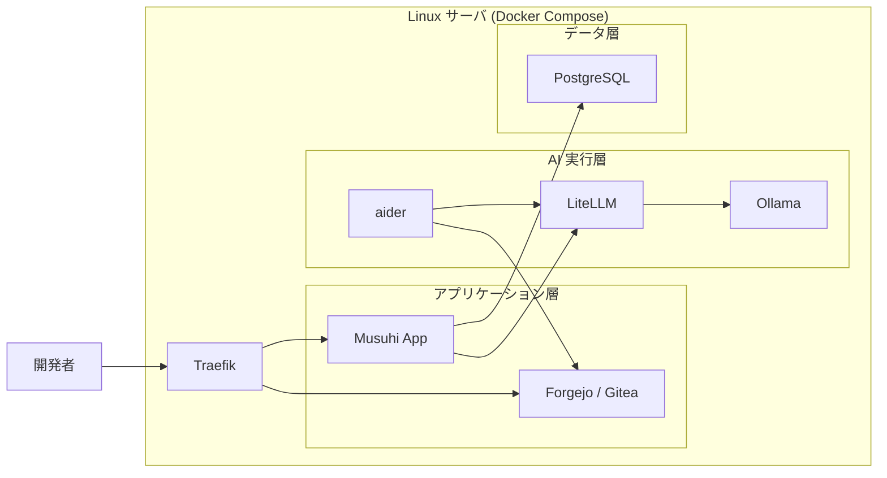

# Phase 別リリース概要

前: [002-01.プロジェクト計画書](002-01.プロジェクト計画書.md) | [一覧](../README.md) | 次: [002-03.Phase-Iteration-Ticket分割基準](002-03.Phase-Iteration-Ticket分割基準.md)

目次（クリックで展開）

- [1. 目的](#1-目的)
- [2. 本版の対象スコープ](#2-本版の対象スコープ)
- [3. Version 1.0.0（UC-01）リリース概要](#3-version-100uc-01リリース概要)
  - [3.1 サーバ構成](#31-サーバ構成)
  - [3.2 できること](#32-できること)
  - [3.3 完了条件](#33-完了条件)
- [4. 将来バージョンの扱い](#4-将来バージョンの扱い)
- [5. 参照ドキュメント](#5-参照ドキュメント)
- [6. 更新履歴](#6-更新履歴)

## 1. 目的

本ドキュメントは、**Musuhi Version 1.0.0** のリリース時点で、
どの構成で動作し、何が実現できるかを明確化する。

## 2. 本版の対象スコープ

- 対象Version: **1.0.0**
- 対象ユースケース: **UC-01 新規プロジェクト開発**
- 対象FR: **FR-001～FR-012（Must）/ FR-013（Should）**

> Version 2.0.0（UC-02）、Version 3.0.0（UC-03）、Version 4.0.0（UC-04）は本ドキュメントの対象外とし、[001-01.機能要件定義書](../001.要件定義/001-01.機能要件定義書.md)で管理する。

## 3. Version 1.0.0（UC-01）リリース概要

### 3.1 サーバ構成

### 3.2 できること

| 操作 | 実現する機能 | 対応 FR |
| --- | --- | --- |
| システム概要入力・保存 | UI でシステム概要を入力・保存 | FR-001 |
| 機能抽出・プロジェクト名生成・初期ディレクトリ作成 | AI 機能抽出・プロジェクト名候補・初期構造作成 | FR-002 |
| GitHub リポジトリ作成・commit/push | 新規リポジトリ作成・初回 commit/push | FR-003 |
| GitHub Projects作成・Phase0タスク生成 | ボード作成・Phase0固定タスク登録 | FR-004 |
| 提案・要求仕様書自動生成 | AI による提案・要求仕様書の生成・refactor・push | FR-005 |
| ドキュメントユーザレビュー・承認 | ユーザとのレビューループを経て承認完了 | FR-006 |
| 要件定義書自動生成 | 承認済み提案書をもとに要件定義書生成・push | FR-007 |
| タスク分割・GitHub Projects登録 | Phase/Iteration/Ticket分割・Projects登録 | FR-008 |
| 開発規約自動生成 | 技術スタックへの開発規約生成 | FR-009 |
| tools準備 | Musuhi/tools を新規プロジェクトへコピー | FR-010 |
| Ticket開発サイクル実行 | 設計・実装・テスト・受入テスト・master push | FR-011 |
| レトロスペクティブ・次Iteration計画 | 振り返り記録・次Iterationタスク登録 | FR-012 |
| リリース・運用タスク管理 | IaC生成・起動停止手順・エンドユーザドキュメント | FR-013 |

### 3.3 完了条件

| AC-ID | 内容 | 判定方法 |
| --- | --- | --- |
| AC-001 | システム概要が保存され、次ステップへ進める | 自動テスト |
| AC-002 | 機能リストが抽出・確認でき、初期ディレクトリが作成される | 自動テスト |
| AC-003 | GitHub リポジトリが作成され、初回 commit/push が完了する | 自動テスト |
| AC-004 | GitHub Projects が作成され、Phase0 タスクが登録される | 自動テスト |
| AC-005 | 提案・要求仕様書が自動生成され、commit/push される | 自動テスト |
| AC-006 | ドキュメントがレビュー・修正を経て承認状態になる | 手動確認 |
| AC-007 | 要件定義書が自動生成され、commit/push される | 自動テスト |
| AC-008 | Phase/Iteration/Ticket 分割が完了し、GitHub Projects に登録される | 自動テスト |
| AC-009 | 対象プロジェクトだけの開発規約が生成される | 自動テスト |
| AC-010 | tools が新規プロジェクトへコピーされ、commit/push される | 自動テスト |
| AC-011 | Ticket 開発サイクルが完了し、master ブランチへ commit/push される | 自動 + 手動 |
| AC-012 | レトロスペクティブが記録され、次 Iteration タスクが Projects に登録される | 手動確認 |
| AC-013 | リリース・運用タスクが完了し、成果物が保存される | 手動確認 |

## 4. 将来バージョンの扱い

| Version | 対応ユースケース | 取り扱い |
| --- | --- | --- |
| 2.0.0 | UC-02 既存プロジェクト拡張 | 要件定義書のみ記載 |
| 3.0.0 | UC-03 障害対応 | 要件定義書のみ記載 |
| 4.0.0 | UC-04 レガシーシステムの改修・改善 | 要件定義書のみ記載 |

## 5. 参照ドキュメント

- [002-01.プロジェクト計画書](002-01.プロジェクト計画書.md)
- [002-03.Phase-Iteration-Ticket分割基準](002-03.Phase-Iteration-Ticket分割基準.md)
- [001-01.機能要件定義書](../001.要件定義/001-01.機能要件定義書.md)

## 6. 更新履歴

| 日付 | 版 | 変更内容 | 作成者 |
| --- | --- | --- | --- |
| 2026-05-05 | 0.3 | FR-001～FR-013に対応して「できること」・完了条件・AC-001～AC-013を再定義 | Copilot |
| 2026-05-04 | 0.2 | Version 1.0.0（UC-01）対象へ限定し再構成 | Copilot |
| 2026-05-01 | 0.1 | 初版作成 | Copilot |
