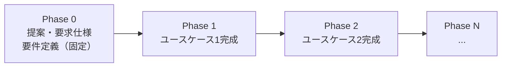
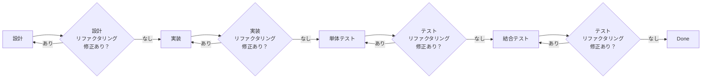

# Phase・Iteration・Ticket 分割基準

前: [002-02.Phase別リリース概要](002-02.Phase別リリース概要.md) | [一覧](../README.md) | 次: なし

<details>
<summary>目次（クリックで展開）</summary>

- [1. 目的](#1-目的)
- [2. 分割基準](#2-分割基準)
  - [2.1 Phase 分割基準](#21-phase-分割基準)
  - [2.2 Iteration 分割基準](#22-iteration-分割基準)
  - [2.3 Ticket 分割基準](#23-ticket-分割基準)
- [3. Ticket 内の作業内容](#3-ticket-内の作業内容)
- [4. Phase 0（固定タスク）](#4-phase-0固定タスク)
- [5. Phase 1 以降のタスクテンプレート](#5-phase-1-以降のタスクテンプレート)
- [6. 業務フロー整合ルール（UC-01）](#6-業務フロー整合ルールuc-01)
- [7. 更新履歴](#7-更新履歴)

</details>

## 1. 目的

本ドキュメントは、Musuhi を使用した新規プロジェクト開発において、タスク分割を行う際の基準を定義する。
TK0-3-1（開発タスク生成）フェーズで Phase / Iteration / Ticket の分割を実施する際に、本基準に従って分割を行う。

> 本ドキュメントの「Phase 0/1/2」は Musuhi 内での開発実行フェーズを指す。Musuhi 自体の開発フェーズ（「001.提案・要求仕様フェーズ」等）とは異なる概念である。

---

## 2. 分割基準

### 2.1 Phase 分割基準

**1つのユースケースが完成するまでを 1 Phase とする。**

- Phase はリリース単位であり、ユーザーが価値を受け取れる単位で区切る
- Phase 0 は「提案・要求仕様・要件定義」の固定フェーズとして必ず存在する
- Phase 1 以降はユースケースごとに分割し、番号を付与する（Phase 1, Phase 2, ...）



### 2.2 Iteration 分割基準

**1つのユースケースを完成させるのに必要な 1 機能を完成させるのを 1 Iteration とする。**

- Iteration は機能単位であり、Phase 内でのデリバリー単位となる
- 受入テストとレトロスペクティブは Iteration の最後に必ず実施する
- Iteration 単位で master ブランチへコミットする

### 2.3 Ticket 分割基準

**1 Iteration 内に必要な 1 小機能の完成までを 1 Ticket とする。**

- Ticket は開発実行の最小単位である
- 単一の API、単一の UI コンポーネント、単一の DB 操作に分解できる粒度を目安とする
- モックを使えば他 Ticket と独立してテストできること
- 完了条件が「自動テスト pass」または「動作確認」で一文で書けること

---

## 3. Ticket 内の作業内容

1 Ticket 内では以下の工程をすべて完結させる。
リファクタリングは **修正項目が出なくなるまで** 繰り返す。



| 工程 | 内容 |
| --- | --- |
| 設計 | 方針・インターフェース・データ構造の確認・定義 |
| 設計リファクタリング | 設計の改善。修正項目がなくなるまで繰り返す |
| 実装 | 機能の実装 |
| 実装リファクタリング | 実装の改善。修正項目がなくなるまで繰り返す |
| 単体テスト | 自動テスト実装・CI 確認 |
| 単体テストリファクタリング | テストコードの改善。修正項目がなくなるまで繰り返す |
| 結合テスト | 他モジュール・API との結合確認 |
| 結合テストリファクタリング | テストコードの改善。修正項目がなくなるまで繰り返す |

---

## 4. Phase 0（固定タスク）

Phase 0 は「提案・要求仕様・要件定義」フェーズであり、すべての新規プロジェクトで固定のタスク構造を持つ。

```
PH0: 提案・要求仕様・要件定義
  IT0-1: 提案・要求仕様作成
    TK0-1-1: 提案・要求仕様書自動生成
    TK0-1-2: 提案・要求仕様書ユーザ承認
  IT0-2: 要件定義作成
    TK0-2-1: 要件定義書自動生成
    TK0-2-2: 要件定義書ユーザ承認
  IT0-3: 開発タスク生成
    TK0-3-1: Phase分割・登録 / Phase1のIteration分割・登録 / Iteration1-1のTicket分割・登録
  IT0-4: 開発準備
    TK0-4-1: 開発規約自動生成
    TK0-4-2: tools準備
```

各タスクの内容:

| タスクID | 内容 | 担当 |
| --- | --- | --- |
| TK0-1-1 | 提案・要求仕様書をユーザインプットから自動生成。リファクタリングを繰り返し、修正項目がなくなれば完了 | Musuhi |
| TK0-1-2 | Musuhi とユーザでレビュー・リファクタリングを繰り返し、ユーザ指摘がなくなれば完了 | Musuhi + ユーザ |
| TK0-2-1 | 要件定義書を提案・要求仕様書をもとに自動生成。リファクタリングを繰り返し、修正項目がなくなれば完了 | Musuhi |
| TK0-2-2 | Musuhi とユーザでレビュー・リファクタリングを繰り返し、ユーザ指摘がなくなれば完了 | Musuhi + ユーザ |
| TK0-3-1 | 本ドキュメントの分割基準に従い Phase / Iteration / Ticket に分割してタスクを登録する | Musuhi |
| TK0-4-1 | プロジェクトに適した開発規約を自動生成する | Musuhi |
| TK0-4-2 | 新規プロジェクトで必要な `Musuhi/tools` 配下のツールを `新規プロジェクト/tools` 配下にコピーする | Musuhi |

---

## 5. Phase 1 以降のタスクテンプレート

TK0-3-1 で分割・登録するタスクのテンプレートは以下の通り。

```
PH1: 設計・開発・テスト（ユースケース1）
  IT1-1: 機能1
    TK1-1-1: 機能1-1 設計・開発・単体テスト・結合テスト  ← Ticket
    TK1-1-2: 機能1-2 設計・開発・単体テスト・結合テスト  ← Ticket
    TK1-1-3: 機能1-3 設計・開発・単体テスト・結合テスト  ← Ticket
    ・・・
    TK1-1-x: 機能1 受入テスト・masterブランチコミット
    TK1-1-y: レトロスペクティブ
  IT1-2: 機能2
    TK1-2-1: 機能2-1 設計・開発・単体テスト・結合テスト  ← Ticket
    ・・・
    TK1-2-x: 機能2 受入テスト・masterブランチコミット
    TK1-2-y: レトロスペクティブ
  ・・・

PH2: リリース・運用（必要に応じて）
  IT2-1: リリースIaC生成
  IT2-2: 新規システム起動・停止手順ドキュメント生成
  IT2-3: エンドユーザ向けドキュメント生成
```

### ポイント

- 各 TK（Ticket）は「設計・リファクタリング・開発・リファクタリング・単体テスト・リファクタリング・結合テスト・リファクタリング」を実施する
- `TK{n}-{m}-x` （受入テスト・masterコミット）は Iteration の最後に必ず設ける
- `TK{n}-{m}-y` （レトロスペクティブ）は受入テスト完了後に実施し、次 Iteration の Ticket 分割も合わせて実施する
- TK0-3-1 での登録時点では、**次の Iteration（Iteration1-1）の Ticket のみ** 詳細化し、それ以降は Iteration 粒度での登録に留める。詳細化はレトロスペクティブ時に随時実施する

---

## 6. 業務フロー整合ルール（UC-01）

### 6.1 Phase 0 着手前の固定実施事項（Step1〜Step4）

- Step1: ユーザは UI 上でシステム概要を箇条書き・メモ形式で入力する
- Step2: Musuhi は入力内容をもとに機能・構成要素を抽出し、アプリケーション名を生成する
- Step2: Musuhi は `Musuhi` ディレクトリと同じ階層に新規プロジェクトディレクトリを作成し、テンプレートに基づいて必須ディレクトリを生成する。空ディレクトリには `.keep` を配置する
- Step3: Musuhi は GitHub に新規リポジトリを作成する。不明項目はユーザへ問い合わせる。GitHub 相当ツールの選択対応は本フェーズ対象外
- Step3: 初期ディレクトリ構成を含む新規プロジェクト全体を commit / push する
- Step4: Musuhi は GitHub Projects を作成し、Phase 0 固定タスク（IT0-1〜IT0-4）を生成する

### 6.2 タスク完了時の固定運用（Step5以降）

- 各タスク完了時、`新規プロジェクト/_document/000.進捗状況` に `generate_issue_roadmap` を使用して進捗ファイルを出力する
- 進捗ファイルおよび同時に生成・更新されたドキュメントはタスク完了時に commit / push する

### 6.3 Step12〜Step14 の運用ルール

- Step12: 各 Ticket では「設計・リファクタリング・開発・リファクタリング・単体テスト・リファクタリング・結合テスト・リファクタリング」を実施する
- Step12: 設計成果物は `新規プロジェクト/_document/004.リリース・運用フェーズ` 配下に、対象機能を含む業務フロー図と必要設計書を作成・更新する
- Step13: レトロスペクティブ結果（改善・追加機能を含む）は `新規プロジェクト/_document/003.設計・開発・テストフェーズ` 配下の適切なディレクトリへ保存する
- Step13: 次 Iteration の Ticket 分割とタスク登録を実施し、必要に応じて以降 Iteration 計画も更新する
- Step14: 必要時は Phase 2（IT2-1〜IT2-3）へ Ticket を追加し、順次実施する

---

## 7. 更新履歴

| 日付 | 版 | 変更内容 | 作成者 |
| --- | --- | --- | --- |
| 2026-05-04 | 0.1 | 初版作成 | Copilot |
| 2026-05-04 | 0.2 | UC-01 業務フロー（Step1〜14）との整合ルールを追記 | Copilot |
