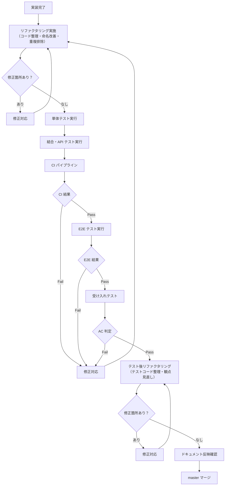

# テスト計画書

前: なし | [一覧](../README.md) | [次: 004-02.テスト観点・種別一覧.md](004-02.テスト観点・種別一覧.md)

目次（クリックで展開）

- [1. 目的](#1-目的)
- [2. テスト方針](#2-テスト方針)
- [3. テスト種別と範囲](#3-テスト種別と範囲)
- [4. テスト環境](#4-テスト環境)
- [5. テストスケジュール](#5-テストスケジュール)
  - [5.1 Phase 0 テストスケジュール](#51-phase-0-テストスケジュール)
  - [5.2 Phase 1 テストスケジュール](#52-phase-1-テストスケジュール)
- [6. テスト実施フロー](#6-テスト実施フロー)
- [7. テストデータ管理](#7-テストデータ管理)
- [8. 品質ゲートとの紐付け](#8-品質ゲートとの紐付け)
- [9. 欠陥管理](#9-欠陥管理)
- [10. ツール一覧](#10-ツール一覧)
- [11. 参照ドキュメント](#11-参照ドキュメント)
- [12. 更新履歴](#12-更新履歴)

## 1. 目的

本ドキュメントは、Musuhi の各 Phase・Iteration におけるテスト計画を定義する。
テスト種別・スケジュール・環境・品質ゲートを明確化し、受け入れ基準との整合を確保する。

## 2. テスト方針

- 本書の `Phase 0/1` は開発実行フェーズを指し、提案・要求仕様フェーズの立ち上げフェーズ0とは区別する
- 自動テストを優先し、CI で毎 Push・PR 時に実行する
- テストカバレッジ 80% 以上を維持する
- Must 要件（FR-001〜FR-004）はすべて自動テストで判定する
- 人間判定が必要な箇所（AC-004 重要変更・AC-008）は手動テストを補完的に実施する
- 受け入れテストは各 Iteration 終端で実施し、Pass の確認後に master マージする
- 各 Phase・Iteration 終了時に、テスト結果を入力としてユーザ・AI 合同のレトロスペクティブを実施する

## 3. テスト種別と範囲

| テスト種別 | 目的 | 実施タイミング | 担当 | 自動化 |
| --- | --- | --- | --- | --- |
| 単体テスト | 関数・メソッドレベルの検証 | 実装時・PR 作成時 | 開発者 | ◎ 全自動 |
| 結合テスト | コンポーネント間連携の検証 | PR 作成時 | 開発者 | ◎ 全自動 |
| API テスト | REST API の仕様適合確認 | PR 作成時 | 開発者 | ◎ 全自動 |
| E2E テスト | ユーザー操作シナリオ全体の検証 | Iteration 終端 | 開発者 | ○ 主自動 |
| 受け入れテスト | AC 達成確認 | Iteration 終端 | PO・レビュアー | △ 一部手動 |
| 性能テスト | NFR 性能目標の確認 | Phase 完了前 | 開発者 | ○ 自動 |
| セキュリティテスト | OWASP Top 10 対応確認 | Iteration 毎 | 開発者 | ○ Trivy/SAST |
| 回帰テスト | 既存機能への影響確認 | master マージ前 | 開発者 | ◎ 全自動 |

## 4. テスト環境

| 環境名 | 目的 | 構成 | 備考 |
| --- | --- | --- | --- |
| ローカル | 開発中テスト | docker-compose.override.yml | 開発者 PC |
| CI | 自動テスト（PR・Push） | GitHub Actions / Forgejo CI | コンテナ実行 |
| ステージング | 受け入れテスト | 本番同等構成 | Iteration 終端で起動 |

**テスト用外部依存のモック方針:**

| 外部依存 | モック方法 |
| --- | --- |
| LiteLLM / Ollama | testcontainers または モックサーバー |
| Forgejo / Gitea | testcontainers またはモック API |
| Garage (S3) | MinIO コンテナ（テスト用） |

## 5. テストスケジュール

### 5.1 Phase 0 テストスケジュール

| Iteration | 対象FR | テスト種別 | 完了条件 |
| --- | --- | --- | --- |
| Iteration 1 | FR-001 | 単体・結合・API・受け入れ | AC-001 Pass |
| Iteration 2 | FR-002, FR-003 | 単体・結合・API・E2E・受け入れ | AC-002, AC-003 Pass |
| Iteration 3 | FR-004 | 単体・結合・API・E2E・受け入れ・セキュリティ | AC-004 Pass |

### 5.2 Phase 1 テストスケジュール

| Iteration | 対象FR | テスト種別 | 完了条件 |
| --- | --- | --- | --- |
| Iteration 4 | 全FR（回帰） | 回帰・性能 | NFR 目標値達成 |
| Iteration 5 | FR-005, FR-008 | 単体・結合・E2E・受け入れ | AC-005, AC-008 Pass |
| Iteration 6 | FR-006 | 単体・結合・E2E・受け入れ | AC-006 Pass |

## 6. テスト実施フロー

## 7. テストデータ管理

- テストデータは `testdata/` ディレクトリで一元管理する
- フィクスチャは YAML または JSON 形式で定義する
- 個人情報・機密情報は含めない
- テスト実行後はデータをクリーンアップする（DB トランザクションロールバックまたはテスト用 DB）
- 本番データのテスト使用は禁止する

## 8. 品質ゲートとの紐付け

| 品質ゲート | 対応テスト | 実施タイミング |
| --- | --- | --- |
| GATE-001 (CI テスト全 Pass) | 単体・結合・API テスト | PR 作成時 |
| GATE-002 (カバレッジ 80%+) | 単体テスト | PR 作成時 |
| GATE-003 (静的解析エラー 0) | SAST / Trivy | PR 作成時 |
| GATE-005 (AC 全 Pass) | 受け入れテスト | Iteration 終端 |

## 9. 欠陥管理

| 優先度 | 判定基準 | 対応方法 | 完了条件 |
| --- | --- | --- | --- |
| P1 | サービス停止・データ損失・セキュリティ違反 | 即日対応・PO 報告 | 当日中に解消 |
| P2 | AC 未達・主要機能不全 | 当該 Iteration 内 | AC 再判定 Pass |
| P3 | UI 軽微不整合・表示ズレ | 次 Iteration 以内 | 次 Iteration AC 判定 |

- 欠陥は Git Issue として起票し、優先度・関連 AC・担当者を記載する
- P1 欠陥は master マージを停止し、解消後に再判定する

## 10. ツール一覧

| ツール | 用途 | 対象 |
| --- | --- | --- |
| `go test` | 単体・結合テスト | Go (musuhi-api) |
| `go test -cover` | カバレッジ計測 | Go (musuhi-api) |
| `vitest` | 単体テスト | TypeScript (musuhi-frontend) |
| `playwright` | E2E テスト | フロントエンド全体 |
| `golangci-lint` | 静的解析 | Go |
| `ESLint` | 静的解析 | TypeScript |
| `Trivy` | コンテナ脆弱性スキャン | 全コンテナ |
| `govulncheck` | Go 依存ライブラリ脆弱性チェック | Go |
| `k6` | 性能テスト | API |

## 11. 参照ドキュメント

- [003-03.受け入れ基準](../../001.提案・要求仕様フェーズ/003.要求仕様共通/003-03.受け入れ基準.md)
- [002-01.品質管理計画書](../002.品質管理計画/002-01.品質管理計画書.md)
- [003-01.機能要件定義書](../004.要件定義/003-01.機能要件定義書.md)
- [004-02.テスト観点・種別一覧](004-02.テスト観点・種別一覧.md)

## 12. 更新履歴

| 日付 | 版 | 変更内容 | 作成者 |
| --- | --- | --- | --- |
| 2026-05-01 | 0.1 | 初版作成 | Copilot |
| 2026-05-01 | 0.2 | フェーズ定義注記とレトロスペクティブ前提を追記 | Copilot |
| 2026-05-01 | 0.3 | テスト実施フローにリファクタリングループを追加 | Copilot |
