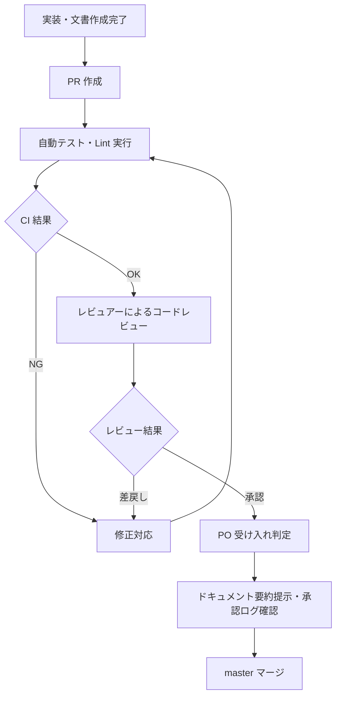
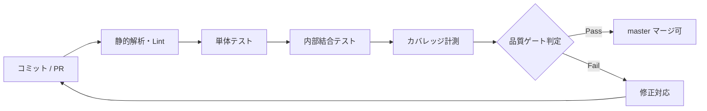
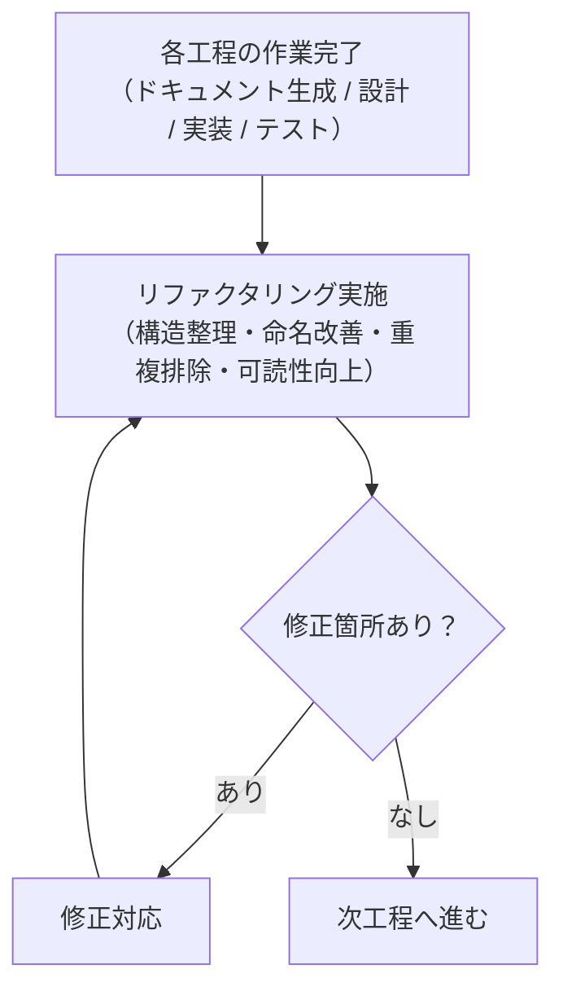

# 品質管理計画書

前: なし | [一覧](../README.md) | 次: なし

目次（クリックで展開）

- [1. 目的](#1-目的)
- [2. 品質目標](#2-品質目標)
- [3. 品質管理プロセス](#3-品質管理プロセス)
  - [3.1 レビュープロセス](#31-レビュープロセス)
  - [3.2 テストプロセス](#32-テストプロセス)
  - [3.3 CI/CD プロセス](#33-cicd-プロセス)
  - [3.4 リファクタリングプロセス](#34-リファクタリングプロセス)
- [4. 品質メトリクス](#4-品質メトリクス)
  - [4.1 コード品質](#41-コード品質)
  - [4.2 テスト品質](#42-テスト品質)
  - [4.3 ドキュメント品質](#43-ドキュメント品質)
- [5. レビュー観点チェックリスト](#5-レビュー観点チェックリスト)
  - [5.1 要件定義レビュー観点](#51-要件定義レビュー観点)
  - [5.2 設計・実装レビュー観点](#52-設計実装レビュー観点)
- [6. 不具合管理](#6-不具合管理)
- [7. 品質管理ツール](#7-品質管理ツール)
- [8. 品質ゲート基準](#8-品質ゲート基準)
- [9. 参照ドキュメント](#9-参照ドキュメント)
- [10. 更新履歴](#10-更新履歴)

## 1. 目的

本ドキュメントは、Musuhi の開発品質を担保するための管理方針・プロセス・メトリクスを定義する。
前提として、001.提案・要求仕様フェーズの成果物はユーザ承認済みかつ保存済みであることを扱う。

## 2. 品質目標

| 目標ID | 項目 | 目標値 | 測定方法 |
| --- | --- | --- | --- |
| QG-001 | テストカバレッジ | 80% 以上 | CI カバレッジ計測 |
| QG-002 | 受け入れ基準 Pass 率 | 100%（Must 要件） | 受け入れ判定記録 |
| QG-003 | 重大バグ（P1）未解消件数 | 0 件 | Issue トラッカー |
| QG-004 | ドキュメント同期遅延 | master マージ前に必ず更新 | レビュー承認記録 |
| QG-005 | Lint・静的解析エラー | 0 件 | CI 静的解析ログ |
| QG-006 | リファクタリング後の修正箇所 | 0 件（各工程リファクタリングPass後） | リファクタリング記録 |

## 3. 品質管理プロセス

### 3.1 レビュープロセス

### 3.2 テストプロセス

| テスト種別 | 実施タイミング | 担当 | 判定方法 |
| --- | --- | --- | --- |
| 単体テスト | 実装時 | 開発者 | CI 自動実行 |
| 内部結合テスト | PR 作成時 | 開発者 | CI 自動実行 |
| E2E テスト | Sprint 終端 | 開発者 | CI 自動実行 |
| 受け入れテスト | Sprint 終端 | PO・レビュアー | 手動判定 |
| 回帰テスト | master マージ前 | 開発者 | CI 自動実行 |

### 3.3 CI/CD プロセス

### 3.4 リファクタリングプロセス

リファクタリングは **ドキュメント生成・設計・実装・テストの各工程完了後** に必ず実施する。
修正箇所がなくなるまでリファクタリング → 修正を繰り返してから次工程へ進む。

**各工程でのリファクタリング観点:**

| 工程 | リファクタリング対象 | 観点 |
| --- | --- | --- |
| ドキュメント生成 | Markdown 文書 | 表記統一・構造整理・重複削除・用語統一 |
| 設計 | 設計ドキュメント・ER 図・API 定義 | 依存関係整理・命名一貫性・不要エンドポイント削除 |
| 実装 | ソースコード | 関数分割・命名改善・マジックナンバー除去・共通化 |
| テスト | テストコード・テスト観点 | 重複テスト排除・テストデータ整理・可読性向上 |

## 4. 品質メトリクス

### 4.1 コード品質

| メトリクス | 目標値 | 測定ツール |
| --- | --- | --- |
| テストカバレッジ（行） | 80% 以上 | go test -cover / vitest |
| 静的解析エラー | 0 件 | golangci-lint / ESLint |
| 循環的複雑度 | 関数あたり 10 以下 | gocyclo 等 |

### 4.2 テスト品質

| メトリクス | 目標値 |
| --- | --- |
| Must 要件の AC Pass 率 | 100% |
| P1 バグの未解消件数 | 0 件 |
| テストケース自動化率 | 機能テストの 80% 以上 |

### 4.3 ドキュメント品質

| メトリクス | 目標値 |
| --- | --- |
| master マージ前のドキュメント更新率 | 100% |
| 用語集未定義用語の使用 | 0 件 |
| リンク切れ | 0 件 |

## 5. レビュー観点チェックリスト

### 5.1 要件定義レビュー観点

- [ ] スコープ定義との整合性が取れているか
- [ ] 機能要件 ID (FR) が重複・欠落していないか
- [ ] 受け入れ基準 (AC) が全 FR に定義されているか
- [ ] 用語集に未登録の用語を使用していないか
- [ ] 非機能要件との整合性が取れているか
- [ ] リスク・制約との矛盾がないか
- [ ] トレーサビリティ表が更新されているか
- [ ] レビュー時の要約内容と元文書の差異が許容範囲内か
- [ ] UI 上の承認操作と承認ログが一致しているか

### 5.2 設計・実装レビュー観点

- [ ] 要件定義との整合性が取れているか
- [ ] セキュリティ要件を満たしているか（OWASP Top 10 確認）
- [ ] テストカバレッジが基準値を超えているか
- [ ] コーディング規約に準拠しているか
- [ ] ドキュメントが更新されているか
- [ ] 変更管理ルールに従って承認を受けているか

## 6. 不具合管理

| 優先度 | 定義 | 対応期限 |
| --- | --- | --- |
| P1（致命的） | サービス停止・データ損失・セキュリティ違反 | 即日対応 |
| P2（重大） | 主要機能の動作不全・受け入れ基準未達 | 当該 Sprint 内 |
| P3（軽微） | UI 不整合・表示ズレ・軽微な誤記 | 次 Sprint 以内 |

- 不具合は Git Issue として起票する
- P1 は発見当日に PO・レビュアーへ共有する
- 解消後は関連 AC を再判定する

## 7. 品質管理ツール

| ツール | 用途 | 対象 |
| --- | --- | --- |
| golangci-lint | Go 静的解析 | バックエンド |
| go test -cover | Go テスト・カバレッジ | バックエンド |
| ESLint / Prettier | フロントエンド静的解析 | フロントエンド |
| vitest / playwright | フロントエンドテスト | フロントエンド |
| Prometheus / Grafana | 性能メトリクス監視 | インフラ・アプリ |
| Loki | ログ集約・解析 | インフラ・アプリ |

## 8. 品質ゲート基準

master マージ前に以下をすべて満たすこと。

| ゲートID | 条件 |
| --- | --- |
| GATE-001 | CI の全テストが Pass |
| GATE-002 | テストカバレッジが 80% 以上 |
| GATE-003 | 静的解析エラーが 0 件 |
| GATE-004 | レビュアーの承認が得られている |
| GATE-005 | 対象 Sprint の AC が全 Pass |
| GATE-006 | 関連ドキュメントが更新されている |
| GATE-007 | 各工程のリファクタリングが実施され、修正箇所が 0 件であること |

## 9. 参照ドキュメント

- [003-03.受け入れ基準](../../001.提案・要求仕様フェーズ/003.要求仕様共通/003-03.受け入れ基準.md)
- [003-07.非機能要件](../../001.提案・要求仕様フェーズ/003.要求仕様共通/003-07.非機能要件.md)
- [003-10.変更管理ルール](../../001.提案・要求仕様フェーズ/003.要求仕様共通/003-10.変更管理ルール.md)
- [004-01.テスト計画書](../004.テスト計画/004-01.テスト計画書.md)

## 10. 更新履歴

| 日付 | 版 | 変更内容 | 作成者 |
| --- | --- | --- | --- |
| 2026-05-01 | 0.1 | 初版作成 | Copilot |
| 2026-05-01 | 0.2 | 要約提示・承認ログ確認をレビュー工程へ追記 | Copilot |
| 2026-05-01 | 0.3 | 各工程リファクタリングプロセス（3.4節）・QG-006・GATE-007 を追加 | Copilot |
