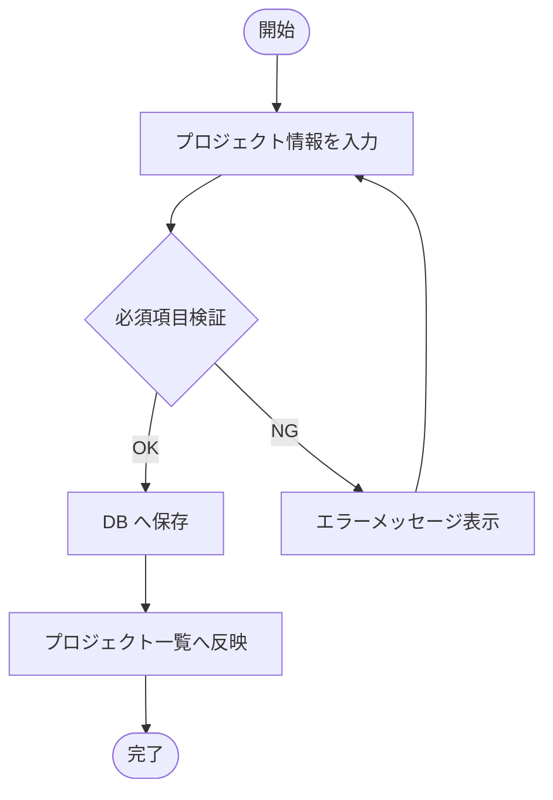
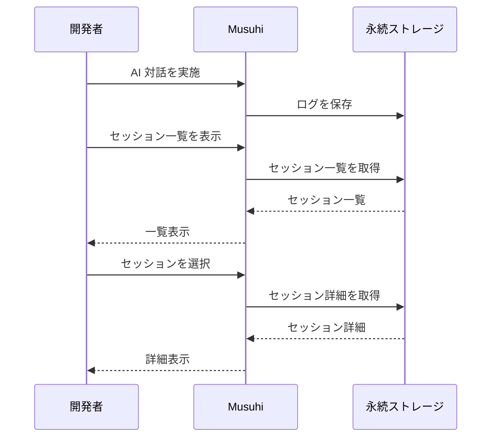
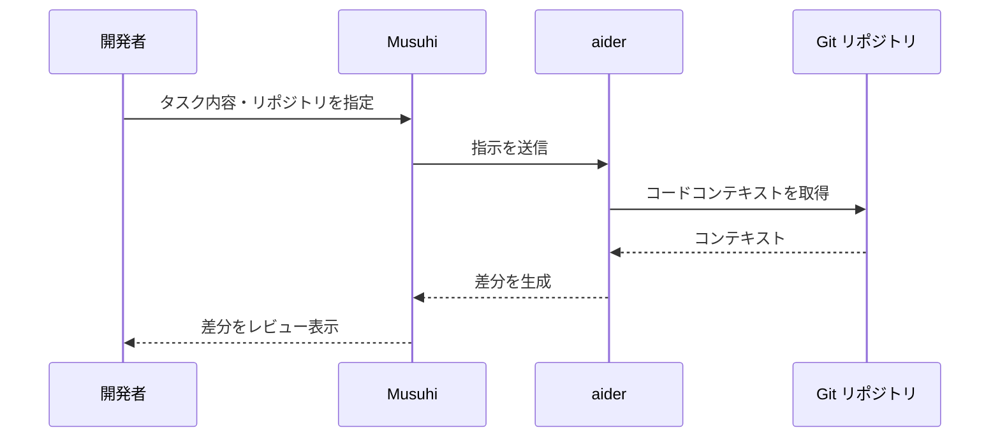
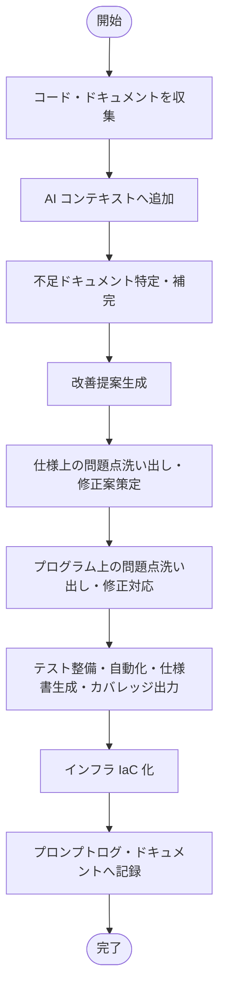

# 機能要件定義書

[前: なし](../README.md) | [一覧](../README.md) | [次: 003-02.非機能要件定義書.md](003-02.非機能要件定義書.md)

目次（クリックで展開）

- [1. 目的](#1-目的)
- [2. 要件定義の方針](#2-要件定義の方針)
- [3. 機能一覧](#3-機能一覧)
- [4. 機能詳細](#4-機能詳細)
  - [4.1 FR-001 プロジェクト作成・一覧](#41-fr-001-プロジェクト作成一覧)
  - [4.2 FR-002 プロンプトログ保存・再表示](#42-fr-002-プロンプトログ保存再表示)
  - [4.3 FR-003 Markdown 文書管理](#43-fr-003-markdown-文書管理)
  - [4.4 FR-004 aider 基本連携](#44-fr-004-aider-基本連携)
  - [4.5 FR-005 進捗可視化](#45-fr-005-進捗可視化)
  - [4.6 FR-006 AI 指示テンプレート](#46-fr-006-ai-指示テンプレート)
  - [4.7 FR-007 自動レポート出力](#47-fr-007-自動レポート出力)
  - [4.8 FR-008 レガシーシステム改修支援](#48-fr-008-レガシーシステム改修支援)
- [5. 画面一覧](#5-画面一覧)
- [6. API エンドポイント一覧](#6-api-エンドポイント一覧)
- [7. 要件変更管理](#7-要件変更管理)
- [8. 更新履歴](#8-更新履歴)

## 1. 目的

本ドキュメントは、001.提案・要求仕様フェーズの機能要件一覧 (003-02) を要件定義フェーズで詳細化し、設計・実装・テストへ引き渡す基準を確立する。

## 2. 要件定義の方針

- 001.提案・要求仕様フェーズの FR-001〜FR-008 を引き継ぎ、詳細化する
- 各 FR に画面・API・データ定義との紐付けを明示する
- 優先度 Must の要件は Phase 0 (Iteration 1〜3) で確定させる
- 本書で扱う `Phase` は開発実行フェーズを指し、提案・要求仕様フェーズの「プロジェクト立ち上げフェーズ0」と区別する
- 001フェーズ成果物のユーザレビュー時要約提示、UI 承認、GitHub/Projects 反映は本フェーズで機能仕様として定義・管理する

## 3. 機能一覧

| 要件ID | 機能名 | 優先度 | Phase | 目標Iteration | 前フェーズ対応FR |
| --- | --- | --- | --- | --- | --- |
| FR-001 | プロジェクト作成・一覧 | Must | Phase 0 | Iteration 1 | FR-001 |
| FR-002 | プロンプトログ保存・再表示 | Must | Phase 0 | Iteration 2 | FR-002 |
| FR-003 | Markdown 文書管理 | Must | Phase 0 | Iteration 2 | FR-003 |
| FR-004 | aider 基本連携 | Must | Phase 0 | Iteration 3 | FR-004 |
| FR-005 | 進捗可視化 | Should | Phase 1 | Iteration 5 | FR-005 |
| FR-006 | AI 指示テンプレート | Should | Phase 1 | Iteration 6 | FR-006 |
| FR-007 | 自動レポート出力 | Could | Phase 2 | Iteration 9 | FR-007 |
| FR-008 | レガシーシステム改修支援 | Should | Phase 1 | Iteration 5 | FR-008 |

## 4. 機能詳細

### 4.1 FR-001 プロジェクト作成・一覧

**概要:** 複数プロジェクトを並行管理するための基盤機能

**入力項目:**

| 項目名 | 種別 | 必須 | 最大長 | 備考 |
| --- | --- | --- | --- | --- |
| プロジェクト名 | 文字列 | ○ | 128文字 | 重複不可 |
| 説明 | テキスト | — | 1024文字 | |
| 開始日 | 日付 | ○ | — | ISO 8601 形式 |

**出力項目:**

| 項目名 | 種別 | 備考 |
| --- | --- | --- |
| プロジェクトID | UUID | 自動採番 |
| 作成日時 | Timestamp | UTC |
| ステータス | Enum | active / archived |

**正常系フロー:**

**例外系:**
- 必須項目不足: バリデーションエラーを表示
- プロジェクト名重複: 重複エラーを表示

**関連:** 画面: SCR-001 / API: POST /projects, GET /projects / AC: AC-001

---

### 4.2 FR-002 プロンプトログ保存・再表示

**概要:** AI 対話全体を記録し、再利用と監査に対応する

**入力項目:**

| 項目名 | 種別 | 必須 | 備考 |
| --- | --- | --- | --- |
| セッションID | UUID | ○ | 自動採番 |
| プロジェクトID | UUID | ○ | FR-001 で作成済み |
| 発話内容 | テキスト | ○ | |
| 応答内容 | テキスト | ○ | |
| タイムスタンプ | Timestamp | ○ | UTC |

**出力項目:**

| 項目名 | 種別 | 備考 |
| --- | --- | --- |
| セッション一覧 | リスト | プロジェクト単位でフィルタ可能 |
| セッション詳細 | テキスト | 発話/応答を時系列表示 |

**正常系フロー:**

**例外系:**
- 保存失敗: リトライまたはエラー通知
- セッション未存在: 404 エラー

**関連:** 画面: SCR-002 / API: POST /sessions, GET /sessions, GET /sessions/{id} / AC: AC-002

---

### 4.3 FR-003 Markdown 文書管理

**概要:** 要求仕様・要件定義・設計書を一元管理する

**入力項目:**

| 項目名 | 種別 | 必須 | 備考 |
| --- | --- | --- | --- |
| 文書タイトル | 文字列 | ○ | 128文字以内 |
| 本文 | Markdown テキスト | ○ | |
| プロジェクトID | UUID | ○ | |
| 更新コメント | 文字列 | — | 256文字以内 |

**出力項目:**

| 項目名 | 種別 | 備考 |
| --- | --- | --- |
| 文書ID | UUID | 自動採番 |
| 本文 | Markdown テキスト | |
| 更新履歴 | リスト | 更新日時・更新者・コメント |
| 文書要約 | テキスト | レビュー用の要点表示 |
| 承認状態 | Enum | draft / in_review / approved |

**正常系フロー:**
1. 文書を作成・更新する
2. 変更内容を履歴へ記録する
3. Markdown プレビューで確認する
4. レビュー用要約を生成し確認する
5. 承認操作を実行して状態を更新する
6. 時系列で履歴参照できる

**例外系:**
- 同時編集競合: 差分提示とマージ選択

**関連:** 画面: SCR-003 / API: POST /documents, PUT /documents/{id}, GET /documents/{id}/history, GET /documents/{id}/summary, POST /documents/{id}/approve / AC: AC-003

---

### 4.4 FR-004 aider 基本連携

**概要:** 実装タスクを aider に引き渡し、差分生成まで自動化する

**入力項目:**

| 項目名 | 種別 | 必須 | 備考 |
| --- | --- | --- | --- |
| タスク内容 | テキスト | ○ | |
| 対象リポジトリ | URL / パス | ○ | |
| 指示テンプレートID | UUID | — | FR-006 と連携 |

**出力項目:**

| 項目名 | 種別 | 備考 |
| --- | --- | --- |
| 差分 (Diff) | テキスト | unified diff 形式 |
| 実行ログ | テキスト | aider 実行ログ |

**正常系フロー:**

**例外系:**
- aider 実行エラー: エラーログを表示し再実行を促す
- リポジトリ未存在: エラー表示

**自動判定補足 (AC-004):**
- 生成差分を Qdrant で要件・設計チャンクと照合し、類似度スコア >= 0.75 を Pass 候補とする
- 認証/権限/データ永続化/外部公開経路に関わる変更は手動レビューを必須とする

**関連:** 画面: SCR-004 / API: POST /tasks/aider / AC: AC-004

---

### 4.5 FR-005 進捗可視化

**概要:** マイルストーン・Iteration 単位で進捗を確認できるダッシュボード

**入力項目:**
- プロジェクトID
- 表示対象 Phase / Iteration

**出力項目:**

| 項目名 | 種別 | 備考 |
| --- | --- | --- |
| 進捗ステータス | Enum | 未着手 / 進行中 / 完了 |
| タスク一覧 | リスト | FR・AC・イテレーション別 |
| 完了率 | 数値 | % 表示 |
| 外部同期ステータス | リスト | GitHub Issue / Projects への反映状態 |

**関連:** 画面: SCR-005 / API: GET /projects/{id}/progress, GET /projects/{id}/sync-status / AC: AC-005

---

### 4.6 FR-006 AI 指示テンプレート

**概要:** フェーズ別テンプレートを選択して AI 指示文を生成する

**入力項目:**
- テンプレートID
- パラメータ（プロジェクト名・タスク内容）

**出力項目:**
- 生成された指示文

**関連:** 画面: SCR-006 / API: GET /templates, POST /templates/{id}/generate / AC: AC-006

---

### 4.7 FR-007 自動レポート出力

**概要:** 指定期間のプロジェクト進捗レポートを生成する

**入力項目:**
- プロジェクトID
- 対象期間（開始日・終了日）
- 出力形式（Markdown / PDF）

**出力項目:**
- 進捗レポートファイル

**関連:** 画面: SCR-007 / API: POST /reports/generate / AC: AC-007

---

### 4.8 FR-008 レガシーシステム改修支援

**概要:** 既存システムのコード・ドキュメントを分析し、改善提案・テスト整備・IaC 化を支援する

**入力項目:**

| 項目名 | 種別 | 必須 | 備考 |
| --- | --- | --- | --- |
| 対象コード | ファイルパス / ZIP | ○ | |
| 既存ドキュメント | Markdown / テキスト | — | |
| 分析視点 | 複数選択 | ○ | ドキュメント / バグ / セキュリティ / テスト / IaC |

**出力項目:**

| 出力物 | 種別 | 備考 |
| --- | --- | --- |
| 不足ドキュメント一覧 | リスト | |
| 改善提案リスト | リスト | |
| 問題点一覧・修正案 | テキスト | |
| テストコード | コード | |
| テスト仕様書 | Markdown | |
| テスト結果レポート | テキスト | |
| カバレッジレポート | HTML / JSON | |
| IaC テンプレート | YAML / HCL | Docker Compose / Terraform / Bicep |

**正常系フロー:**

**例外系:**
- 対象コード未追加: 入力要求エラーを表示

**関連:** 画面: SCR-008 / API: POST /legacy/analyze / AC: AC-008

## 5. 画面一覧

| 画面ID | 画面名 | 関連FR | 概要 |
| --- | --- | --- | --- |
| SCR-001 | プロジェクト一覧・作成 | FR-001 | プロジェクト作成フォームと一覧表示 |
| SCR-002 | プロンプトログ一覧・詳細 | FR-002 | セッション一覧とチャット形式の詳細表示 |
| SCR-003 | 文書管理 | FR-003 | Markdown エディタ・プレビュー・履歴 |
| SCR-004 | aider 連携 | FR-004 | タスク入力・差分表示 |
| SCR-005 | 進捗ダッシュボード | FR-005 | マイルストーン・タスク進捗表示 |
| SCR-006 | テンプレート選択・生成 | FR-006 | テンプレート一覧・生成フォーム |
| SCR-007 | レポート生成 | FR-007 | 期間指定・出力形式選択 |
| SCR-008 | レガシー改修支援 | FR-008 | コード追加・分析視点選択・結果表示 |

## 6. API エンドポイント一覧

| HTTP メソッド | パス | 機能 | 関連FR |
| --- | --- | --- | --- |
| POST | /projects | プロジェクト作成 | FR-001 |
| GET | /projects | プロジェクト一覧 | FR-001 |
| GET | /projects/{id} | プロジェクト詳細 | FR-001 |
| POST | /sessions | セッション作成 | FR-002 |
| GET | /sessions | セッション一覧 | FR-002 |
| GET | /sessions/{id} | セッション詳細 | FR-002 |
| POST | /documents | 文書作成 | FR-003 |
| PUT | /documents/{id} | 文書更新 | FR-003 |
| GET | /documents/{id}/history | 文書履歴 | FR-003 |
| GET | /documents/{id}/summary | 文書要約取得 | FR-003 |
| POST | /documents/{id}/approve | 文書承認 | FR-003 |
| POST | /tasks/aider | aider 連携 | FR-004 |
| GET | /projects/{id}/progress | 進捗取得 | FR-005 |
| GET | /projects/{id}/sync-status | 外部同期状態取得 | FR-005 |
| GET | /templates | テンプレート一覧 | FR-006 |
| POST | /templates/{id}/generate | 指示文生成 | FR-006 |
| POST | /reports/generate | レポート生成 | FR-007 |
| POST | /legacy/analyze | レガシー分析 | FR-008 |

## 7. 要件変更管理

- 要件変更は [003-10.変更管理ルール](../../001.提案・要求仕様フェーズ/003.要求仕様共通/003-10.変更管理ルール.md) に従い Issue 起票・承認後に反映する
- FR の追加・変更時は本書・トレーサビリティ表を同時更新する

## 8. 更新履歴

| 日付 | 版 | 変更内容 | 作成者 |
| --- | --- | --- | --- |
| 2026-05-01 | 0.1 | 初版作成（FR-001〜FR-008 詳細化） | Copilot |
| 2026-05-01 | 0.2 | 文書要約・承認・外部同期状態の要件を追記 | Copilot |
