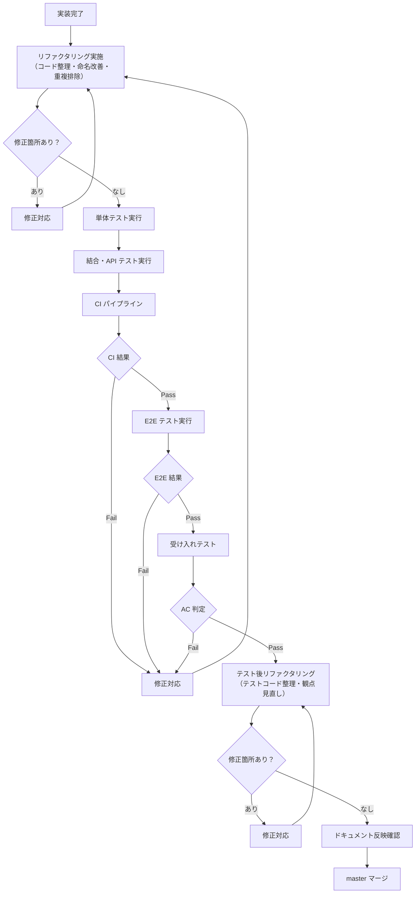

# テスト計画書

前: なし | [一覧](../README.md) | [次: 004-02.テスト観点・種別一覧.md](004-02.テスト観点・種別一覧.md)

目次（クリックで展開）

- [1. 目的](#1-目的)
- [2. テスト方針](#2-テスト方針)
- [3. テスト種別と範囲](#3-テスト種別と範囲)
- [4. テスト環境](#4-テスト環境)
- [5. テストスケジュール](#5-テストスケジュール)
  - [5.1 Phase 0 テストスケジュール](#51-phase-0-テストスケジュール)
  - [5.2 Phase 1 テストスケジュール](#52-phase-1-テストスケジュール)
- [6. テスト実施フロー](#6-テスト実施フロー)
- [7. テストデータ管理](#7-テストデータ管理)
- [8. テスト結果ファイル命名規則](#8-テスト結果ファイル命名規則)
- [9. 品質ゲートとの紐付け](#9-品質ゲートとの紐付け)
- [10. 欠陥管理](#10-欠陥管理)
- [11. ツール一覧](#11-ツール一覧)
- [12. 参照ドキュメント](#12-参照ドキュメント)
- [13. 更新履歴](#13-更新履歴)

## 1. 目的

本ドキュメントは、Musuhi の各 Phase・Sprint におけるテスト計画を定義する。
テスト種別・スケジュール・環境・品質ゲートを明確化し、受け入れ基準との整合を確保する。

## 2. テスト方針

- 本書の `Phase 0/1` は開発実行フェーズを指し、提案・要求仕様フェーズの立ち上げフェーズ0とは区別する
- 自動テストを優先し、CI で毎 Push・PR 時に実行する
- テストカバレッジ 80% 以上を維持する
- Must 要件（FR-001～FR-012）はすべて自動テストで判定する
- 人間判定が必要な箇所（AC-006 文書承認・ AC-011/AC-012/AC-013）は手動テストを補完的に実施する
- 受け入れテストは各 Sprint 終端で実施し、Pass の確認後に master マージする
- 各 Phase・Sprint 終了時に、テスト結果を入力としてユーザ・AI 合同のレトロスペクティブを実施する

## 3. テスト種別と範囲

| テスト種別 | 目的 | 実施タイミング | 担当 | 自動化 |
| --- | --- | --- | --- | --- |
| 単体テスト | 関数・メソッドレベルの検証 | 実装時・PR 作成時 | 開発者 | ◎ 全自動 |
| 内部結合テスト | コンポーネント間連携の検証 | PR 作成時 | 開発者 | ◎ 全自動 |
| 外部結合テスト | GitHub API・外部サービスとの実接続確認 | PR 作成時 | 開発者 | ○ 主自動 |
| API テスト | REST API の仕様適合確認 | PR 作成時 | 開発者 | ◎ 全自動 |
| E2E テスト | ユーザー操作シナリオ全体の検証 | Sprint 終端 | 開発者 | ○ 主自動 |
| 受け入れテスト | AC 達成確認 | Sprint 終端 | PO・レビュアー | △ 一部手動 |
| 性能テスト | NFR 性能目標の確認 | Phase 完了前 | 開発者 | ○ 自動 |
| セキュリティテスト | OWASP Top 10 対応確認 | Sprint 毎 | 開発者 | ○ Trivy/SAST |
| 回帰テスト | 既存機能への影響確認 | master マージ前 | 開発者 | ◎ 全自動 |

## 4. テスト環境

| 環境名 | 目的 | 構成 | 備考 |
| --- | --- | --- | --- |
| ローカル | 開発中テスト | docker-compose.override.yml | 開発者 PC |
| CI | 自動テスト（PR・Push） | GitHub Actions / Forgejo CI | コンテナ実行 |
| ステージング | 受け入れテスト | 本番同等構成 | Sprint 終端で起動 |

**テスト用外部依存のモック方針:**

| 外部依存 | モック方法 |
| --- | --- |
| LiteLLM / Ollama | testcontainers または モックサーバー |
| Forgejo / Gitea | testcontainers またはモック API |
| Garage (S3) | MinIO コンテナ（テスト用） |

## 5. テストスケジュール

### 5.1 Phase 0 テストスケジュール

| Sprint | 対象FR | テスト種別 | 完了条件 |
| --- | --- | --- | --- |
| Sprint 1 | FR-001, FR-002, FR-003, FR-004 | 単体・結合・API・受け入れ | AC-001, AC-002, AC-003, AC-004 Pass |
| Sprint 2 | FR-005, FR-006, FR-007 | 単体・結合・API・E2E・受け入れ | AC-005, AC-006, AC-007 Pass |
| Sprint 3 | FR-008, FR-009, FR-010 | 単体・結合・API・E2E・受け入れ・セキュリティ | AC-008, AC-009, AC-010 Pass |

### 5.2 Phase 1 テストスケジュール

| Sprint | 対象FR | テスト種別 | 完了条件 |
| --- | --- | --- | --- |
| Sprint 1～N | FR-011 | 単体・結合・E2E・受け入れ | AC-011 Pass（全Ticket） |
| Sprint N+1 | FR-012 | 単体・結合・E2E・受け入れ | AC-012 Pass |
| Phase 2 | FR-013（Should） | 単体・結合・E2E・受け入れ | AC-013 Pass |
| Phase 完了前 | 全FR（回帰） | 回帰・性能 | NFR 目標値達成 |

## 6. テスト実施フロー

## 7. テストデータ管理

- テストデータは `testdata/` ディレクトリで一元管理する
- フィクスチャは YAML または JSON 形式で定義する
- 個人情報・機密情報は含めない
- テスト実行後はデータをクリーンアップする（DB トランザクションロールバックまたはテスト用 DB）
- 本番データのテスト使用は禁止する

## 8. テスト結果ファイル命名規則

- プレーンテキストのテスト結果は、実行日時をファイル名に含めず固定名で保存する
- 単体テスト・内部結合テスト・外部結合テスト・APIテストは `FR-{機能番号3桁}` を対象IDとする
  - 例: `FR-001単体テスト結果.txt`, `FR-001内部結合テスト結果.txt`, `FR-001外部結合テスト結果.txt`, `FR-001APIテスト結果.txt`
- E2Eテスト・セキュリティテストは `SPR-{Phase番号}-{Sprint番号}` を対象IDとする
  - 例: `SPR-1-1E2Eテスト結果.txt`, `SPR-1-1セキュリティテスト結果.txt`
- 性能テストは `PH-{Phase番号}` を対象IDとする
  - 例: `PH-1性能テスト結果.txt`
- 回帰テストは `MRG-{PR番号}` を対象IDとする
  - 例: `MRG-123回帰テスト結果.txt`
- 受け入れテストの雛形ファイルは `FR-{機能番号3桁}` を対象IDとして用意し、同一機能で再実行した場合は上書きする
- 実行日時はファイル本文の先頭に記録する
- 自動出力には `tools/test_result_export/export_test_result.sh` または `services/musuhi-api/src/Makefile` を使用する

## 9. 品質ゲートとの紐付け

| 品質ゲート | 対応テスト | 実施タイミング |
| --- | --- | --- |
| GATE-001 (CI テスト全 Pass) | 単体・結合・API テスト | PR 作成時 |
| GATE-002 (カバレッジ 80%+) | 単体テスト | PR 作成時 |
| GATE-003 (静的解析エラー 0) | SAST / Trivy | PR 作成時 |
| GATE-005 (AC 全 Pass) | 受け入れテスト | Sprint 終端 |

## 10. 欠陥管理

| 優先度 | 判定基準 | 対応方法 | 完了条件 |
| --- | --- | --- | --- |
| P1 | サービス停止・データ損失・セキュリティ違反 | 即日対応・PO 報告 | 当日中に解消 |
| P2 | AC 未達・主要機能不全 | 当該 Sprint 内 | AC 再判定 Pass |
| P3 | UI 軽微不整合・表示ズレ | 次 Sprint 以内 | 次 Sprint AC 判定 |

- 欠陥は Git Issue として起票し、優先度・関連 AC・担当者を記載する
- P1 欠陥は master マージを停止し、解消後に再判定する

## 11. ツール一覧

| ツール | 用途 | 対象 |
| --- | --- | --- |
| `go test` | 単体・内部結合テスト | Go (musuhi-api) |
| `go test -cover` | カバレッジ計測 | Go (musuhi-api) |
| `export_test_result.sh` | テスト結果ファイル出力・雛形生成 | 全テスト結果 |
| `make export-test-result` | テスト結果ファイル出力の共通入口 | musuhi-api |
| `vitest` | 単体テスト | TypeScript (musuhi-frontend) |
| `playwright` | E2E テスト | フロントエンド全体 |
| `golangci-lint` | 静的解析 | Go |
| `ESLint` | 静的解析 | TypeScript |
| `Trivy` | コンテナ脆弱性スキャン | 全コンテナ |
| `govulncheck` | Go 依存ライブラリ脆弱性チェック | Go |
| `k6` | 性能テスト | API |

## 12. 参照ドキュメント

- [003-03.受け入れ基準](../../001.提案・要求仕様フェーズ/003.要求仕様共通/003-03.受け入れ基準.md)
- [003-01.品質管理計画書](../003.品質管理計画/003-01.品質管理計画書.md)
- [001-01.機能要件定義書](../001.要件定義/001-01.機能要件定義書.md)
- [004-02.テスト観点・種別一覧](004-02.テスト観点・種別一覧.md)

## 13. 更新履歴

| 日付 | 版 | 変更内容 | 作成者 |
| --- | --- | --- | --- |
| 2026-05-01 | 0.1 | 初版作成 | Copilot |
| 2026-05-01 | 0.2 | フェーズ定義注記とレトロスペクティブ前提を追記 | Copilot |
| 2026-05-05 | 0.4 | テスト方针・ITaスケジュールをFR-001～FR-013対応に更新 | Copilot |
| 2026-05-01 | 0.3 | テスト実施フローにリファクタリングループを追加 | Copilot |
| 2026-05-06 | 0.5 | テスト種別と範囲に外部結合テストを追加 | Copilot |
| 2026-05-07 | 0.6 | テスト結果ファイル命名規則と自動出力手順を追加 | Copilot |
