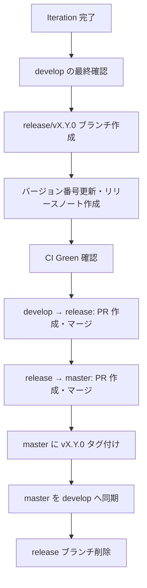

# Git 運用規約

[前: 005-02.ドキュメント規約.md](005-02.ドキュメント規約.md) | [一覧](../README.md) | [次: 005-04.ログ規約.md](005-04.ログ規約.md)

<details>
<summary>目次（クリックで展開）</summary>

- [1. 目的](#1-目的)
- [2. ブランチ戦略](#2-ブランチ戦略)
  - [2.1 ブランチ種別](#21-ブランチ種別)
  - [2.2 ブランチ運用フロー](#22-ブランチ運用フロー)
- [3. コミットメッセージ規約](#3-コミットメッセージ規約)
  - [3.1 フォーマット](#31-フォーマット)
  - [3.2 タイプ一覧](#32-タイプ一覧)
  - [3.3 コミットメッセージ例](#33-コミットメッセージ例)
- [4. プルリクエスト規約](#4-プルリクエスト規約)
  - [4.1 PR 作成ルール](#41-pr-作成ルール)
  - [4.2 PR テンプレート](#42-pr-テンプレート)
  - [4.3 マージ条件](#43-マージ条件)
- [5. タグ・リリース規約](#5-タグリリース規約)
- [6. Iteration 完了時の Git 操作](#6-iteration-完了時の-git-操作)
- [7. 禁止事項](#7-禁止事項)
- [8. 更新履歴](#8-更新履歴)

</details>

## 1. 目的

本ドキュメントは、Musuhi 開発における Git ブランチ管理・コミットメッセージ・PR 運用の規約を定義する。
トレーサビリティと安全なリリースフローを実現する。

## 2. ブランチ戦略

### 2.1 ブランチ種別

| ブランチ名 | 用途 | 削除 |
| --- | --- | --- |
| `master` | 安定版・リリースブランチ | 削除不可 |
| `develop` | 開発統合ブランチ | 削除不可 |
| `feature/{issue番号}-{概要}` | 機能開発 | マージ後削除 |
| `fix/{issue番号}-{概要}` | バグ修正 | マージ後削除 |
| `docs/{issue番号}-{概要}` | ドキュメント追加・更新 | マージ後削除 |
| `refactor/{issue番号}-{概要}` | リファクタリング | マージ後削除 |
| `release/v{バージョン}` | リリース準備 | リリース後削除 |

**命名例:**

```
feature/42-project-crud-api
fix/55-session-delete-bug
docs/60-coding-conventions
release/v1.0.0
```

### 2.2 ブランチ運用フロー

```mermaid
gitGraph
   commit id: "initial"
   branch develop
   checkout develop
   branch feature/42-project-api
   checkout feature/42-project-api
   commit id: "feat: add project create API"
   commit id: "test: add unit tests"
   checkout develop
   merge feature/42-project-api id: "merge feature"
   branch release/v0.1.0
   checkout release/v0.1.0
   commit id: "chore: bump version v0.1.0"
   checkout master
   merge release/v0.1.0 id: "release v0.1.0" tag: "v0.1.0"
   checkout develop
   merge master id: "sync master"
```

- `feature/*` / `fix/*` / `docs/*` は必ず `develop` から分岐する
- `develop` への直接プッシュを禁止する（PR 必須）
- `master` への直接プッシュを禁止する（`release/*` からの PR のみ）

## 3. コミットメッセージ規約

### 3.1 フォーマット

[Conventional Commits](https://www.conventionalcommits.org/) に準拠する。

```
{タイプ}({スコープ}): {概要}

{本文（任意）}

{フッター（任意）}
```

- **タイプ**: 変更の種別（必須）
- **スコープ**: 変更の対象範囲（任意、例: `api`, `ui`, `db`, `docs`）
- **概要**: 50文字以内、命令形、末尾ピリオドなし

### 3.2 タイプ一覧

| タイプ | 用途 |
| --- | --- |
| `feat` | 新機能追加 |
| `fix` | バグ修正 |
| `docs` | ドキュメントのみの変更 |
| `style` | コードの意味に影響しない変更（フォーマット等） |
| `refactor` | バグ修正でも機能追加でもないコード変更 |
| `test` | テストの追加・修正 |
| `chore` | ビルドプロセス・ツール・設定の変更 |
| `ci` | CI/CD 設定の変更 |
| `perf` | パフォーマンス改善 |
| `revert` | コミットの取り消し |

### 3.3 コミットメッセージ例

```
feat(api): add project create endpoint

POST /projects を実装。入力バリデーション・UUID 生成・DB 保存を含む。

Closes #42
```

```
fix(ui): fix session list not refreshing on delete

削除後に一覧が更新されない不具合を修正。
useEffect の依存配列に sessions を追加。

Fixes #55
```

```
docs: add coding conventions

005-01.コーディング規約.md を追加。
Go・TypeScript・SQL・Docker 規約を定義。
```

## 4. プルリクエスト規約

### 4.1 PR 作成ルール

- PR タイトルはコミットメッセージ規約に準拠する
- PR は 1 つの Issue または機能に対応する（大きすぎる PR を避ける）
- PR 作成時にレビュアーを必ず指定する
- CI がすべて Green であることを確認してからレビュー依頼する
- WIP（作業中）の PR は `[WIP]` プレフィックスを付ける

### 4.2 PR テンプレート

```markdown
## 変更内容

<!-- 変更の概要を記述 -->

## 関連 Issue

Closes #

## 変更理由

<!-- なぜこの変更が必要か -->

## テスト内容

- [ ] 単体テストを追加・更新した
- [ ] 手動動作確認を実施した
- [ ] 既存テストがすべてパスする

## スクリーンショット（UI 変更がある場合）

## チェックリスト

- [ ] コーディング規約に準拠している
- [ ] ドキュメントを更新した（必要な場合）
- [ ] 機密情報をコミットに含めていない
```

### 4.3 マージ条件

master / develop へのマージには以下がすべて満たされていること。

| 条件 | 確認方法 |
| --- | --- |
| CI（Lint・テスト・セキュリティスキャン）が Green | CI ステータス |
| レビュアー 1 名以上の Approve | Forgejo/Gitea のレビュー承認 |
| コンフリクトが解消されている | merge ベースを最新に保つ |
| 関連ドキュメントが更新されている | チェックリスト確認 |
| テストカバレッジが基準値以上 | CI レポート |

## 5. タグ・リリース規約

- タグは [Semantic Versioning](https://semver.org/) に従う: `v{MAJOR}.{MINOR}.{PATCH}`
- Iteration 完了時に `vX.Y.0` タグを打つ
- タグは master にのみ打つ
- リリースノートに変更点を記載する

| バージョン | タイミング |
| --- | --- |
| `v0.1.0` | Iteration 1 完了 |
| `v0.2.0` | Iteration 2 完了 |
| `v0.3.0` | Iteration 3 完了 |
| `v1.0.0` | Phase 0 完了・MVP リリース |

## 6. Iteration 完了時の Git 操作

各 Iteration 完了時に以下の手順を実施する。



```bash
# Iteration 完了の操作例
git checkout develop
git pull origin develop

git checkout -b release/v0.1.0
# バージョン情報更新・リリースノート作成
git commit -m "chore: bump version v0.1.0"

# PR: release/v0.1.0 → master（レビュー・CI 確認後マージ）
git checkout master
git pull origin master
git tag -a v0.1.0 -m "Release v0.1.0: Iteration 1 完了"
git push origin v0.1.0

# master を develop へ同期
git checkout develop
git merge master
git push origin develop

# release ブランチ削除
git push origin --delete release/v0.1.0
```

## 7. 禁止事項

- `master` / `develop` への直接プッシュ
- `git push --force` の使用（緊急時はチームに連絡してから実施）
- `git commit --amend` で公開済みコミットの書き換え
- 機密情報（パスワード・API キー）のコミット
- `--no-verify` による Git フックのスキップ
- `latest` や `temp`、`test` 等の意味のないブランチ名

## 8. 更新履歴

| 日付 | 版 | 変更内容 | 作成者 |
| --- | --- | --- | --- |
| 2026-05-02 | 0.2 | 次ドキュメントリンクに 005-04.ログ規約.md を追加 | Copilot |
| 2026-05-01 | 0.1 | 初版作成 | Copilot |
