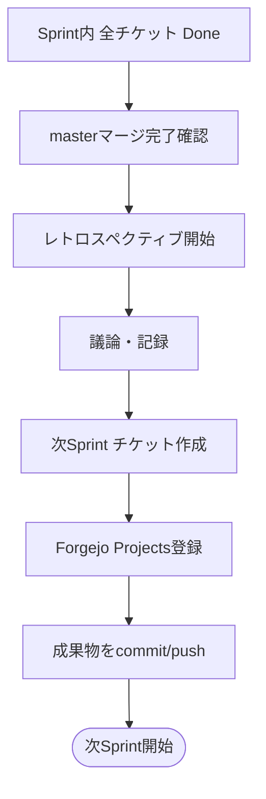

# レトロスペクティブ実施規約

前: [001-04.tools利用規約](001-04.tools利用規約.md) | [一覧](../README.md) | 次: なし

<details>
<summary>目次（クリックで展開）</summary>

- [1. 目的](#1-目的)
- [2. 実施タイミング](#2-実施タイミング)
- [3. 参加者](#3-参加者)
- [4. 実施手順](#4-実施手順)
- [5. 議論項目](#5-議論項目)
- [6. 次のSprintのチケット作成](#6-次のsprintのチケット作成)
- [7. 成果物の保存先](#7-成果物の保存先)
- [8. チェックリスト](#8-チェックリスト)
- [9. 更新履歴](#9-更新履歴)

</details>

## 1. 目的

本ドキュメントは、Sprint 完了後に実施するレトロスペクティブの手順・議論項目・成果物管理ルールを定める。

レトロスペクティブの目的は以下の通りである。

- 完了した Sprint の軌跡を振り返り、次の Sprint の計画精度を高める
- 課題・改善点を記録し、パターンを蓄積する
- 申し送り事項を収集し、次 Sprint のチケット候補へ反映する

> 関連: [001-03.フェーズ・スプリント・チケット設計規約 セクション9](001-03.フェーズ・スプリント・チケット設計規約.md#9-sprintレトロスペクティブ) から本規約への参照導線を記載している。

---

## 2. 実施タイミング

Sprint の **全チケットが `Done` になり、`master` ブランチへのマージが完了した後**に実施する。



---

## 3. 参加者

| 参加者 | 必須 / 任意 |
| --- | --- |
| Musuhi | 必須 |
| ユーザ | 任意 |

ユーザが不参加の場合、Musuhi が単独で振り返りを実施し、結果をドキュメントに記録する。

---

## 4. 実施手順

1. **前準備（Musuhi）**
   - Sprint の全チケットの完了状態・master マージを確認する
   - 要件定義書（`_document/002.要件定義フェーズ`）を基準に、設計書（`_document/003.設計・開発・テストフェーズ/003.設計`）および実装との差分を確認し、矛盾項目を洗い出す
   - 各チケットの申し送りコメント（`Add Comment`）を収集・整理する
   - Done チケット実績（Story Point / 開始日時 / 終了日時 / AI Token 数）を集計し、ベロシティを算出する

2. **振り返り（Musuhi・ユーザ）**
   - [5. 議論項目](#5-議論項目) に沿って振り返りを実施する
   - 良かった点・改善点・次 Sprint へのアクションを記録する

3. **次 Sprint チケット作成（Musuhi）**
   - [6. 次のSprintのチケット作成](#6-次のsprintのチケット作成) の手順に従いチケットを作成・登録する

4. **成果物の保存・commit/push（Musuhi）**
   - [7. 成果物の保存先](#7-成果物の保存先) の規則に従い記録を保存する
   - 保存ファイルを commit/push し、Forgejo Projects の対象タスクを更新する

---

## 5. 議論項目

| 項目 | 内容 | 記録先 |
| --- | --- | --- |
| 良かったこと | 見積精度・設計・実装・テストで特にうまくいったこと | レトロスペクティブ記録ファイル |
| 改善すること | ブロッカー・解決に時間がかかったこと・設計・実装・テスト上の問題 | レトロスペクティブ記録ファイル |
| 要件定義との矛盾項目 | 要件定義と設計書・実装で矛盾している項目を確認し、原因と是正方針を決定する | レトロスペクティブ記録ファイル |
| 申し送り事項の取り込み | 各チケットの申し送りコメント（`Add Comment`）を収集・整理し、次以降の Sprint チケット候補とする | レトロスペクティブ記録ファイル |
| 次の Sprint へのアクション | 改善項目のチケット化・ルール・AI 指示の見直し等 | Forgejo Projects チケット |

### KPT フォーマット（推奨）

振り返りの記録には KPT（Keep / Problem / Try）フォーマットを推奨する。

```
## KPT

### Keep（続けること）
- 例: テストを先に書いてから実装する手順が効果的だった

### Problem（問題だったこと）
- 例: API 仕様変更の影響範囲把握に時間がかかった

### Try（次回試すこと）
- 例: API 変更時に影響範囲チェックリストを最初に作成する
```

---

## 6. 次のSprintのチケット作成

Sprint 終了後、次の Sprint のチケットを以下の手順で作成・見直す。

1. **WBS の見直し**
   [001-03 セクション7](001-03.フェーズ・スプリント・チケット設計規約.md#7-wbs概要phasesprintticket) の WBS 概要とレトロスペクティブ結果を照合し、次 Sprint のスコープを再確認する

2. **申し送り事項の取り込み**
   前 Sprint の全チケットの申し送りコメント（`Add Comment`）を収集・整理し、優先度を評価した上で次 Sprint のチケット候補に追加する

3. **SP 見積**
   前 Sprint までの Done Ticket に記録された `Story Point` / `開始日時` / `終了日時` / `AI Token 数` からベロシティを算出し、チケットごとに SP を見積る  
   （[001-02 セクション5](001-02.タスクフォーマット規約.md#5-見積基準) 参照）

4. **Ticket 粒度の見直し**
   前 Sprint の実績を元に Ticket 分割基準を必要に応じて調整する

5. **チケット作成**
   [001-02.タスクフォーマット規約](001-02.タスクフォーマット規約.md) のテンプレートに従い Forgejo Projects に登録する

6. **依存関係の設定**
   `Depends on` フィールドを設定し、`Start date` / `Target date` を確認する

7. **001-03 ドキュメントの更新**
   作成したチケット詳細を [001-03.フェーズ・スプリント・チケット設計規約](001-03.フェーズ・スプリント・チケット設計規約.md) に追記する

---

## 7. 成果物の保存先

| 成果物 | 保存先 | 形式 |
| --- | --- | --- |
| レトロスペクティブ記録 | `新規プロジェクト/_document/003.設計・開発・テストフェーズ/` 配下の適切なディレクトリ | Markdown |
| 次 Sprint チケット一覧 | Forgejo Projects | Issue |
| ベロシティ集計 | レトロスペクティブ記録ファイル内に含める | — |

> 保存先は [002-03 セクション6.3（Step12〜Step14 の運用ルール）](../../002.要件定義フェーズ/002.プロジェクト計画/002-03.タスク推進計画.md#63-step12step14-の運用ルール) にも記載している。

---

## 8. チェックリスト

レトロスペクティブ完了の基準として、以下を全て満たすこと。

- [ ] Sprint 全チケットが Done・`master` マージ完了を確認
- [ ] 良かったこと・改善することをドキュメントに記録（KPT 推奨）
- [ ] 要件定義書と設計書・実装の矛盾項目を洗い出し、原因と是正方針を記録した
- [ ] 全チケットの申し送りコメント（`Add Comment`）を収集・整理した
- [ ] 次の Sprint WBS スコープを確認・必要に応じて修正
- [ ] 申し送り事項からチケット候補を追加し、優先度を評価した
- [ ] 前 Sprint までの Done Ticket 実績（Story Point / 時間 / AI Token）からベロシティを算出し SP を見積った
- [ ] 次の Sprint のチケットを Forgejo Projects に登録した
- [ ] `Parent issue` / `Depends on` / `Story Point`（必要に応じて `Estimate` も）を全チケットに設定
- [ ] Roadmap ビューで次の Sprint の期間を確認した
- [ ] 001-03 ドキュメントに次の Sprint のチケット詳細セクションを追記した
- [ ] レトロスペクティブ記録ファイルを保存し、commit/push した

---

## 9. 更新履歴

| 日付 | 版 | 変更内容 | 作成者 |
| --- | --- | --- | --- |
| 2026-05-06 | 0.1 | 初版作成 | Copilot |
| 2026-05-06 | 0.2 | Step13成果物保存先の参照先を現行構成（002-03 セクション6.3）へ修正 | Copilot |
