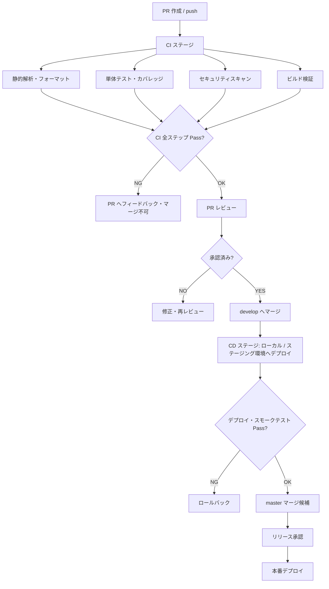
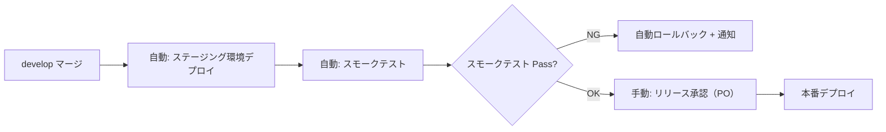

# CI/CD 規約

[前: 005-05.セキュリティ規約.md](005-05.セキュリティ規約.md) | [一覧](../README.md) | [次: 005-07.開発システムバージョン規約.md](005-07.開発システムバージョン規約.md)

目次（クリックで展開）

- [1. 目的](#1-目的)
- [2. 適用範囲](#2-適用範囲)
- [3. パイプライン全体構成](#3-パイプライン全体構成)
- [4. CI 必須チェック](#4-ci-必須チェック)
  - [4.1 静的解析・フォーマット](#41-静的解析フォーマット)
  - [4.2 テスト](#42-テスト)
  - [4.3 セキュリティスキャン](#43-セキュリティスキャン)
  - [4.4 ビルド検証](#44-ビルド検証)
- [5. CD・デプロイ規約](#5-cdデプロイ規約)
  - [5.1 デプロイ承認フロー](#51-デプロイ承認フロー)
  - [5.2 デプロイ成功条件](#52-デプロイ成功条件)
  - [5.3 ロールバック方針](#53-ロールバック方針)
- [6. 環境別デプロイ戦略](#6-環境別デプロイ戦略)
- [7. パイプライン失敗時の対応](#7-パイプライン失敗時の対応)
- [8. 禁止事項](#8-禁止事項)
- [9. 更新履歴](#9-更新履歴)

## 1. 目的

本ドキュメントは、Musuhi における CI/CD パイプラインの設計方針・必須チェック・デプロイ承認フローを定義する。
コーディング規約（005-01）の「7. CI での強制」を補完し、安全・安定したリリースサイクルを実現する。

## 2. 適用範囲

- `services/` 配下の全サービスのビルド・テスト・デプロイ
- `_compose/` のコンテナ構成変更
- ドキュメント（`_document/`）の変更はデプロイ対象外だが、CI によるリンクチェックを適用する

## 3. パイプライン全体構成

## 4. CI 必須チェック

### 4.1 静的解析・フォーマット

| 対象 | ツール | 条件 |
| --- | --- | --- |
| Go | `gofmt`, `golangci-lint` | フォーマット差分ゼロ・Lint エラーゼロ |
| TypeScript | `eslint`, `prettier` | Lint エラーゼロ・フォーマット差分ゼロ |
| Dockerfile | `hadolint` | Warning 以上はエラー扱い |
| Markdown | `markdownlint` | ドキュメントディレクトリに適用 |

- CI 失敗時はマージをブロックする
- ローカルでの事前実行を推奨し、`Makefile` または `scripts/` に実行コマンドを提供する

### 4.2 テスト

| 対象 | ツール | 合格条件 |
| --- | --- | --- |
| Go 単体テスト | `go test ./...` | 全テスト Pass |
| Go カバレッジ | `go test -cover` | カバレッジ 80% 以上（NFR-MAIN-002） |
| TypeScript 単体テスト | Jest / Vitest | 全テスト Pass |
| API 内部結合テスト | 独自スクリプト（Phase 1 以降） | 全テスト Pass |

- テストは並列実行を許可するが、DB アクセスを伴うテストはトランザクションロールバックで分離する
- `testdata/` に固定フィクスチャを配置し、外部依存なしで実行できるようにする

### 4.3 セキュリティスキャン

| 対象 | ツール | 対応条件 |
| --- | --- | --- |
| Go 依存ライブラリ | `govulncheck` | 高深刻度（CVSS >= 7.0）ゼロ |
| コンテナイメージ | `Trivy` | CRITICAL / HIGH ゼロ |
| フロントエンド依存 | `npm audit` | Critical ゼロ |
| シークレット漏えい | `gitleaks` | 検出ゼロ |

- スキャン結果はパイプラインの成果物（Artifacts）として保存する
- 脆弱性が検出された場合はマージをブロックし、Issue を自動起票する

### 4.4 ビルド検証

- 各サービスの `Dockerfile-local`（ローカル用）でビルドが成功することを確認する
- ビルド成果物（Docker イメージ）はタグ `{サービス名}:{ブランチ名}-{短縮コミットハッシュ}` で管理する
- `docker-compose.yml` の構文チェック（`docker compose config`）を実施する

## 5. CD・デプロイ規約

### 5.1 デプロイ承認フロー

- **ステージング環境** へのデプロイは `develop` マージで自動実行する
- **本番環境** へのデプロイは PO の手動承認後に実行する（自動デプロイ禁止）
- 承認は Pull Request または CI/CD ツールの Approval 機能を使用する

### 5.2 デプロイ成功条件

- 全コンテナの `HEALTHCHECK` が `healthy` 状態になること
- スモークテスト（主要 API エンドポイントへのリクエスト確認）が Pass すること
- エラーログが 5 分間発生しないこと

### 5.3 ロールバック方針

- スモークテスト失敗時は直前のイメージタグへ自動ロールバックする
- データマイグレーションを伴う場合は手動ロールバック手順を事前に準備する
- ロールバック完了後は必ず原因調査を実施し、Issue を起票する

## 6. 環境別デプロイ戦略

| 環境 | トリガー | デプロイ方式 | 承認 |
| --- | --- | --- | --- |
| ローカル開発 | 手動（`docker compose up`） | Docker Compose | 不要 |
| CI 検証環境 | PR push 時 | Docker Compose（CI ランナー上） | 不要 |
| ステージング | `develop` マージ | Docker Compose / 将来: Kubernetes | 不要（自動） |
| 本番 | `master` マージ + 手動承認 | Docker Compose / 将来: Kubernetes | PO 承認必須 |

- 環境ごとの設定は `.env.{環境名}` で管理し、`_compose/` 配下で管理する
- 本番環境の設定値は CI のシークレットから注入し、リポジトリにコミットしない

## 7. パイプライン失敗時の対応

| 失敗種別 | 対応 | 担当 |
| --- | --- | --- |
| CI 静的解析・テスト失敗 | 開発者がローカルで修正し再 push | 開発者 |
| セキュリティスキャン検出 | 脆弱性対応後にマージ。緊急度高の場合は即日対応 | 開発者 |
| デプロイ失敗 | 自動ロールバック後に原因調査・Issue 起票 | 開発者 |
| 本番デプロイ失敗 | 即時ロールバック・PO への報告・障害対応フロー（UC-03）に従う | 開発者 + PO |

- 失敗ログは CI/CD ツールの Artifacts に 30 日間保存する
- 繰り返し発生する失敗はドキュメントに原因と対処法を追記する

## 8. 禁止事項

- CI をスキップした状態での `master` / `develop` への直接 push
- パイプライン設定（ワークフローファイル）でのシークレットのハードコード
- 本番デプロイの手動承認省略
- テスト失敗を無視した状態でのマージ（`--no-verify` 等の回避操作）
- カバレッジ閾値を恒久的に引き下げる変更（一時的な除外は Issue で記録し期限を設ける）

## 9. 更新履歴

| 日付 | 版 | 変更内容 | 作成者 |
| --- | --- | --- | --- |
| 2026-05-02 | 0.1 | 初版作成 | Copilot |
