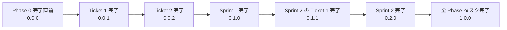

# 開発システムバージョン規約

[前: 005-06.CI／CD規約.md](005-06.CI／CD規約.md) | [一覧](../README.md) | 次: なし

目次（クリックで展開）

- [1. 目的](#1-目的)
- [2. 適用範囲](#2-適用範囲)
- [3. バージョン番号の基本方針](#3-バージョン番号の基本方針)
- [4. 更新ルール](#4-更新ルール)
  - [4.1 Phase 0 完了前](#41-phase-0-完了前)
  - [4.2 Ticket 完了時](#42-ticket-完了時)
  - [4.3 Sprint 完了時](#43-sprint-完了時)
  - [4.4 Phase 完了時](#44-phase-完了時)
- [5. バージョン遷移例](#5-バージョン遷移例)
- [6. 運用ルール](#6-運用ルール)
- [7. 禁止事項](#7-禁止事項)
- [8. 更新履歴](#8-更新履歴)

## 1. 目的

本ドキュメントは、Musuhi で開発する新規プロジェクトの開発中バージョンをどの粒度で更新するかを定義する。
Phase・Sprint・Ticket の進捗とバージョン番号を対応付け、進捗確認・成果物管理・Git タグ運用の基準を統一する。

## 2. 適用範囲

- Musuhi が作成・管理する新規プロジェクトのアプリケーション本体
- 新規プロジェクト配下の設計書・進捗ファイル・リリース関連ドキュメント
- Git コミット、タグ、進捗出力ファイルに記載する開発中バージョン

本規約は Version 1.0.0（UC-01 新規プロジェクト開発）の進め方を前提とする。

## 3. バージョン番号の基本方針

開発中バージョンは `MAJOR.MINOR.PATCH` 形式で管理する。

| 要素 | 意味 | 更新契機 |
| --- | --- | --- |
| MAJOR | Phase 完了数 | 全 Phase タスク完了 |
| MINOR | Sprint 完了数 | Sprint タスク完了 |
| PATCH | Ticket 完了数 | Ticket タスク完了 |

初期値は `0.0.0` とする。

## 4. 更新ルール

### 4.1 Phase 0 完了前

- 003.設計・開発・テストフェーズに入る直前までは `0.0.0` を維持する
- Phase 0 の提案・要求仕様・要件定義・開発準備でドキュメントや設定が更新されても、バージョン番号は上げない
- Phase 0 完了時点で、次に着手する最初の Ticket の開始バージョンは `0.0.0` とする

### 4.2 Ticket 完了時

- Ticket タスクが 1 件完了するごとに PATCH を `+1` する
- 更新後のバージョンは、進捗ファイル、対象ドキュメント、必要な Git タグまたはコミットメッセージに反映する
- 例: `0.0.0` → `0.0.1` → `0.0.2`

### 4.3 Sprint 完了時

- Sprint タスクが完了したら MINOR を `+1` し、PATCH は `0` にリセットする
- Sprint 完了時点のバージョンは `0.{n}.0` とする
- 例: Sprint 1 の全 Ticket 完了後に `0.1.0`、Sprint 2 の全 Ticket 完了後に `0.2.0`

### 4.4 Phase 完了時

- 対象 Phase の全 Sprint タスクが完了したら MAJOR を `+1` し、MINOR / PATCH は `0` にリセットする
- Version 1.0.0（UC-01）の対象 Phase が完了した時点で `1.0.0` とする
- 将来の Phase でも同じ考え方を適用し、次の開発単位完了時に `2.0.0`, `3.0.0` と進める

## 5. バージョン遷移例

| イベント | バージョン | 補足 |
| --- | --- | --- |
| 003 フェーズ着手前 | `0.0.0` | Phase 0 完了直後 |
| Ticket 1 完了 | `0.0.1` | 最初の機能スライス完了 |
| Ticket 2 完了 | `0.0.2` | 同一 Sprint 内で PATCH 増分 |
| Sprint 1 完了 | `0.1.0` | PATCH を 0 に戻す |
| Sprint 2 の Ticket 1 完了 | `0.1.1` | 新 Sprint の最初の Ticket |
| 全 Phase タスク完了 | `1.0.0` | Version 1.0.0 リリース基準 |

## 6. 運用ルール

- バージョン更新は Ticket / Sprint / Phase の完了判定と同時に実施する
- Step5 以降で出力する `新規プロジェクト/_document/000.進捗状況` の進捗ファイルには、その時点のバージョンを明記する
- Sprint 完了時のタグやリリースノートは、本規約のバージョン番号と [005-03.Git運用規約](005-03.Git運用規約.md) のタグ運用を整合させる
- バージョン更新の根拠となる完了タスクは GitHub Projects 上で `Done` になっていること
- 同一コミット内で複数 Ticket を完了させた場合でも、完了した Ticket 数に応じて PATCH を連番で管理する

## 7. 禁止事項

- Phase 0 完了前に `0.0.1` 以上へ更新すること
- Ticket 未完了のまま PATCH を更新すること
- Sprint 完了時に PATCH をリセットしないこと
- Phase 完了時に MAJOR を更新せず `0.x.y` のまま運用を継続すること
- Git タグ、進捗ファイル、関連ドキュメントで異なるバージョン番号を併記すること

## 8. 更新履歴

| 日付 | 版 | 変更内容 | 作成者 |
| --- | --- | --- | --- |
| 2026-05-05 | 0.1 | 初版作成 | Copilot |