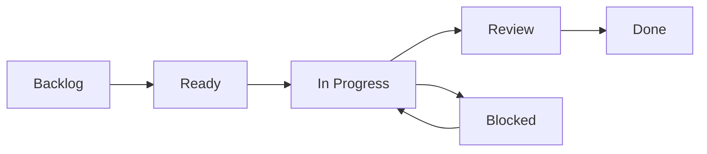

# GitHub Projects推進ルール

前: なし | [一覧](../README.md) | 次: [001-02.タスクフォーマット規約](001-02.タスクフォーマット規約.md)

目次（クリックで展開）

- [1. 目的](#1-目的)
- [2. 対象範囲](#2-対象範囲)
- [3. Projects項目定義](#3-projects項目定義)
- [4. ステータス運用](#4-ステータス運用)
- [5. ビュー運用](#5-ビュー運用)
- [6. レビュー運用](#6-レビュー運用)
- [7. 禁止事項](#7-禁止事項)
- [8. 更新履歴](#8-更新履歴)

## 1. 目的

本ドキュメントは、Musuhi の設計・開発・テストフェーズにおける GitHub Projects の運用ルールを定義する。
タスクの可視化、依存関係管理、進捗レビューを統一し、遅延・手戻りを早期検知する。

## 2. 対象範囲

- 対象フェーズ: 003.設計・開発・テストフェーズ
- 対象タスク: フェーズタスク、スプリントタスク、チケットタスク
- 対象成果物: 設計書、実装、テスト記録、リリース判定記録

## 3. Projects項目定義

GitHub Projects のカスタムフィールドは以下を標準とする。

本プロジェクトでは、タスクは Draft issue ではなく GitHub Issue を使用し、
親子関係は `Parent issue` / sub-issue で管理する。

| 項目 | 種別 | 必須 | 説明 |
| --- | --- | --- | --- |
| `Type` | Single select | 必須 | `Phase` / `Sprint` / `Ticket` |
| `Status` | Single select | 必須 | `Backlog` / `Ready` / `In Progress` / `Blocked` / `Review` / `Done` |
| `Phase` | Single select | 必須 | `設計` / `開発` / `テスト` |
| `Sprint` | Text or Single select | 必須 | 例: `I1-1`, `I2-2` |
| `Start date` | Date | 推奨 | 開始予定日 |
| `Target date` | Date | 推奨 | 完了予定日 |
| `Service` | Single select | 任意 | `core` / `ui` / `cli` / `doc` / `test` / `ops` |
| `Priority` | Single select | 必須 | `P0` / `P1` / `P2` |
| `Estimate` | Single select | 必須 | `XS` / `S` / `M` / `L` |
| `Parent issue` | Built-in | 必須 | 親Issue（sub-issueの親） |
| `Sub-issues progress` | Built-in | 推奨 | 子Issueの完了率 |
| `Parent` | Text | 任意 | 補助情報（移行期の互換用メモ） |
| `Depends on` | Text | 任意 | 依存先チケット番号またはURL |

## 4. ステータス運用

- `Backlog`: 起票済み、未着手
- `Ready`: 着手条件（依存・定義・担当）が揃った状態
- `In Progress`: 実作業中
- `Blocked`: 外部要因で停止中
- `Review`: 実装完了、レビュー待ち
- `Done`: 完了条件を満たしクローズ済み

状態遷移は原則として以下に従う。

## 5. ビュー運用

- Roadmapビュー: 期間と依存を確認する基準ビュー
- Boardビュー: 日次の実行管理ビュー
- Tableビュー: 遅延、担当偏り、優先度の見直しビュー

親子を見やすくするため、Tableビューには以下を標準表示する。

- `Title`
- `Type`
- `Status`
- `Phase`
- `Sprint`
- `Parent issue`
- `Sub-issues progress`
- `Depends on`

親子確認用の推奨設定:

- レイアウト: Table
- Group by: `Parent issue`
- Sort: `Type` → `Sprint` → `Title`
- Filter: `Type` in (`Phase`, `Sprint`, `Ticket`)

Roadmapビューの設定基準:

- Group by: `Phase`
- Timeline: `Start date` 〜 `Target date`
- Filter: `Type` in (`Phase`, `Sprint`)

難易度軸ロードマップ運用:

- GitHub Projects の標準 Roadmap は日付軸前提のため、難易度軸表示は `tools/generate_issue_roadmap/` で補完する
- 週次レビュー前に `go run . -owner <owner> -repo <repo> -project-number <n>` を実行し、最新の難易度ロードマップ HTML を再生成する
- 難易度は `Estimate` を基準に `XS=1, S=2, M=3, L=5, XL=8` へ変換して表示する
- 可視化結果は、レビュー対象の Issue 粒度（`Type` / `Phase` / `Sprint`）と整合していることを確認する

## 6. レビュー運用

- スプリント開始時: 目標・完了条件・依存関係をレビュー
- 週次: `Blocked` と `Target date` 超過見込みを確認
- スプリント終了時: 完了判定と次スプリントへの引継ぎを記録

## 7. 禁止事項

- `Type` 未設定のまま運用すること
- `Parent issue` 未設定のまま子チケットを起票すること
- 依存関係があるのに `Depends on` を空欄のまま進めること
- 完了条件未達で `Done` に遷移すること
- Draft issue のまま恒久運用すること

## 8. 更新履歴

| 日付 | 版 | 変更内容 | 作成者 |
| --- | --- | --- | --- |
| 2026-05-02 | 0.1 | 初版作成 | Copilot |
| 2026-05-02 | 0.2 | GitHub Issue + sub-issue運用を標準化し、Tableビューの標準表示列（Parent issue / Sub-issues progress）を追加 | Copilot |
| 2026-05-02 | 0.3 | 難易度軸ロードマップを `tools/generate_issue_roadmap_vegalite/` で補完する運用を追加 | Copilot |
| 2026-05-03 | 0.4 | 難易度軸ロードマップを `tools/generate_issue_roadmap/` (Go版) に一本化し、vegalite版を削除 | Copilot |
