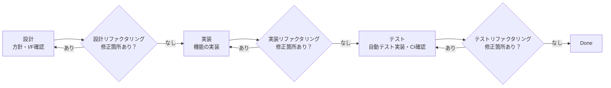
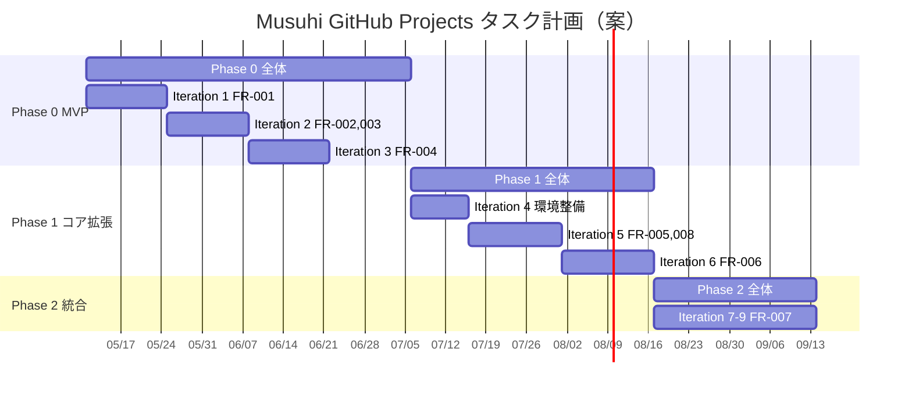

# フェーズ・イテレーション・チケット設計規約

前: [001-02.タスクフォーマット規約](001-02.タスクフォーマット規約.md) | [一覧](../README.md) | 次: [001-04.tools利用規約](001-04.tools利用規約.md)

目次（クリックで展開）

- [1. 目的](#1-目的)
- [2. Phase・Iteration 計画](#2-phaseiteration-計画)
- [3. タスク分解方針](#3-タスク分解方針)
- [4. チケット粒度の考え方](#4-チケット粒度の考え方)
- [5. WBS概要（Phase→Iteration→Ticket）](#5-wbs概要phaseiterationticket)
- [6. ガントチャート確認用サンプル](#6-ガントチャート確認用サンプル)
- [7. Iterationレトロスペクティブ](#7-iterationレトロスペクティブ)
- [8. 運用開始前チェックリスト](#8-運用開始前チェックリスト)
- [9. 更新履歴](#9-更新履歴)

## 1. 目的

本ドキュメントは、Musuhi の設計・開発・テストフェーズを GitHub Projects 上で管理するための
初期タスク分解案を示す。
Phase/Iteration は [002-01.プロジェクト計画書](../../002.要件定義フェーズ/002.プロジェクト計画/002-01.プロジェクト計画書.md) の「4.1 Phase・Iteration 計画」に準拠する。

## 2. Phase・Iteration 計画

| Phase | Iteration | 対象FR | 完了条件 |
| --- | --- | --- | --- |
| Phase 0 (MVP) | Iteration 1 | FR-001 プロジェクト作成・一覧 | AC-001 Pass / リファクタリングPass / master マージ |
| Phase 0 (MVP) | Iteration 2 | FR-002 プロンプトログ保存・FR-003 Markdown文書管理 | AC-002, AC-003 Pass / リファクタリングPass / master マージ |
| Phase 0 (MVP) | Iteration 3 | FR-004 aider基本連携 | AC-004 Pass / リファクタリングPass / master マージ |
| Phase 1 (コア拡張) | Iteration 4 | 環境整備・技術的負債解消 | 既存AC全Pass維持 / リファクタリングPass |
| Phase 1 (コア拡張) | Iteration 5 | FR-005 進捗可視化・FR-008 レガシー改修支援 | AC-005, AC-008 Pass / リファクタリングPass / master マージ |
| Phase 1 (コア拡張) | Iteration 6 | FR-006 AI指示テンプレート | AC-006 Pass / リファクタリングPass / master マージ |
| Phase 2 (統合・最適化) | Iteration 7〜9 | FR-007 自動レポート出力・安定化 | AC-007 Pass / リファクタリングPass / master マージ |

## 3. タスク分解方針

- フェーズタスク（Phase）は「Phase 0/1/2」に対応し、マイルストーン単位で管理する
- イテレーションタスクは対象FRとACを明示し、完了判定基準を固定する
- チケットタスクは機能スライス（縦断的機能単位）で切り出す
- 開発作業はAIが実施するため、時間見積は行わず複雑度で相対評価する
- 依存関係があるチケットは `Depends on` で必ず明示する

## 4. チケット粒度の考え方

1チケット = 1機能スライス（単一責務・独立テスト可能）

各チケット内で以下の工程をすべて完結させる:

チケットの分割基準:
- ✅ 単一のAPI、単一のUIコンポーネント、単一のDB操作に分解できる
- ✅ モックを使えば他チケットと独立してテストできる
- ✅ 完了条件が「自動テスト pass」または「動作確認」で一文で書ける
- ❌ 複数のDB操作とUI変更が混在している → 分割する

## 5. WBS概要（Phase→Iteration→Ticket）

### Phase 0: Iteration 1 — FR-001 プロジェクト作成・一覧

- [infra] DBマイグレーション基盤とprojectsテーブル作成
- [api] APIサーバ基盤（ルーティング・共通レスポンス・エラーハンドリング）
- [api] プロジェクト作成API (POST /projects)
- [api] プロジェクト一覧・詳細API (GET /projects, GET /projects/{id})
- [api] 外部プロジェクト同時作成API (POST /projects/with-external)
- [api] 外部初期構造セットアップAPI (POST /projects/{id}/external-setup)
- [ui] プロジェクト一覧・作成画面 (SCR-001) とE2Eテスト

### Phase 0: Iteration 2 — FR-002, FR-003

- [infra] sessions・messages・documents・document_historiesテーブル作成
- [api] セッション作成・一覧API
- [api] プロンプトメッセージ追加・取得API
- [api] 文書作成API (POST /documents)
- [api] 文書更新・詳細・履歴API
- [ui] プロンプトログ一覧・詳細画面
- [ui] Markdownエディタ・文書一覧画面

### Phase 0: Iteration 3 — FR-004

- [infra] tasksテーブル作成
- [api] aider実行API (POST /tasks/aider)
- [api] タスク状態確認API (GET /tasks/{id})
- [core] aiderコンテナ連携実装
- [ui] aiderタスク指示・結果確認画面

### Phase 1: Iteration 4〜6 以降

- Iteration 4: 環境整備・技術的負債解消
- Iteration 5: FR-005 進捗可視化 / FR-008 レガシー改修支援
- Iteration 6: FR-006 AI指示テンプレート

### Phase 2: Iteration 7〜9

- FR-007 自動レポート出力・UI/UX改善・安定化

## 6. ガントチャート確認用サンプル

Roadmap ビューで以下の単位を表示する。

- 表示対象: `Type` が `Phase` または `Iteration`
- グループ: `Phase`
- 期間軸: `Start date` 〜 `Target date`

> 上記の日程は参考値である。実際の開始日は Iteration 1 着手時に確定する。

## 7. Iterationレトロスペクティブ

### 実施タイミング

Iterationの全チケットが `Done` になり、masterマージ完了後に実施する。

### レトロスペクティブの目的

- 完了したIterationの軌跡を振り返り、次のIterationの計画精度を高める
- 課題・改善点を記録し、パターンを蓄積する
- 次のIterationのチケットを洗い出す

### 議論項目

| 項目 | 内容 |
| --- | --- |
| 良かったこと | 見積精度・設計・実装・テストで特にうまくいったこと |
| 改善すること | ブロッカー・解決に時間がかかったこと・設計・実装・テストの操作上の問題 |
| 次のIterationへのアクション | 改善項目をチケット化する、ルール・AI指示の見直しなど |

### 次のIterationのチケット作成

Iteration終了後、次のIterationのチケットを以下の流れで作成・見直しを行う。

1. **WBSの見直し**: 現在のWBS概要（セクション5）とレトロスペクティブ結果を照合し、次のIterationのスコープを再確認する
2. **チケット粒度の見直し**: 前回Iterationの実績を元に、チケット分割基準を必要に応じて調整する
3. **チケット作成**: 本規約のチケットテンプレート（[001-02.タスクフォーマット規約](001-02.タスクフォーマット規約.md)）に従ってGitHub Projectsに登録する
4. **依存関係の設定**: `Depends on` フィールドを設定し、`Start date` / `Target date` を確認する
5. **本ドキュメントの更新**: 作成したチケット詳細を本ドキュメントに追記する

### チェックリスト

- [ ] Iteration全チケットがDone・masterマージ完了を確認
- [ ] 良かったこと・改善することをGitHub Projectsのコメントまたはドキュメントに記録
- [ ] 次のIterationのWBSスコープを確認・必要に応じて修正
- [ ] 次のIterationのチケットをGitHub Projectsに登録
- [ ] `Parent issue` / `Depends on` / `Estimate` を全チケットに設定
- [ ] Roadmapビューで次のIterationの期間を確認
- [ ] 本ドキュメントに次のIterationのチケット詳細セクションを追記

---

## 8. 運用開始前チェックリスト

- [ ] `Type`, `Status`, `Phase`, `Iteration`, `Service`, `Priority`, `Estimate` をカスタムフィールドに追加
- [ ] Roadmap / Board / Table ビューを作成
- [ ] フェーズタスク（Phase 0 / Phase 1 / Phase 2）を先に作成
- [ ] 各 Iteration を作成し `Parent issue` をフェーズタスクに設定
- [ ] TK-1-1〜TK-1-7 をチケットとして登録し `Parent issue` と `Depends on` を設定
- [ ] Iteration 1 の `Start date` と `Target date` を設定してRoadmapビューを確認

## 9. 更新履歴

| 日付 | 版 | 変更内容 | 作成者 |
| --- | --- | --- | --- |
| 2026-05-02 | 0.1 | 初版作成 | Copilot |
| 2026-05-02 | 0.2 | Phase/Iterationをプロジェクト計画書に整合・チケット粒度を機能スライス方式に変更・Iteration1チケット詳細を追加 | Copilot |
| 2026-05-02 | 0.3 | ファイル名を「設計規約」に変更・TK-1-1〜TK-1-7の作業工程チェックリストをアクティビティ図（設計RF/実装RF/テストRF）に整合・Iterationレトロスペクティブセクション追加 | AI |
| 2026-05-02 | 0.4 | セクション6（Iteration 1チケット設計詳細）を削除・セクション番号繰り上げ・レトロスペクティブを本文に追加 | AI |
| 2026-05-02 | 0.5 | Draft issue運用からGitHub Issue + sub-issue運用へ移行し、`Parent issue` 前提のチェックリストへ更新 | Copilot |
