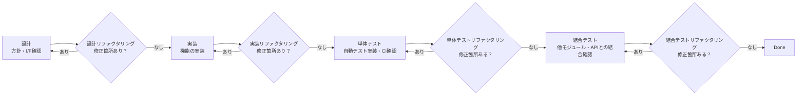
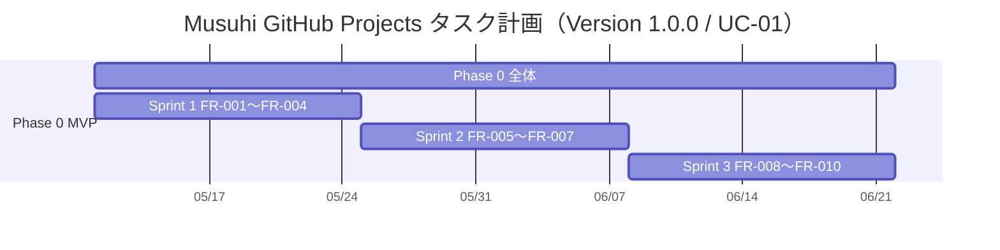

# フェーズ・スプリント・チケット設計規約

前: [001-02.タスクフォーマット規約](001-02.タスクフォーマット規約.md) | [一覧](../README.md) | 次: [001-04.tools利用規約](001-04.tools利用規約.md)

<details>
<summary>目次（クリックで展開）</summary>

- [1. 目的](#1-目的)
- [2. Phase・Sprint・Ticket 分割基準](#2-phasesprintticket-分割基準)
- [3. Phase 0 固定タスク構造](#3-phase-0-固定タスク構造)
- [4. Version 1.0.0 タスクテンプレート（UC-01）](#4-version-100-タスクテンプレートuc-01)
- [5. タスク分解方針](#5-タスク分解方針)
- [6. Ticket 粒度の考え方](#6-ticket-粒度の考え方)
- [7. WBS概要（Phase→Sprint→Ticket）](#7-wbs概要phasesprintticket)
- [8. ガントチャート確認用サンプル](#8-ガントチャート確認用サンプル)
- [9. Sprintレトロスペクティブ](#9-sprintレトロスペクティブ)
- [10. 運用開始前チェックリスト](#10-運用開始前チェックリスト)
- [11. 業務フロー整合ルール（Step5/12/13）](#11-業務フロー整合ルールstep51213)
- [12. 更新履歴](#12-更新履歴)
- ※ レトロスペクティブの実施手順は [001-05.レトロスペクティブ実施規約](001-05.レトロスペクティブ実施規約.md) を参照

</details>

## 1. 目的

本ドキュメントは、Musuhi の設計・開発・テストフェーズを GitHub Projects 上で管理するための
タスク分割基準と初期タスク分解案を示す。
Phase/Sprint/Ticket の分割基準は [002-03.Phase-Sprint-Ticket分割基準](../../002.要件定義フェーズ/002.プロジェクト計画/002-03.Phase-Sprint-Ticket分割基準.md) を準拠とする。

本ドキュメントの対象は **Version 1.0.0（UC-01 新規プロジェクト開発）** のみとし、
Version 2.0.0 以降（UC-02〜UC-04）は [001-01.機能要件定義書](../../002.要件定義フェーズ/001.要件定義/001-01.機能要件定義書.md) で管理する。

## 2. Phase・Sprint・Ticket 分割基準

| 分割単位 | 基準 |
| --- | --- |
| Phase | 1つのユースケースが完成するまでを 1 Phase とする |
| Sprint | 1つのユースケースを完成させるのに必要な 1 機能を完成させるのを 1 Sprint とする |
| Ticket | 1 Sprint 内に必要な 1 小機能の完成までを 1 Ticket とする |

> 詳細な分割基準・テンプレートは [002-03.Phase-Sprint-Ticket分割基準](../../002.要件定義フェーズ/002.プロジェクト計画/002-03.Phase-Sprint-Ticket分割基準.md) を参照する。

## 3. Phase 0 固定タスク構造

Phase 0 は「提案・要求仕様・要件定義」フェーズであり、すべてのプロジェクトで固定のタスク構造を持つ。

```
PH0: 提案・要求仕様・要件定義
  SP0-1: 提案・要求仕様作成
    TK0-1-1: 提案・要求仕様書自動生成
    TK0-1-2: 提案・要求仕様書ユーザ承認
  SP0-2: 要件定義作成
    TK0-2-1: 要件定義書自動生成
    TK0-2-2: 要件定義書ユーザ承認
  SP0-3: 開発タスク生成
    TK0-3-1: Phase分割・登録 / Phase1のSprint分割・登録 / Sprint1-1のTicket分割・登録
  SP0-4: 開発準備
    TK0-4-1: 開発規約自動生成
    TK0-4-2: tools準備
```

## 4. Version 1.0.0 タスクテンプレート（UC-01）

TK0-3-1 で分割・登録するタスクのテンプレート（Version 1.0.0 対象）。

```
PH1: 設計・開発・テスト（ユースケース1）
  SP1-1: 機能1
    TK1-1-1: 機能1-1 設計・開発・単体テスト・結合テスト  ← Ticket
    TK1-1-2: 機能1-2 設計・開発・単体テスト・結合テスト  ← Ticket
    TK1-1-3: 機能1-3 設計・開発・単体テスト・結合テスト  ← Ticket
    ・・・
    TK1-1-x: 機能1 受入テスト・masterブランチコミット
    TK1-1-y: レトロスペクティブ
  SP1-2: 機能2
    TK1-2-1: 機能2-1 設計・開発・単体テスト・結合テスト  ← Ticket
    ・・・
    TK1-2-x: 機能2 受入テスト・masterブランチコミット
    TK1-2-y: レトロスペクティブ
  ・・・

```

> Version 2.0.0 以降のテンプレートは本書の対象外とし、要件定義書で管理する。

## 5. タスク分解方針

- フェーズタスク（Phase）はユースケース単位で管理する
- スプリントタスクは機能単位で管理する
- Ticketタスクは機能スライス（縦断的機能単位）で切り出す
- 開発作業はAIが実施するため、時間見積は行わず複雑度で相対評価する
- 依存関係があるチケットは `Depends on` で必ず明示する

## 6. Ticket 粒度の考え方

1 Ticket = 1機能スライス（単一責務・独立テスト可能）

各 Ticket 内で以下の工程をすべて完結させる。リファクタリングは修正項目がなくなるまで繰り返す。



Ticket の分割基準:
- ✅ 単一のAPI、単一のUIコンポーネント、単一のDB操作に分解できる
- ✅ モックを使えば他チケットと独立してテストできる
- ✅ 完了条件が「自動テスト pass」または「動作確認」で一文で書ける
- ❌ 複数のDB操作とUI変更が混在している → 分割する

## 7. WBS概要（Phase→Sprint→Ticket）

### Phase 0: 固定タスク

[3. Phase 0 固定タスク構造](#3-phase-0-固定タスク構造) 参照。すべてのプロジェクトで共通の固定タスク構造を持つ。

### Version 1.0.0（UC-01）: ユースケース単位で分割

Musuhi 開発プロジェクト自身の Version 1.0.0 の WBS 小細目は TK0-3-1 実施時に [4. Version 1.0.0 タスクテンプレート（UC-01）](#4-version-100-タスクテンプレートuc-01) に従って分割・登録する。現在の Musuhi 開発が対象とする機能要件は [001-01.機能要件定義書](../../002.要件定義フェーズ/001.要件定義/001-01.機能要件定義書.md) を参照する。

## 8. ガントチャート確認用サンプル

Roadmap ビューで以下の単位を表示する。

- 表示対象: `Type` が `Phase` または `Sprint`
- グループ: `Phase`
- 期間軸: 各 Ticket の複雑度（難易度）に基づいて相対的に設定する。時間見積は行わず、`Story Point`（必要に応じて `Estimate` 併用）を基準に `Start date` / `Target date` を決定する



> 上記の日程は参考値である。実際の開始日は Sprint 1 着手時に確定する。

## 9. Sprintレトロスペクティブ

Sprint レトロスペクティブの実施手順・議論項目・チェックリストは **[001-05.レトロスペクティブ実施規約](001-05.レトロスペクティブ実施規約.md)** を参照する。

---

## 10. 運用開始前チェックリスト

- [ ] `Type`, `Status`, `Phase`, `Sprint`, `Service`, `Priority`, `Story Point`（必要に応じて `Estimate`）をカスタムフィールドに追加
- [ ] Roadmap / Board / Table ビューを作成
- [ ] Phase 0 の固定タスク（SP0-1〜SP0-4）を登録
- [ ] 各 Sprint を作成し `Parent issue` をフェーズタスクに設定
- [ ] TK0-3-1 完了後、Version 1.0.0（UC-01）の最初の Sprint 用 Ticket を登録し `Parent issue` と `Depends on` を設定
- [ ] Sprint 1 の `Start date` と `Target date` を設定してRoadmapビューを確認

## 11. 業務フロー整合ルール（Step5/12/13）

### Step5: タスク完了時の進捗出力

- 各タスク完了時、`新規プロジェクト/_document/000.進捗状況` に `generate_issue_roadmap` で進捗ファイルを出力する
- 進捗ファイルを含む更新済みドキュメントを commit / push し、GitHub Projects 上の対象タスクを更新する

### Step12: Ticket実行時の設計成果物

- 各 Ticket の設計工程では、対象機能を含む業務フロー図および必要設計書を `新規プロジェクト/_document/004.リリース・運用フェーズ` 配下へ作成・更新する
- Ticket 内の実施順序は「設計・リファクタリング・開発・リファクタリング・単体テスト・リファクタリング・結合テスト・リファクタリング」とする

### Step13: レトロスペクティブ成果物

- レトロスペクティブ結果（改善・追加機能を含む）は `新規プロジェクト/_document/003.設計・開発・テストフェーズ` 配下の適切なディレクトリに保存する
- 保存した結果を反映し、次 Sprint の Ticket 分割とタスク登録を実施する

## 12. 更新履歴

| 日付 | 版 | 変更内容 | 作成者 |
| --- | --- | --- | --- |
| 2026-05-02 | 0.1 | 初版作成 | Copilot |
| 2026-05-02 | 0.2 | Phase/Sprintをプロジェクト計画書に整合・チケット粒度を機能スライス方式に変更・Sprint1チケット詳細を追加 | Copilot |
| 2026-05-04 | 0.3 | Phase 0固定タスク構造・Phase 1以降タスクテンプレート・Ticket分割基準を追加 | Copilot |
| 2026-05-02 | 0.3 | ファイル名を「設計規約」に変更・TK-1-1〜TK-1-7の作業工程チェックリストをアクティビティ図（設計RF/実装RF/テストRF）に整合・Sprintレトロスペクティブセクション追加 | AI |
| 2026-05-02 | 0.4 | セクション6（Sprint 1チケット設計詳細）を削除・セクション番号繰り上げ・レトロスペクティブを本文に追加 | AI |
| 2026-05-02 | 0.5 | Draft issue運用からGitHub Issue + sub-issue運用へ移行し、`Parent issue` 前提のチェックリストへ更新 | Copilot |
| 2026-05-04 | 0.6 | UC-01 業務フロー（Step5/12/13）と整合する運用ルール・成果物保存先を追記 | Copilot |
| 2026-05-05 | 0.8 | ガントチャートのSprint FR割当を新FR体系（FR-001〜FR-010）に整合・Phase0全体期間を42dに修正 | Copilot || 2026-05-05 | 0.9 | レトロスペクティブに申し送り事項取り込み手順・SP見積手順を追加・議論項目に申し送り取り込みを明記・チェックリスト更新 | Copilot || 2026-05-04 | 0.7 | Version 1.0.0（UC-01）対象へ限定し、将来バージョンの扱いを明確化 | Copilot |
