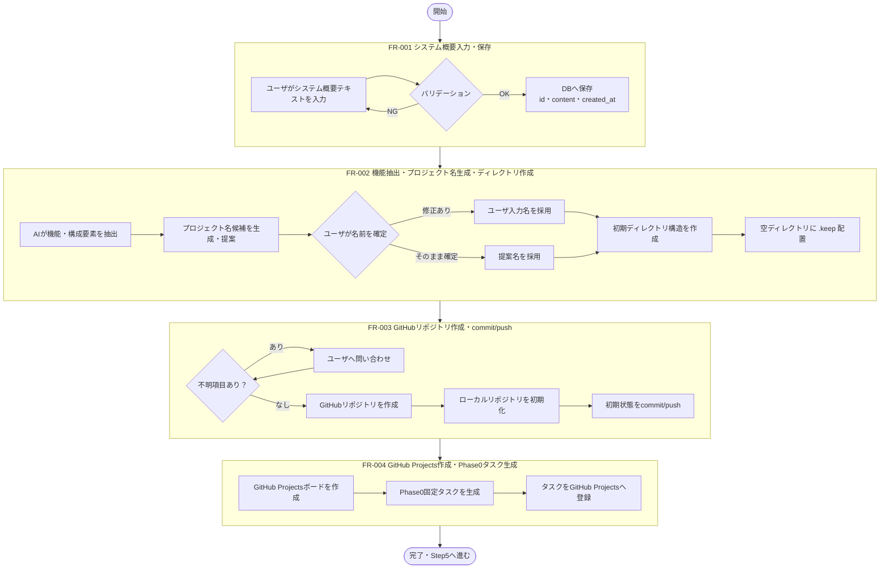
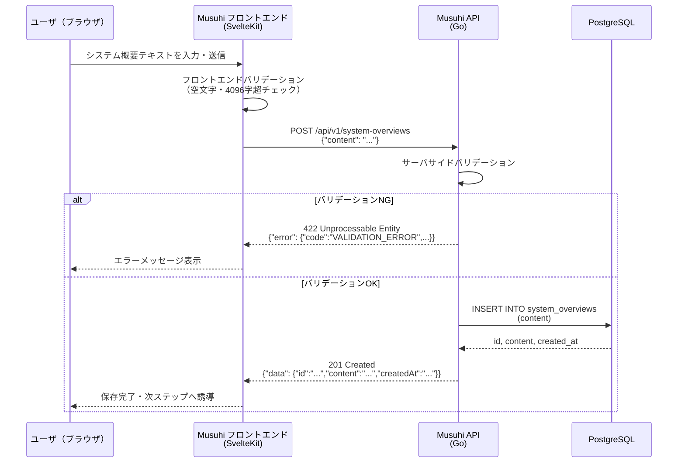

# IT1-1 機能業務フロー図

[一覧](../README.md)

> 対象: IT1-1（FR-001〜FR-004）の業務フロー

## 1. 全体フロー（FR-001〜FR-004 連結）

```mermaid
flowchart TD
    Start([開始]) --> FR001

    subgraph FR001["FR-001 システム概要入力・保存"]
        A1[ユーザがシステム概要テキストを入力] --> A2{バリデーション}
        A2 -- NG --> A1
        A2 -- OK --> A3[DBへ保存\nid・content・created_at]
    end

    FR001 --> FR002

    subgraph FR002["FR-002 機能抽出・プロジェクト名生成・ディレクトリ作成"]
        B1[AIが機能・構成要素を抽出] --> B2[プロジェクト名候補を生成・提案]
        B2 --> B3{ユーザが名前を確定}
        B3 -- 修正あり --> B4[ユーザ入力名を採用]
        B3 -- そのまま確定 --> B5[提案名を採用]
        B4 --> B6[初期ディレクトリ構造を作成]
        B5 --> B6
        B6 --> B7[空ディレクトリに .keep 配置]
    end

    FR002 --> FR003

    subgraph FR003["FR-003 GitHubリポジトリ作成・commit/push"]
        C1{不明項目あり？} -- あり --> C2[ユーザへ問い合わせ]
        C2 --> C1
        C1 -- なし --> C3[GitHubリポジトリを作成]
        C3 --> C4[ローカルリポジトリを初期化]
        C4 --> C5[初期状態をcommit/push]
    end

    FR003 --> FR004

    subgraph FR004["FR-004 GitHub Projects作成・Phase0タスク生成"]
        D1[GitHub Projectsボードを作成] --> D2[Phase0固定タスクを生成]
        D2 --> D3[タスクをGitHub Projectsへ登録]
    end

    FR004 --> End([完了・Step5へ進む])
```

## 2. FR-001 詳細フロー（SCR-001 / POST /system-overviews）

```mermaid
sequenceDiagram
    participant User as ユーザ（ブラウザ）
    participant UI as Musuhi フロントエンド<br>(SvelteKit)
    participant API as Musuhi API<br>(Go)
    participant DB as PostgreSQL

    User->>UI: システム概要テキストを入力・送信
    UI->>UI: フロントエンドバリデーション<br>（空文字・4096字超チェック）
    UI->>API: POST /api/v1/system-overviews<br>{"content": "..."}
    API->>API: サーバサイドバリデーション
    alt バリデーションNG
        API-->>UI: 422 Unprocessable Entity<br>{"error": {"code":"VALIDATION_ERROR",...}}
        UI-->>User: エラーメッセージ表示
    else バリデーションOK
        API->>DB: INSERT INTO system_overviews<br>(content)
        DB-->>API: id, content, created_at
        API-->>UI: 201 Created<br>{"data": {"id":"...","content":"...","createdAt":"..."}}
        UI-->>User: 保存完了・次ステップへ誘導
    end
```
