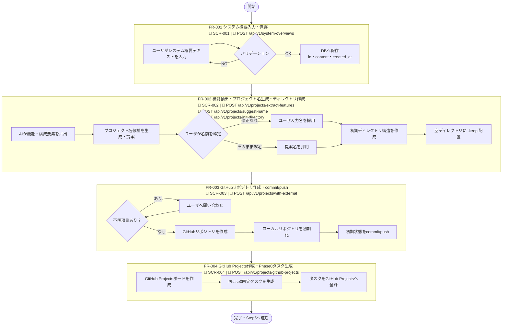
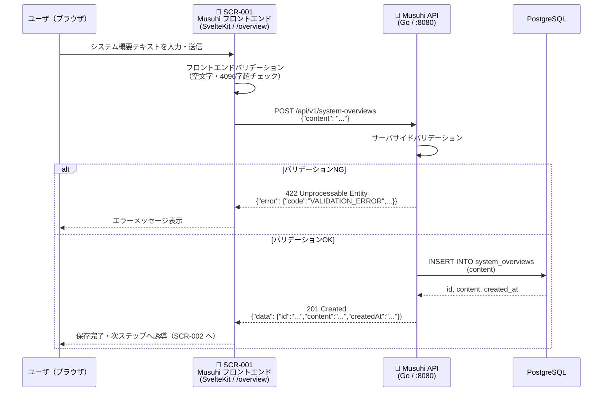

# SP1-1 機能業務フロー図

[一覧](../README.md) | [→ 002.インフラ構成図](002.インフラ構成図.md)

> 対象: SP1-1（FR-001〜FR-004）の業務フロー

## 1. 全体フロー（FR-001〜FR-004 連結）

### 画面・API 対応表

| FR | 画面 | 使用 API |
| --- | --- | --- |
| FR-001 | [SCR-001 システム概要入力](/overview) | `POST /api/v1/system-overviews` |
| FR-002 | [SCR-002 プロジェクト名・構成要素確認](/projects/setup) | `POST /api/v1/projects/extract-features` `POST /api/v1/projects/suggest-name` `POST /api/v1/projects/init-directory` |
| FR-003 | [SCR-003 GitHubリポジトリ作成確認](/projects/{id}/repository) | `POST /api/v1/projects/with-external` |
| FR-004 | [SCR-004 GitHub Projects設定確認](/projects/{id}/github-projects) | `POST /api/v1/projects/github-projects` |

---

## 2. FR-001 詳細フロー（SCR-001 / POST /api/v1/system-overviews）

> 📱 **画面**: SCR-001 システム概要入力（`/overview`）  
> 🔌 **API**: `POST /api/v1/system-overviews`、`GET /api/v1/system-overviews/{id}`

