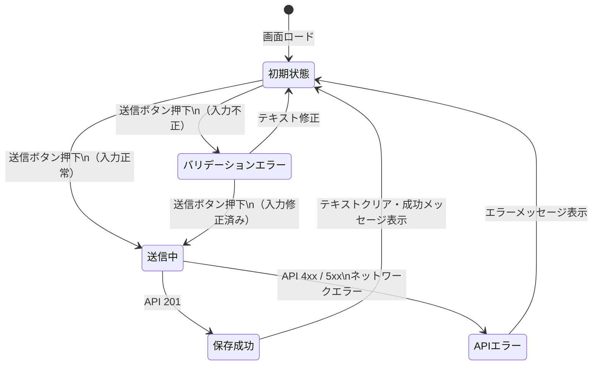

# SP1-1 画面設計書（SCR-001）

[一覧](../README.md) | [← 003.API仕様書](003.API仕様書.md) | [→ 005.DB設計書](005.DB設計書.md)

> **対象**: TK1-1-1 で実装した FR-001 対応画面「SCR-001 システム概要入力」の詳細仕様

<details>
<summary>目次（クリックで展開）</summary>

- [1. 画面基本情報](#1-画面基本情報)
- [2. 画面レイアウト](#2-画面レイアウト)
- [3. UI コンポーネント定義](#3-ui-コンポーネント定義)
  - [3.1 ページタイトル・説明文](#31-ページタイトル説明文)
  - [3.2 システム概要テキストエリア](#32-システム概要テキストエリア)
  - [3.3 文字数カウンター](#33-文字数カウンター)
  - [3.4 エラーメッセージ](#34-エラーメッセージ)
  - [3.5 成功メッセージ](#35-成功メッセージ)
  - [3.6 送信ボタン](#36-送信ボタン)
- [4. バリデーション仕様](#4-バリデーション仕様)
- [5. API 連携仕様](#5-api-連携仕様)
- [6. 状態遷移図](#6-状態遷移図)
- [7. アクセシビリティ](#7-アクセシビリティ)
- [8. 実装箇所](#8-実装箇所)

</details>

---

## 1. 画面基本情報

| 項目 | 内容 |
| --- | --- |
| 画面 ID | SCR-001 |
| 画面名 | システム概要入力 |
| URL パス | `/overview` |
| 対応 FR | FR-001 |
| 対応 TK | TK1-1-1 |
| 認証要否 | 要（SP1-1 スコープでは未実装・将来対応） |
| 遷移元 | SCR-000 ログイン（認証後） |
| 遷移先 | SCR-002 プロジェクト名・構成要素確認（保存成功後） |
| ページタイトル | `システム概要入力 \| Musuhi`（`<title>` タグ） |

---

## 2. 画面レイアウト

```
┌────────────────────────────────────────────────────────────┐
│  システム概要入力                                           │  ← h1
│  開発するシステムの概要を箇条書き・メモ形式で入力してください。│  ← 説明文
│  入力内容はAIによる機能抽出・プロジェクト名生成に利用されます。│
│                                                            │
│  システム概要テキスト *                                     │  ← label
│  ┌──────────────────────────────────────────────────────┐  │
│  │                                                      │  │
│  │  例:                                                 │  │  ← textarea (12行)
│  │  - ユーザ管理機能                                     │  │
│  │  - 商品カタログ表示                                   │  │
│  │  - カート・注文機能                                   │  │
│  │                                                      │  │
│  └──────────────────────────────────────────────────────┘  │
│  0 / 4096 文字                                             │  ← 文字数カウンター
│                                                            │
│  [エラーメッセージ表示エリア（エラー時のみ）]               │
│  [成功メッセージ表示エリア（成功時のみ）]                   │
│                                                            │
│                              [ 保存する ]                   │  ← ボタン（右寄せ）
└────────────────────────────────────────────────────────────┘
```

コンテナ幅: `max-width: 720px`、中央寄せ

---

## 3. UI コンポーネント定義

### 3.1 ページタイトル・説明文

| 項目 | 内容 |
| --- | --- |
| タグ | `<h1>` |
| テキスト | `システム概要入力` |
| 説明文 | `開発するシステムの概要を箇条書き・メモ形式で入力してください。`<br>`入力内容はAIによる機能抽出・プロジェクト名生成に利用されます。` |

### 3.2 システム概要テキストエリア

| 項目 | 内容 |
| --- | --- |
| 要素 | `<textarea>` |
| `id` | `content` |
| `label` | `システム概要テキスト`（必須マーク `*` 付き、赤色） |
| `placeholder` | `例：\n- ユーザ管理機能\n- 商品カタログ表示\n- カート・注文機能` |
| `rows` | 12 |
| `maxlength` | 4096 |
| `disabled` | 送信中（`isSubmitting = true`）の間は `disabled` 属性を付与 |
| `aria-invalid` | エラーメッセージが存在する場合 `true` |
| `aria-describedby` | エラーメッセージが存在する場合 `"error-message"` |
| リサイズ | 縦方向のみ（`resize: vertical`） |

### 3.3 文字数カウンター

| 項目 | 内容 |
| --- | --- |
| 表示形式 | `{入力文字数} / 4096 文字` |
| 更新タイミング | テキストエリアへの入力リアルタイム |
| `aria-live` | `polite`（スクリーンリーダー向け） |

### 3.4 エラーメッセージ

| 項目 | 内容 |
| --- | --- |
| 表示条件 | `errorMessage` が空でない場合 |
| `id` | `error-message` |
| `role` | `alert` |
| CSS クラス | `alert alert-error` |
| 表示メッセージ（パターン） | 下表参照 |

| 発生ケース | 表示メッセージ |
| --- | --- |
| フロントエンドバリデーション: 空入力 | `システム概要を入力してください。` |
| フロントエンドバリデーション: 文字数超過 | `4096文字以内で入力してください（現在: {N}文字）。` |
| API 422 レスポンス | API `error.message` の値 |
| API 500 / その他 | `サーバーエラーが発生しました。しばらく待ってから再試行してください。` |
| ネットワークエラー | `ネットワークエラーが発生しました。接続を確認してください。` |

### 3.5 成功メッセージ

| 項目 | 内容 |
| --- | --- |
| 表示条件 | `successMessage` が空でない場合 |
| `role` | `status` |
| CSS クラス | `alert alert-success` |
| 表示メッセージ | `保存しました（ID: {uuid}）` |
| 副作用 | 保存成功後、テキストエリアの内容をクリア（`content = ''`） |

### 3.6 送信ボタン

| 項目 | 内容 |
| --- | --- |
| 要素 | `<button type="submit">` |
| 通常時テキスト | `保存する` |
| 送信中テキスト | `保存中...` |
| `disabled` 条件 | `isSubmitting = true` の間 |

---

## 4. バリデーション仕様

### フロントエンドバリデーション（送信前）

| ルール | 条件 | エラーメッセージ |
| --- | --- | --- |
| 必須チェック | `content.trim()` が空 | `システム概要を入力してください。` |
| 最大文字数 | `content.length > 4096` | `4096文字以内で入力してください（現在: {N}文字）。` |

> **注意**: フロントエンドの文字数は `String.length`（UTF-16 コードユニット数）で判定。
> サーバーサイドは Unicode ルーン数（`utf8.RuneCountInString`）で判定するため、
> サロゲートペア文字を多用する場合に差異が生じる可能性がある。

### サーバーサイドバリデーション（API側）

→ [003.API仕様書 §3 バリデーションルール](003.API仕様書.md#3-バリデーションルール) を参照

---

## 5. API 連携仕様

| 項目 | 内容 |
| --- | --- |
| エンドポイント | `POST /api/v1/system-overviews` |
| ベース URL | 環境変数 `VITE_API_BASE_URL`（未設定時: `http://localhost:8080`） |
| リクエストボディ | `{"content": "<入力テキスト>"}` |
| 成功条件 | HTTP 201 |
| エラー条件 | HTTP 422（バリデーション）/ それ以外（サーバーエラー扱い） |

→ 詳細は [003.API仕様書 §2.1](003.API仕様書.md#21-post-apiv1system-overviews--システム概要を保存) を参照

---

## 6. 状態遷移図



---

## 7. アクセシビリティ

| 要件 | 実装方法 |
| --- | --- |
| エラーとテキストエリアの関連付け | `aria-describedby="error-message"` |
| エラー状態の通知 | `aria-invalid="true"` |
| エラーメッセージのライブ通知 | `role="alert"` |
| 成功メッセージのライブ通知 | `role="status"` |
| 文字数カウンターのライブ通知 | `aria-live="polite"` |
| ボタン無効化の通知 | `disabled` 属性（送信中） |

---

## 8. 実装箇所

| ファイル | 役割 |
| --- | --- |
| `services/musuhi-frontend/src/routes/overview/+page.svelte` | SCR-001 の全 UI・状態管理・API 呼び出し |
