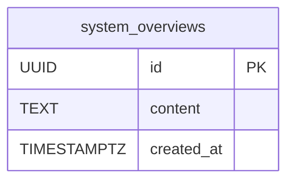

# SP1-1 DB設計書（FR-001）

[一覧](../README.md) | [← 004.画面設計書](004.画面設計書.md)

> **対象**: TK1-1-1 で実装した FR-001「システム概要入力・保存」の DB テーブル詳細設計

<details>
<summary>目次（クリックで展開）</summary>

- [1. テーブル一覧](#1-テーブル一覧)
- [2. テーブル定義](#2-テーブル定義)
  - [2.1 system_overviews](#21-system_overviews)
- [3. ER 図](#3-er-図)
- [4. マイグレーション](#4-マイグレーション)
- [5. データ例](#5-データ例)
- [6. 実装箇所](#6-実装箇所)

</details>

---

## 1. テーブル一覧

| テーブル名 | 概要 | 対応 FR |
| --- | --- | --- |
| `system_overviews` | ユーザが入力したシステム概要テキストを保存する | FR-001 |

---

## 2. テーブル定義

### 2.1 system_overviews

ユーザが入力したシステム概要テキストを 1 件 1 レコードで管理する。

| カラム名 | 型 | NOT NULL | デフォルト | 説明 |
| --- | --- | :---: | --- | --- |
| `id` | `UUID` | ○ | `gen_random_uuid()` | 主キー（自動採番） |
| `content` | `TEXT` | ○ | — | システム概要テキスト |
| `created_at` | `TIMESTAMPTZ` | ○ | `NOW()` | レコード作成日時（タイムゾーン付き） |

#### 制約

| 制約名 | 種別 | 対象カラム | 内容 |
| --- | --- | --- | --- |
| `system_overviews_pkey` | PRIMARY KEY | `id` | UUID 主キー |
| `system_overviews_content_not_null` | NOT NULL | `content` | テキスト必須（空文字はアプリ層で制御） |
| `system_overviews_created_at_not_null` | NOT NULL | `created_at` | 作成日時必須 |

#### インデックス

SP1-1 スコープでは主キー以外のインデックスなし。
ID 直接参照のみのため、追加インデックスは不要と判断。

#### 設計上の注意事項

- `updated_at` / `deleted_at` は SP1-1 スコープでは設けない。  
  概要テキストは保存後に上書き・削除しない運用（FR-001 の受け入れ条件にない）。
- 文字数制限（4096 ルーン）はアプリケーション層（Service）で制御し、DB 側には `CHECK` 制約を設けない。
- UUID の生成は PostgreSQL 拡張 `pgcrypto`（`gen_random_uuid()`）を使用する。

---

## 3. ER 図



> SP1-1 スコープでは `system_overviews` は他テーブルと外部キー関係を持たない。
> FR-002 以降で `projects` テーブルが `system_overviews.id` を参照する予定。

---

## 4. マイグレーション

### Up マイグレーション

```sql
-- +migrate Up
CREATE TABLE IF NOT EXISTS system_overviews (
    id         UUID        PRIMARY KEY DEFAULT gen_random_uuid(),
    content    TEXT        NOT NULL,
    created_at TIMESTAMPTZ NOT NULL DEFAULT NOW()
);
```

**ファイル**: `services/musuhi-api/src/db/migrations/001_create_system_overviews.up.sql`

### Down マイグレーション

```sql
-- +migrate Down
DROP TABLE IF EXISTS system_overviews;
```

**ファイル**: `services/musuhi-api/src/db/migrations/001_create_system_overviews.down.sql`

---

## 5. データ例

```sql
-- 保存例
INSERT INTO system_overviews (content)
VALUES ('- ユーザ管理機能（登録・ログイン・プロファイル編集）
- 商品カタログ表示（一覧・詳細・検索）
- カート・注文機能（追加・削除・確定）
- 決済連携（Stripe）');

-- 取得例（id 指定）
SELECT id, content, created_at
FROM system_overviews
WHERE id = '550e8400-e29b-41d4-a716-446655440000';
```

**取得結果例:**

| id | content | created_at |
| --- | --- | --- |
| `550e8400-e29b-41d4-a716-446655440000` | `- ユーザ管理機能...` | `2026-05-05 09:00:00+09` |

---

## 6. 実装箇所

| ファイル | 役割 |
| --- | --- |
| `services/musuhi-api/src/db/migrations/001_create_system_overviews.up.sql` | テーブル作成 DDL |
| `services/musuhi-api/src/db/migrations/001_create_system_overviews.down.sql` | テーブル削除 DDL |
| `services/musuhi-api/src/internal/model/system_overview.go` | ドメインモデル（`SystemOverview` 構造体） |
| `services/musuhi-api/src/internal/repository/system_overview_postgres.go` | SQL 発行（INSERT / SELECT） |
| `services/musuhi-api/src/internal/repository/system_overview.go` | リポジトリインターフェース定義 |
