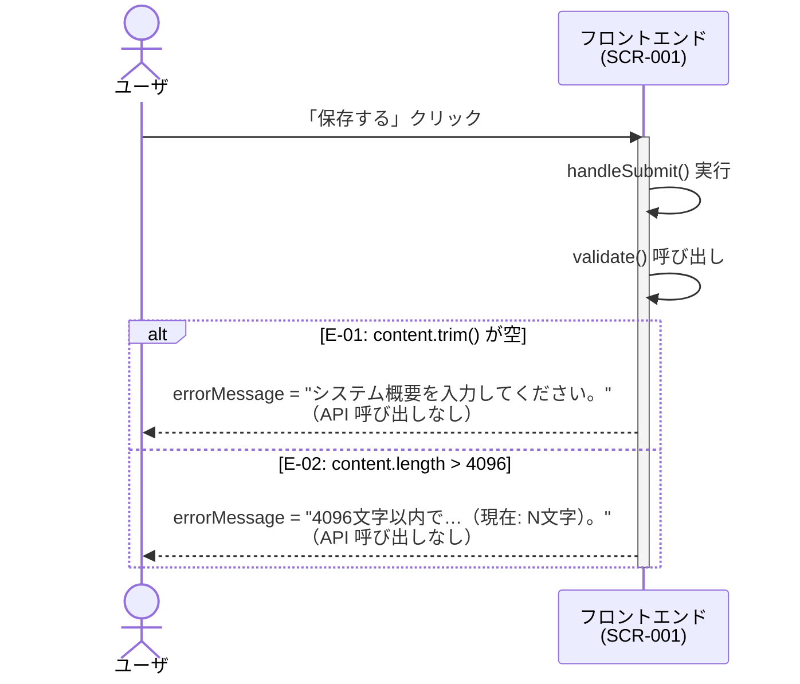
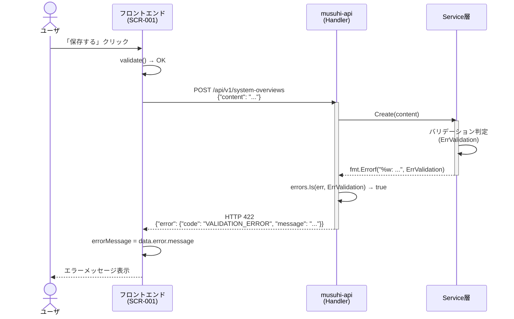
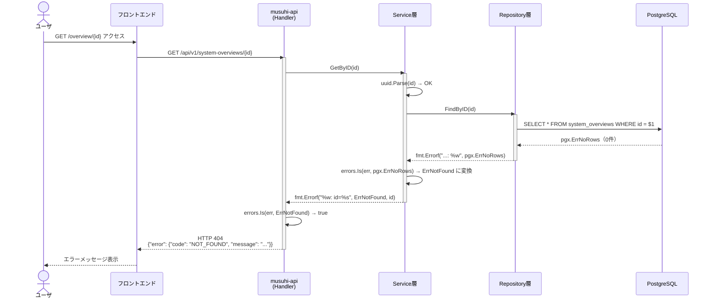
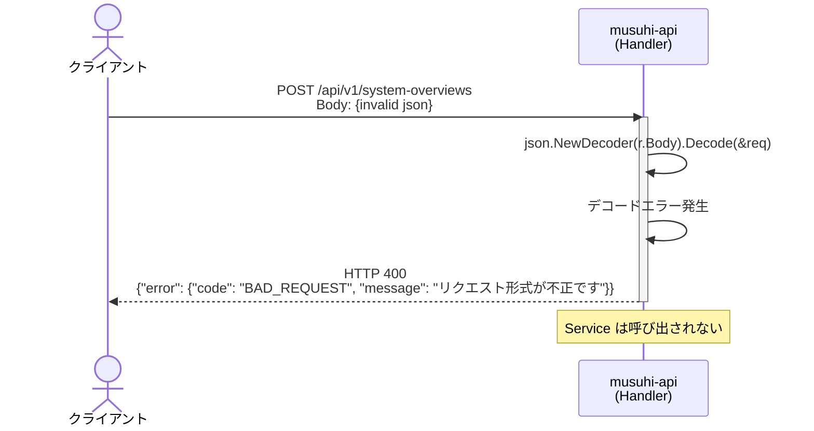
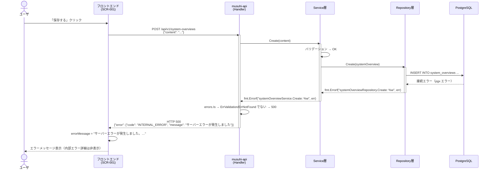
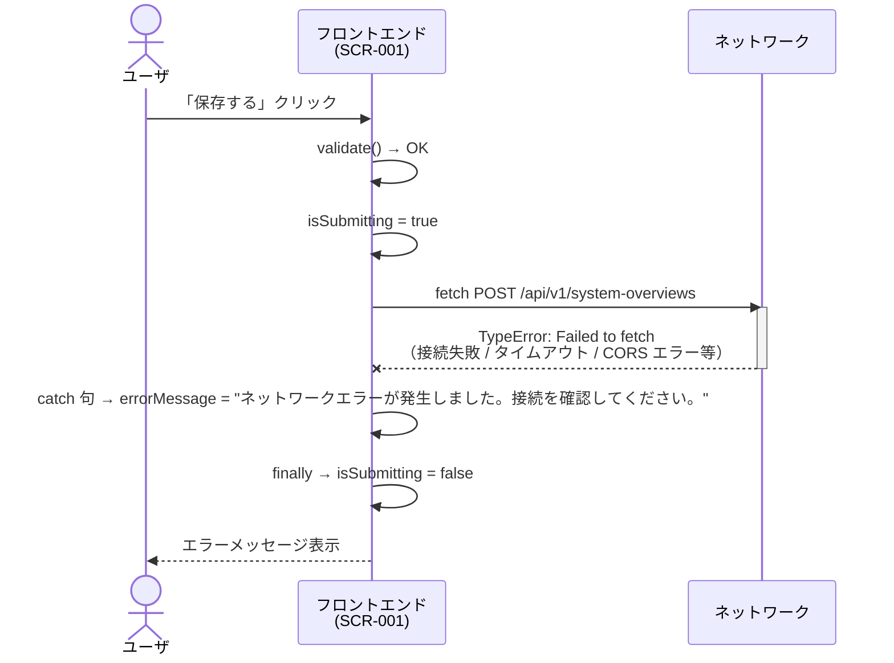
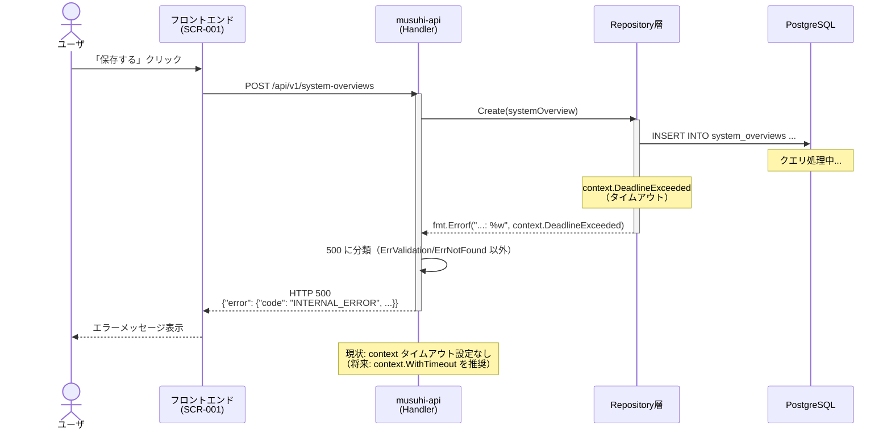

# FR-001 シーケンス図（エラー詳細）

[← 008.フロントエンドコンポーネント設計書](008.フロントエンドコンポーネント設計書.md) | [一覧](../README.md)

> **対象**: TK1-1-1 で実装した FR-001「システム概要入力・保存」の異常系シーケンス詳細
>
> 正常系シーケンスは [001.機能業務フロー図](001.機能業務フロー図.md) を参照。

目次（クリックで展開）

- [1. エラーシーケンス一覧](#1-エラーシーケンス一覧)
- [2. フロントバリデーションエラー](#2-フロントバリデーションエラー)
- [3. API バリデーションエラー（422）](#3-api-バリデーションエラー422)
- [4. リソース未存在エラー（404）](#4-リソース未存在エラー404)
- [5. JSON 形式不正エラー（400）](#5-json-形式不正エラー400)
- [6. DB 接続エラー / タイムアウト（500）](#6-db-接続エラー--タイムアウト500)
- [7. ネットワーク断（フロント→API）](#7-ネットワーク断フロントapi)
- [8. DB タイムアウト](#8-db-タイムアウト)

---

## 1. エラーシーケンス一覧

| # | エラー種別 | 発生箇所 | HTTP | エラーコード |
| --- | --- | --- | --- | --- |
| E-01 | フロントバリデーション（空文字） | フロントエンド | — | — |
| E-02 | フロントバリデーション（文字数超過） | フロントエンド | — | — |
| E-03 | API バリデーションエラー | Service → Handler | 422 | `VALIDATION_ERROR` |
| E-04 | リソース未存在 | Service → Handler | 404 | `NOT_FOUND` |
| E-05 | JSON 形式不正 | Handler | 400 | `BAD_REQUEST` |
| E-06 | DB 接続エラー | Repository → Handler | 500 | `INTERNAL_ERROR` |
| E-07 | ネットワーク断 | フロントエンド | — | — |
| E-08 | DB タイムアウト | Repository → Handler | 500 | `INTERNAL_ERROR` |

---

## 2. フロントバリデーションエラー

**E-01: 空文字入力** / **E-02: 文字数超過**

---

## 3. API バリデーションエラー（422）

**E-03**: フロントのバリデーションを通過したが API 側でバリデーション違反

---

## 4. リソース未存在エラー（404）

**E-04**: GET /{id} で指定 ID のレコードが存在しない（将来実装を含む）

---

## 5. JSON 形式不正エラー（400）

**E-05**: リクエストボディが JSON として解析できない

---

## 6. DB 接続エラー / タイムアウト（500）

**E-06**: Repository がDB接続に失敗する

---

## 7. ネットワーク断（フロント→API）

**E-07**: `fetch()` が例外をスローする（接続タイムアウト・CORS・オフライン等）

---

## 8. DB タイムアウト

**E-08**: DB クエリが完了する前にタイムアウトが発生する（`context.DeadlineExceeded`）

> **補足**: 現状の実装では `context.WithTimeout` を使用していないため、DB タイムアウトはクライアント側のタイムアウトまたはDB側の設定に依存する。将来的に Handler でリクエストコンテキストにタイムアウトを設定することを推奨する。
