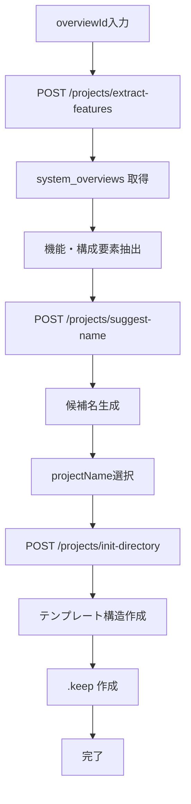

# FR-002 処理フロー設計書

前: [README](README.md) | [一覧](../README.md) | 次: [002.API仕様書](002.API仕様書.md)

## 1. 目的

FR-002（機能抽出・プロジェクト名候補生成・初期ディレクトリ作成）のバックエンド処理フローを定義する。

## 2. 正常系フロー

## 3. エラー処理

- overviewId が UUID 形式でない: `VALIDATION_ERROR` (422)
- overviewId に対応するレコードが存在しない: `NOT_FOUND` (404)
- projectName が空または `^[a-zA-Z0-9][a-zA-Z0-9_-]*$` に不適合: `VALIDATION_ERROR` (422)
- localPath が空または絶対パスでない: `VALIDATION_ERROR` (422)
- template が `"default"` 以外: `VALIDATION_ERROR` (422)
- JSON 形式不正: `BAD_REQUEST` (400)
- ファイルシステム操作失敗: `INTERNAL_ERROR` (500)

## 4. 実装反映先

- API: `services/musuhi-api/src/internal/handler/project.go`
- Service: `services/musuhi-api/src/internal/service/project.go`
- Route: `services/musuhi-api/src/main.go`

## 更新履歴

| 日付 | 版 | 変更内容 | 作成者 |
| --- | --- | --- | --- |
| 2026-05-06 | 0.1 | 初版作成 | Copilot |
| 2026-05-06 | 0.2 | 設計リファクタリング: バリデーション詳細を追記 | Copilot |
