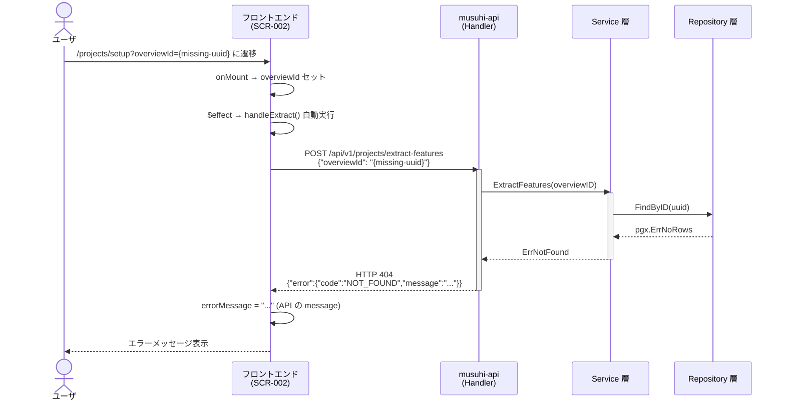
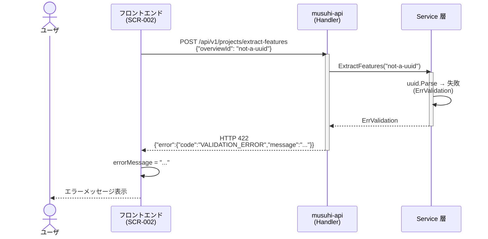
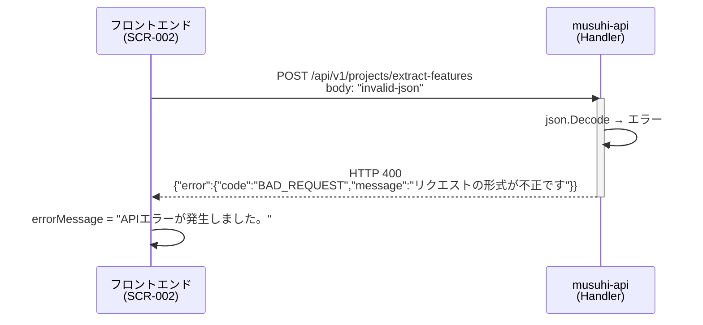
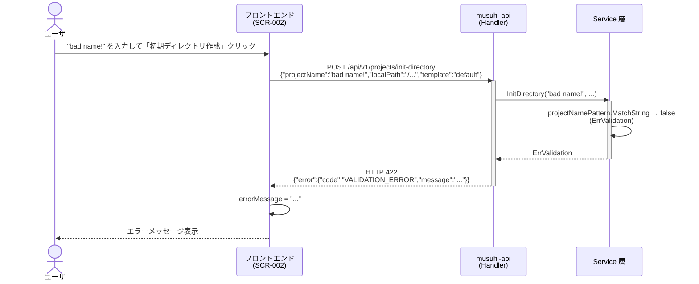
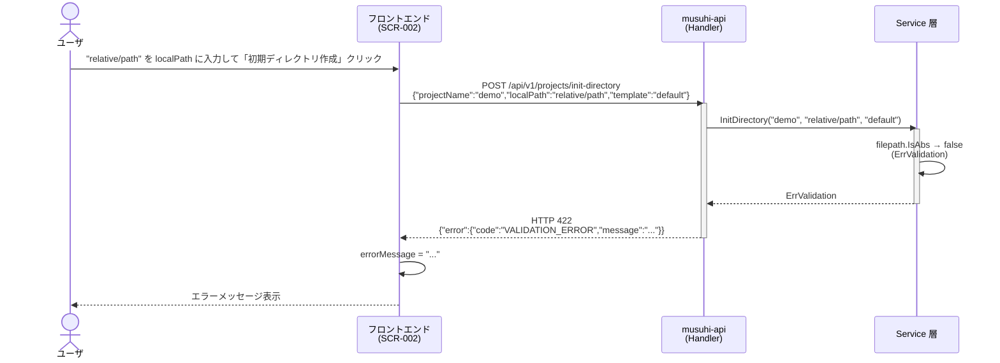
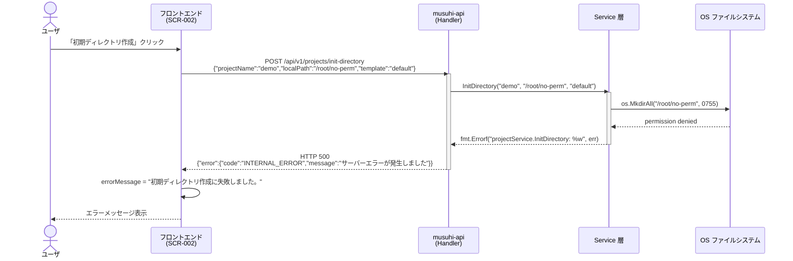
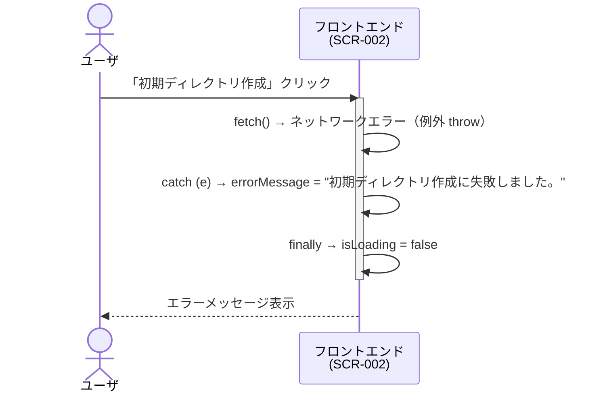

# FR-002 シーケンス図（エラー詳細）

[← 006.フロントエンドコンポーネント設計書](006.フロントエンドコンポーネント設計書.md) | [一覧](../README.md)

> **対象**: TK1-1-2 で実装した FR-002「機能抽出・プロジェクト名生成・初期ディレクトリ作成」の異常系シーケンス詳細
>
> 正常系シーケンスは [001.処理フロー設計書](001.処理フロー設計書.md) を参照。

目次（クリックで展開）

- [1. エラーシーケンス一覧](#1-エラーシーケンス一覧)
- [2. overviewId が存在しない（404）](#2-overviewid-が存在しない404)
- [3. overviewId が UUID 形式不正（422）](#3-overviewid-が-uuid-形式不正422)
- [4. JSON 形式不正エラー（400）](#4-json-形式不正エラー400)
- [5. プロジェクト名バリデーションエラー（422）](#5-プロジェクト名バリデーションエラー422)
- [6. localPath が相対パスエラー（422）](#6-localpath-が相対パスエラー422)
- [7. ディレクトリ作成失敗（500）](#7-ディレクトリ作成失敗500)
- [8. ネットワーク断（フロント→API）](#8-ネットワーク断フロントapi)

---

## 1. エラーシーケンス一覧

| # | エラー種別 | 発生箇所 | HTTP | エラーコード |
| --- | --- | --- | --- | --- |
| E-01 | overviewId が存在しない | Service → Handler | 404 | `NOT_FOUND` |
| E-02 | overviewId が UUID 形式不正 | Service → Handler | 422 | `VALIDATION_ERROR` |
| E-03 | JSON 形式不正 | Handler | 400 | `BAD_REQUEST` |
| E-04 | プロジェクト名バリデーション違反 | Service → Handler | 422 | `VALIDATION_ERROR` |
| E-05 | localPath が相対パス | Service → Handler | 422 | `VALIDATION_ERROR` |
| E-06 | ディレクトリ作成失敗（OS エラー） | Service → Handler | 500 | `INTERNAL_ERROR` |
| E-07 | ネットワーク断 | フロントエンド | — | — |

---

## 2. overviewId が存在しない（404）

**E-01**: extract-features または suggest-name で存在しない overviewId を指定

---

## 3. overviewId が UUID 形式不正（422）

**E-02**: extract-features または suggest-name に UUID 形式でない値を送信

---

## 4. JSON 形式不正エラー（400）

**E-03**: いずれかのエンドポイントに不正な JSON を送信

---

## 5. プロジェクト名バリデーションエラー（422）

**E-04**: `projectName` がパターン `^[a-zA-Z0-9][a-zA-Z0-9_-]*$` に違反

---

## 6. localPath が相対パスエラー（422）

**E-05**: `localPath` に相対パスを指定

---

## 7. ディレクトリ作成失敗（500）

**E-06**: OS レベルでのディレクトリ作成失敗（権限不足など）

---

## 8. ネットワーク断（フロント→API）

**E-07**: API サーバーへの通信が失敗

