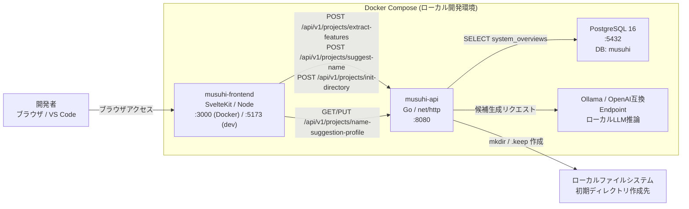

# FR-002-インフラ構成図

[← FR-002-シーケンス図（エラー詳細）](FR-002-シーケンス図（エラー詳細）.md) | [一覧](README.md)

> 対象: TK1-1-2（FR-002）実装時点のインフラ構成

## 1. 全体構成図



## 2. 対象サービス

| サービス | イメージ / 技術 | ポート | 役割 |
| --- | --- | --- | --- |
| musuhi-frontend | SvelteKit (Node 20) | 3000 (Docker) / 5173 (dev) | SCR-002 の UI |
| musuhi-api | Go 1.22 / net/http | 8080 | FR-002 のビジネスロジック・REST API |
| PostgreSQL | postgres:16-alpine | 5432 | system_overviews 参照・projects 永続化 |
| Ollama | ollama/ollama | 11434 | 神様候補名の AI 生成（任意利用） |

> SP1-1 スコープでは本番クラウド環境は対象外とする。

## 3. API ルーティング（機能内スコープ）

| メソッド | パス | 機能 | FR |
| --- | --- | --- | --- |
| POST | /api/v1/projects/extract-features | 概要から機能・構成要素を抽出 | FR-002 |
| POST | /api/v1/projects/suggest-name | プロジェクト名候補を生成 | FR-002 |
| POST | /api/v1/projects/init-directory | 初期ディレクトリを作成 | FR-002 |
| GET | /api/v1/projects/name-suggestion-profile | 候補生成プロファイル取得 | FR-002 |
| PUT | /api/v1/projects/name-suggestion-profile | 候補生成プロファイル更新 | FR-002 |

## 4. データフロー（FR-002）

```
[ブラウザ]
  │  POST /api/v1/projects/suggest-name  {"overviewId":"..."}
  ▼
[musuhi-api :8080]
  │  handler → service → repository
  │  SELECT content FROM system_overviews WHERE id = $1
  │  (必要時) LLM へ候補生成問い合わせ
  ▼
[PostgreSQL / Ollama]

[musuhi-api :8080]
  │  POST /api/v1/projects/init-directory
  │  mkdir -p <localPath>/<projectName> + .keep 作成
  ▼
[ローカルファイルシステム]
```
