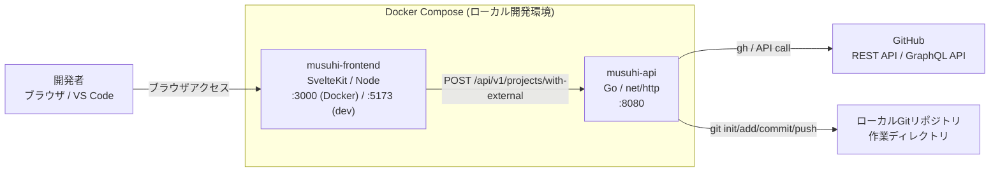

# FR-003-インフラ構成図

[← FR-003-処理フロー設計書](FR-003-処理フロー設計書.md) | [一覧](README.md) | [→ FR-003-API仕様書](FR-003-API仕様書.md)

> 対象: TK1-1-3（FR-003）実装時点のインフラ構成

## 1. 全体構成図



## 2. 対象サービス

| サービス | イメージ / 技術 | ポート | 役割 |
| --- | --- | --- | --- |
| musuhi-frontend | SvelteKit (Node 20) | 3000 (Docker) / 5173 (dev) | SCR-003 の UI |
| musuhi-api | Go 1.22 / net/http | 8080 | FR-003 のビジネスロジック・REST API |
| GitHub | REST/GraphQL API | 443 (外部) | リポジトリ作成・メタ情報取得 |
| Local Git | git CLI | - | ローカル初期化・commit・push |

> SP1-1 スコープでは CI/CD パイプライン連携は対象外とする。

## 3. API ルーティング（機能内スコープ）

| メソッド | パス | 機能 | FR |
| --- | --- | --- | --- |
| POST | /api/v1/projects/with-external | GitHubリポジトリ作成・initial push | FR-003 |

## 4. データフロー（FR-003）

```
[ブラウザ]
  │  POST /api/v1/projects/with-external
  │  {owner, repoName, visibility, localPath, commitMessage}
  ▼
[musuhi-api :8080]
  │  handler → service
  │  入力検証 → ローカルgit初期化/commit
  │  GitHub にリポジトリ作成要求
  ▼
[GitHub API]
  │  repositoryUrl / externalProjectId を返却
  ▼
[musuhi-api :8080]
  │  ローカルから remote へ push
  ▼
[ローカルGitリポジトリ]
```
